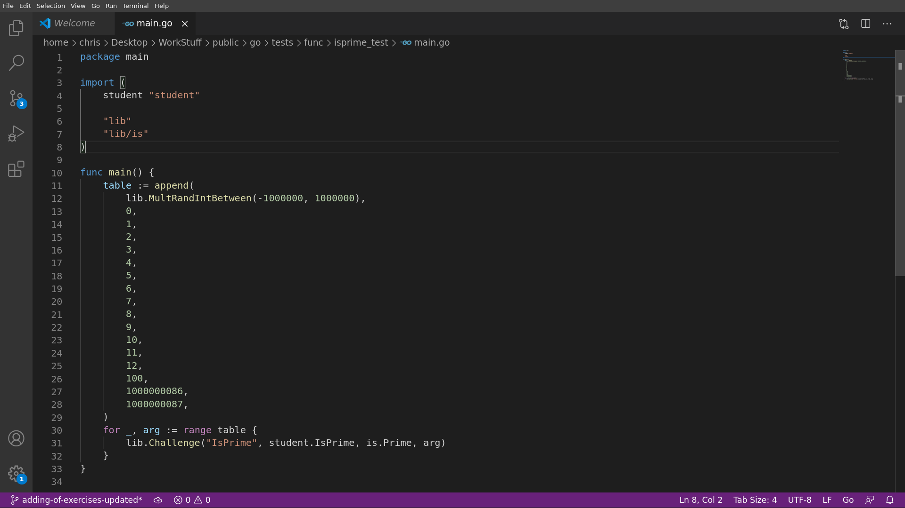
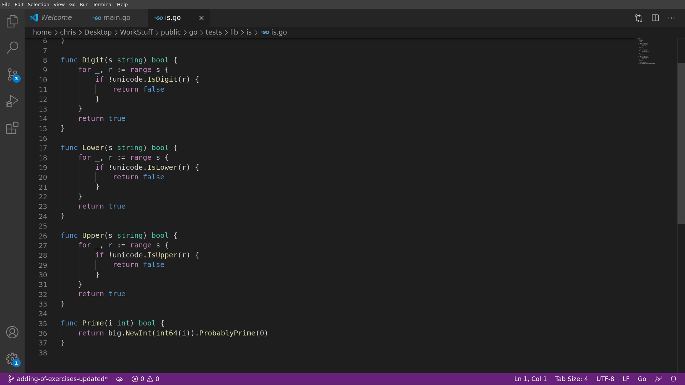

# THE ADDITION OF EXERCISE PROCEDURE

##### The examples take a go exercise in the piscine-go
##### However the principles of redactions work for the js exercises as well
##### Note that the files structure will be different between js and go exercises 

## **1. Writing the subject and / or writing the solution**

Always address each exceptional cases.

Example: [fprime](https://github.com/01-edu/public/blob/master/subjects/fprime.en.md).

The exceptional cases in the `usage` part.

```console
student@ubuntu:~/piscine-go/test$ go build
student@ubuntu:~/piscine-go/test$ ./test 225225
3*3*5*5*7*11*13
student@ubuntu:~/piscine-go/test$ ./test 8333325
3*3*5*5*7*11*13*37

...

student@ubuntu:~/piscine-go/test$ ./test 0

student@ubuntu:~/piscine-go/test$ ./test 1
1
student@ubuntu:~/piscine-go/test$
```

The subject states that only **positive integer** will be tested, however, 0 and 1 are not primes.

The subject writer made a mistake because of forgetting that fact.

During the exam, the test was testing the `1` case and expecting a `1\n` to be printed. The real result should only have been a `\n`.

Some students found this mistake. An update of the subject during the exam treating that special case was immediately necessary.

1. Try to avoid the “you” and contracted “language”

2. Always check the formating md

---

### fprime <span style="color:#ff3234">(Title of the exercise)</span>

#### Instructions <span style="color:#ff3234">(Instructions of the exercise)</span>

Write a program that takes a positive `int` and displays its prime factors, followed by a newline (`'\n'`). <span style="color:#ff3234">(general guidelines, notice the imperative style tense and the avoidance of “you”. “You” is authorized in the case of a presence of a back story where the player is immersed)</span>

- Factors must be displayed in ascending order and separated by `*`. <span style="color:#ff3234">(formating requirement) </span>

- If the number of arguments is different from 1, the program displays a newline. <span style="color:#ff3234">(special case requirement, this case will need to be tested)</span>

- The input, when there is one, will always be valid. <span style="color:#ff3234">(Clarification on what the tester will do, hence giving the student guidelines on the cases to be handled, the tests have to reflect this instruction as well)</span>

- In this exercise the primes factor of 1 is considered as 1. <span style="color:#ff3234">(Handling of exceptional case: THIS Happens to be a mistake, we will see uses this example for the “UPDATING A SUBJECT/TEST PROCEDURE”)</sapn>

### Usage

```console
student@ubuntu:~/piscine-go/test$ go build
student@ubuntu:~/piscine-go/test$ ./test 225225
3*3*5*5*7*11*13
student@ubuntu:~/piscine-go/test$ ./test 8333325
3*3*5*5*7*11*13*37
student@ubuntu:~/piscine-go/test$ ./test 9539
9539
student@ubuntu:~/piscine-go/test$ ./test 804577
804577
student@ubuntu:~/piscine-go/test$ ./test 42
2*3*7
student@ubuntu:~/piscine-go/test$ ./test a

student@ubuntu:~/piscine-go/test$ ./test 0

student@ubuntu:~/piscine-go/test$ ./test 1
1
student@ubuntu:~/piscine-go/test$
```

---

## **2. Creating the files for go tests (2 main cases)**

### for go exercises
### always in -> _public/go/tests/_
### public has to be replaced with the name of your repo if necessary

### **Folder organization**

- Function exercise `(strlen)`
  - 2 file:
    - public/go/tests/func/strlen_test.go (the test file)
    - public/subjects/strlen/README.md (the subject file)

```console
go
| strlen_test.go
|
| 
| 
|
| __ student (In this folder you can put the solution you want to test)
```

- Program exercise `(doop)`
  - 2 files
    - public/go/tests/func/doop_prog.go
    - public/go/tests/func/doop_test.go
    - public/subjects/doop/README.md

```console
go
| doop_test/main.go (This file launches all the test)
| doop_prog/main.go (This is a working solution on which the test will be based)
|
| 
|    
|         
|
| __ student (In this folder you can put the solution you want to test)
```

---

## **3. Writing a file_test.go (test file for go)**

### <span style="color:#00bae6">**RULE 1**</span>

- Make the test as independent as possible (no self-made functions imported)

- **If** the source is not in the import section, copy and paste the function, with **lowercase** for the first letter of its name.

- **If** you must import the function, we suggest for it to be added in this file
- public/go/tests/lib/is/is.go (`public` changes to your repository name)

- Example: isprime_test/main.go



The func isPrime is imported from the lib/is/is.go file.




### <span style="color:#00bae6">**RULE 2**</span>

Every special case in the subject should be tested. Preferably first. Before the randoms tests

### <span style="color:#00bae6">**RULE 3**</span>

Whenever possible do at least 1 random test! This is to avoid cheating by predictability of the tests. If the tests are fixed, then the student may create a forest of ifs program to bypass the tester.

### z01.functions to be used by tester

- Function exercise in a Quest (strlen) 

```go
lib.Challenge("StrLen", student.StrLen, strLen, s) // s in this case are the arguments of a table

```
- Program exercise in a Quest (doop) <- Screenshots to be added.

```go
lib.ChallengeMain("displaya") // if the program doesn’t have arguments

lib.ChallengeMain("doop", strings.Fields(s)...)// if the program has arguments with s being the arguments of the table
```

Please not that the lib has plenty of other useful functions (such as randoms data functions) to help you build the tests. Check the file at this [address](https://github.com/01-edu/public/blob/master/go/tests/lib/lib.go).

---

## **4. Testing locally (`go test` or `go test -run=Test\<nameOfTheFunction\>`)**

### you do -run=... because you have many test files, so you need to run just one

### Before every PR : a go test has to be executed (in several situations) in the folder(s) of the exercise(s) worked on

**First thing first**
```console
go get -u github.com/01-edu/public/go/tests/lib
```

```console
rm -r student
cp -aT solutions/ student
```

### Execute a go test in the appropriate folder

- Function exercise in a Quest `(strlen)` 

`all/test/go`

```console
go test -run=TestStrlen
```

- Program exercise in a Quest `(doop)` <- Screenshots to be added.

`all/test/go/`

```console
go test -run=TestDoop
```

- Program exercise in the exam `(dooprog)` Screenshots to be added.

Here you can do just _go test_, because there's only one test file

`all/test/go/student/dooprog`

```console
go test
```

- Function exercise in the exam `(atoiprog)` Screenshots to be added.

`all/test/go/student/atoiprog`

```console
go test
```

### **NOTE:** If a go test gives a (cached) result, use this type of command (example with raid3):

`go test count=1 raid3_test.go`

The result should be an OK message:

- This means that the test is running correctly when the correct solution is given. If this does not work, the test file is likely to have errors inside.

- Time should be under 5-6 seconds. If longer, remove some of the iteration of the random tests (for example, less random tests)

- Be watchful of exercises with challenge function: Always test a copy of the variable and not the same variable for both the student and the solution function.

- Introduce errors in the student solution.go file in order to see the errors message and compare them to the subject examples.

- Error messages for structures exercises (linked lists, binary trees) need to be tailored accordingly.


## **5. Creating the files for tests (For js)**

### for js exercises
### always in -> _public/js/tests/_
### public has to be replaced with the name of your repo if necessary

### **Folder organization**

- Function exercise `(primitives)`
  - 2 file:
    - public/js/tests/primitives_test.js (the test file)
    - public/subjects/primitives/README.md (the subject file)

```console
go
| primitives_test.go
|
| 
| 
|
| __ student (In this folder you can put the solution you want to test)
```
## **6. Writing a file_test.js (test file for js)**

### <span style="color:#00bae6">**RULE 1**</span>

- Make the test as independent as possible (no self-made functions imported)

- **If** the source is not in the import section, copy and paste the function, with **lowercase** for the first letter of its name.

- Example: addprimesum_test.go


The func isAPrime is fully copied to the file.