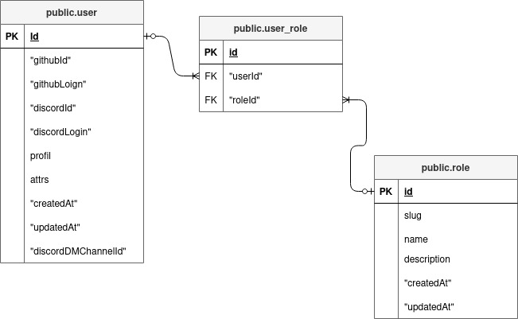

# DB authorization

Every request to Hasura executes against a set of session variables. These variables are expected to be set by the authentication system.

Normally there are some main variables for the authorization context:

- `X-Hasura-User-Id`: this variable usually denotes the user executing the request.

- `X-Hasura-Role`: This variable denotes the role with which the user is executing the current request. Hasura has a built-in notion of a role, and will explicitly look for this variable to infer the role.

- `X-Hasura-campus`: this variable contains the campus that the user currently is on.

In our database we have several roles which are simple arbitrary names.
Each role can be given a set of permissions and actions (`select`, `insert`, `update`, `delete`). That will execute against each table of the database.

To give the user with a certain role a permission to make a request, we must set a permission rule that would look something like this:

```json
{"user_id": {"_eq": "X-Hasura-User-Id"}}
```

This is the same as saying : if the value of the `user_id` column equals the value of the session variable `X-Hasura-User-Id`, allow this request to execute on the current row.

It is possible to express pretty complex rules, by using, for example the operators `_and` and `_or` to create a chain rule. It is even possible to query tables not related to the current object as part of the rule execution. You can see more about it [here](https://hasura.io/docs/latest/graphql/core/auth/authorization/index.html).

## Roles

These are the roles presented in the database:

- `anonymous`: this role allows non logged in users to query (only using `select`) tables:
  - `users` : and columns `id`, `login`
  - `object` : and columns `id`, `childAttr`, `campus`, `name`, `type`
  - `result` : and columns `groupId`, `objectId`, `progressId`, `userId`, `grade`, `campus`
  - `transactions` : and columns `objectId`, `userId`, `amount`, `type`
  - `progress` : and columns `isDone`, `objectId`, `userId`, `id`, `grade`, `campus`

- `user` : this role allows the following queries:

  - without check:
    - `group`, `group_user`, `match`, `registration_user`, `event`, `event_user`, `object`, `object_child`, `object_status`, `object_type`, `registration`, `role`, `transaction_type`

  - with checks:
    - `audit`, `result`, `transaction`, `user_role`, `user`, `progress`

- `campus-admin` : this role allows users to query every table, but with the session variables `X-Hasura-campus` check. This means that users with this role will only be able to query information from their own campus.

- `admin-campus-read-only` : this role allows users to query almost all tables with a campus permission verification.

Example:

```json
{ "campus" : { "_in" : "X-Hasura-campus" } }
```

- `admin` : this role allows users to query any action in any table on the database.

- `admin-read-only` : this role allows users to query almost all tables only using the `select` action.

This is how the user and role tables are related to each other:


