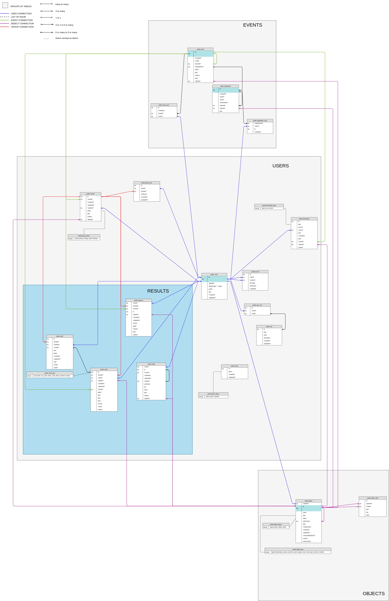

# Database Relations

## Entity Relationship Diagram ERD

An entity relationship diagram (ERD) shows the relationships of entity and sets stored in a database.

An entity in this context is a table, this table contains a set of attributes, they can be of any data structure (INT, TEXT, ...).

An entity can have several relations to other entities. Those relations are represented with "crow foots"

### Relationships cardinality

Relationships have a cardinality, normally they have two indicators that are shown on both sides of the line.

1. One end of the line, refers to the **max** number of times that an instance of one entity can be associated with instances in the related entity. It can be **one**, **many** or **none**

2. The second, describes the **min** number of times one instance can be related to others.
It can be **zero** or **mandatory**

The combination of those two indicators create relations, you can get more information [here](https://community.mis.temple.edu/mis3506digitaldesignfall2018/files/2018/10/Adam-Alalouf_Cardinality.pdf)

## Relations

### Events

Events will be the accumulation of the following tables :

- `event`
- `registration`
- `registration_user`
- `event_user`

This part of the database takes care of schools activities with time.

The `event` table contains the following relations:

- `parentId` that is associated to himself. This association can be better explained if we take a look at the `path` column. An event can be based on a parent event (ex: the event `/madere/div-01/piscine-rust` is associated to this parent event `/madere/div-01`).

- `registrationId` that is associated to the `registration` table. This is a one to one relations, meaning that an event must always have a registration associated to it.

- `objectId` that is associated to the `object` table, this column will identify which object is associated to which event. An object can have multiple events, but an event must always be associated to an object. (it will never exist an event where the `objectId` is `null`)

---

The `event_user` contains the associations between events and users. This will contain information on which users are registered to which event. An event can have multiple users and a user can have multiple events, this way being a many to many relationship.

---

The `registration` table contains all objects/activities that need registration. Having the following relations:

- `parentId` that is associated to himself. As said above (in the events), it has the same use.
- `objectId` that is associated to the object table, this is the object reference to the registrations.

---

The `registration_user` table is a relationship many to many between `registration` and `user`. This table contains all users that are registered to an event.

- `registrationId` a registration can have multiple users.
- `userId` a user can have multiple registrations.

---

### Objects

Object will be the accumulation of the following tables :

- `object`
- `object_child`
- `object_status`
- `object_type`

This part of the database defines the structure of the content.

The `object` table contains the following relations:

- `referenceId` that is associated to himself, this attribute allows the duplication of reference objects (given by **01-edu**), that are used to set up campuses
- `authorId` that is associated to the user table and this is the author of that object/content.

---

The `object_child` table contains the encapsulation of objects. An object can have multiple children and a child must have one object parent. Note that one parent can't be associated two times to children with the same key. This table contains the following relationships to the object table:

- `parentId` that associates the parent object to the child object.
- `childId` that belongs to the parent object.

Both child and parent must have at least one association to the `object` table, and the `object` table can have multiple relations with the `object_child` table.

Example:

Campus `madeira` is a **parent object** of `piscine-go`, therefore the later one is the **child**.

But `piscine-go` can be the **parent object** of all the quest, exams and raids (those being the **child objects**). And so on... creating a finite cycle.

---

### Users

Users will be the accumulation of the following tables:

- `role`
- `user_role`
- `user`
- `group`
- `group_user`
- `token`
- `record`
- `transaction`

---

The `role` table contains permission roles for each user.

---

The `user_role` contains information on which users are associated to which role. A user can have multiple roles and a role can be associated to multiple users.

---

The `group` table is the link between projects or raids and a group of users. This table contains the following relations:

- `eventId` that associates which group is related to which event.
- `captainId` that associates the captain's user.
- `objectId` that associates which group is related to which object.

---

The `group_user` table contains the relation between groups and users. A group can have several users and so do the users.

---

The `token` table stores the tokens ids from the hasura authorization variables for each user. This table has no relation between other tables.

---

The `record` table takes care of students records (bans). All relations in this table are with the table user.

---

The `transaction` table takes care of rewarding the user, by accumulating the user's **xp** , **up** and **down** (you can see more information about those types in the `database-structure.md`). This table contains the following relations:

- `userId` that represents the user rewarded
- `eventId` that associates the event in which the user was rewarded. Example: the user can be rewarded for an exercise `/madere/piscine-go/quest-01/make-it-better` and the parent event of that exercise will be `/madere/piscine-go`.
- `objectId` that associates the object in which the user was rewarded. Example: if a user passes an exercise (object), the reward will be associated to that object.

---

#### Results

Results will be the accumulation of the following tables:

- `audit`
- `match`
- `progress`
- `result`

This part of the database defines the users/students progress in the school.

The `audit` table contains all information related to the audit system and it is one of the ways of obtaining results. This table contains the following relations:

- `groupId` that associates the group being audited.
- `auditorId` as the name says, it is linked to the user table and has a relation of many to one. This column will be the auditor.
- `resultId` that associates the audit to the result. An audit can have one or no results (pending on the auditor review). While the results must have at least one audit.

---

The `match` table is another way of obtaining a result. This table is used in bonus exercises to match two students. The following relations are established:

- `userId` this will be the user wanting the match to happen.
- `matchId` this is a self related id, a match can be made by matching other students or it can be none. If the latter is none it means that the student is waiting for the match, otherwise it is a match.
- `eventId` that associates the event to the current match. Example: a user can be waiting for the exercise `/madere/piscine-go/quest-01/teacher` that is located in the `/madere/piscine-go` event.
- `objectId` that associates the object to the current match, this being the bonus exercise that the user is doing.

---

The `progress` table is the reflection of user's activity on specific path: registration to an event related, commitment to a group associated to this path, generation of result expected to validate a progress on this path.

- `userId` that associates an user with a progress. A progress must always have a user associate to it and a user can or cannot have multiple progresses.
- `groupId` this association allows each user form a group to have progress. This is a many to none or one connection, meaning that a progress can have none or one group and a group can have multiple progresses.
- `eventId` that associates which event the user has progressed on.
- `objectId` that associates which object the user has progressed on.
- `version` is the association between the `progress` and the `result` table

---

The `result` table keeps the track of students result. The following relations are established:

- `userId` that associates an user with a result. An user can have multiple results but a result is associated to just one user.
- `groupId` that associates a group with a result. The same logic as in the `userId`
- `objectId` that associates an object with a result. A result must have always a object associated to it and an object can have multiple results
- `eventId` that associates an event with a result. The same logic as in the `objectId`
