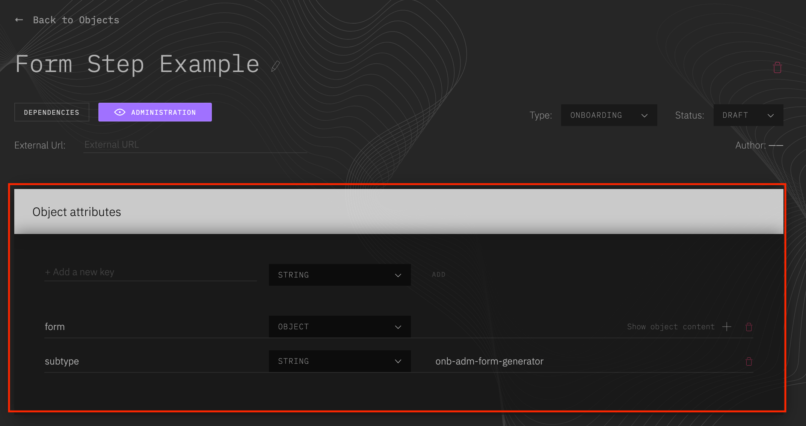
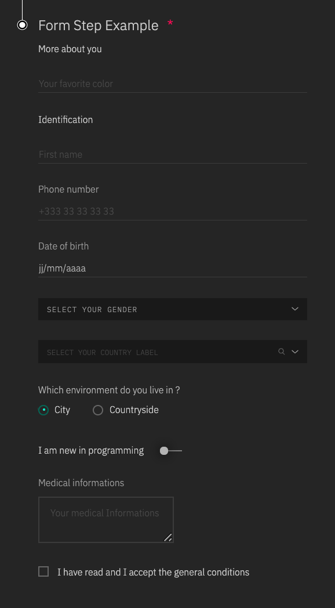
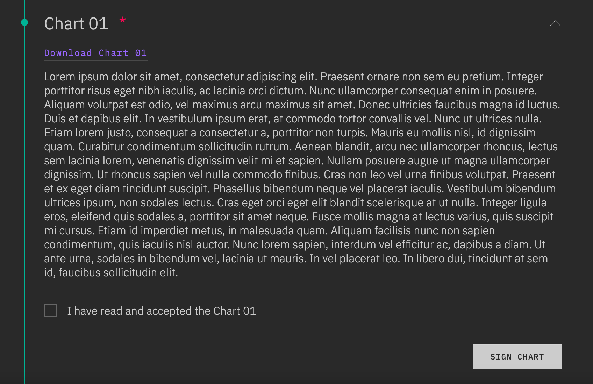

# Sign up & onboarding's Administration section - Modular steps management

## Usage

After their first authentication in the app, every candidate has to do his **sign up** and his **onboarding**. The steps that compose the **sign up** and the **administration** section of the onboarding are either:

- Forms (identification, medical information, etc.)
- Documents to sign (general conditions, charts, regulations, etc.)

All the sections are modular: you can add, update, delete and order them as you wish.

This documentation explains how to manage these steps.

## Create your step child object

### Create a new object for your step in the admin

> Information is available for object's creation: [Object creation](object-creation.md)

- This object must have the same type as its future parent object (_signup_ or _onboarding_).

> Your step is then available in the _Admin_. You can find it in the section of its type (_SignUp_ or _Onboarding_) or thanks to the search bar of the cursus object's page.

### Add this new object as a child of your parent's object

- Edit the parent object: _Sign up_ or _Administration_

> Information is available for object's creation: [Child object creation](object-child-creation.md)

## Settings for a `form` step

In the step object you have created, 2 attributes must be filled:

1.  Subtype
2.  Form

### Description

#### Edit the step object you have created :

> in _Object attributes_



- Add a new key **subtype** of type `String` with the exact value 'form-step'
- Add a new key **form** of type `Object`
  - Form can have several sections. Each section is displayed with a title, and its inputs.
    > NB: The submission of the form will check the required inputs of all the sections created for the form.
  - To create a section, add a new key to the form object, of type `Object`, that contains:
    - A **title** key of type `String`. The value of this property will be the title displayed in the top of the form section.
      > If there is only one section in the form step, and no section title is needed, this property can be ignored.
    - An **inputs** key of type `Object`, which will contain all the inputs of the section. For each wanted input, add a new `Object` element in the "inputs" object.
      > The key of this object will be used as the "name" attribute of your input.
      > The values will be considered as the properties of your input.

#### Defining an input:

- A **type** key of type `String` must be declared. It defines the type of the input : `tel`, `text`, `date`, `select`, `radio`, `switch`, `checkbox`, `textarea`, `countries`.
- All other attributes needed for the input can be added to the object, according to the input type: `placeholder`, `id`, `required`, `label`, `items`, `emptyItems`, `index`, etc...

#### Important indication:

- The **index** property is used to order the inputs. It will not be passed onto the input. Be mindful not to set the same index twice.
- The **type** property is required. It will be used to determine the kind of input should be generated. It is passed onto the input only if the input type attribute is required (type 'tel' or 'text' for example, but not for type 'select' - in this case, we will generate a select element)

  - A special type 'countries' has been added to the classicals. It generate a `Select` (containing all the countries) with a search bar. 'Items' property is handled by the app.
  - It's recommended to add 'min' and 'max' properties to input type 'date' (no default value are set).

- `onChange` prop are ignored as the event is handled by the app.
- For `switch` and `checkbox` input types, the default value has to be set as a boolean property named **value**.
- More information for each inputs is available in the design documentation:
  - [textInput documentation](<https://((DOMAIN))/docs/Components/FormInputs/TextInput>) - used for inputs type 'text', 'tel', and 'date'
  - [textArea documentation](<https://((DOMAIN))/docs/Components/FormInputs/TextArea>)
  - [select documentation](<https://((DOMAIN))/docs/Components/FormControls/Select>)
  - [radio button documentation](<https://((DOMAIN))/docs/Components/FormControls/Radio>)
  - [switch documentation](<https://((DOMAIN))/docs/Components/FormControls/Switch>)
  - [checkbox documentation](<https://((DOMAIN))/docs/Components/FormControls/Checkbox>)

### Examples

Here is an example of the form step's attributes. It presents a form with two sections, and an example of each kind of input type.

> NB : this example object is provided in the admin, in the onboarding section: 'Form step example'.

```json
{
  "subtype": "form-step",
  "form": {
    "identification": {
      "title": "Identification",
      "inputs": {
        "firstName": {
          "index": 0,
          "placeholder": "First name",
          "maxLength": 50,
          "type": "text",
          "required": true
        },
        "tel": {
          "index": 1,
          "required": true,
          "type": "tel",
          "label": "Phone number",
          "placeholder": "+333 33 33 33 33",
          "pattern": "[+][3][0-9]{2}[0-9]{2}[0-9]{2}[0-9]{2}[0-9]{2}"
        },
        "medicalInfo": {
          "label": "Medical informations",
          "placeholder": "Your medical Informations",
          "index": 7,
          "maxLength": 250,
          "type": "textarea"
        },
        "dateOfBirth": {
          "index": 2,
          "required": true,
          "type": "date",
          "label": "Date of birth",
          "min": "1621-07-08",
          "max": "1900-01-01",
          "value": "2000-01-01"
        },
        "country": {
          "index": 4,
          "id": "countries",
          "type": "countries",
          "required": true,
          "emptyItem": { "label": "Select your country label" }
        },
        "gender": {
          "index": 3,
          "type": "select",
          "id": "genders",
          "required": true,
          "emptyItem": { "label": "Select your gender" },
          "items": [
            { "label": "Male", "data": "male" },
            { "label": "Female", "data": "female" }
          ]
        },
        "environment": {
          "index": 5,
          "type": "radio",
          "required": true,
          "label": "Which environment do you live in ?",
          "inlineBlock": true,
          "items": [
            { "label": "City", "data": "city" },
            { "label": "Countryside", "data": "countryside" }
          ]
        },
        "programmingAbilities": {
          "index": 6,
          "type": "switch",
          "label": "I am new in programming",
          "value": true
        },
        "generalConditions": {
          "index": 8,
          "type": "checkbox",
          "label": "I have read and I accept the general conditions",
          "value": false
        }
      }
    },
    "moreAboutYou": {
      "title": "More about you",
      "inputs": {
        "favoriteColor": {
          "index": 0,
          "placeholder": "Your favorite color",
          "type": "text",
          "required": true
        }
      }
    }
  }
}
```

This 'form' step would look like this:



## Settings for a `document to sign` step

The newly created child can be customized with these attributes :

| name       | fullfillment |
| ---------- | ------------ |
| subtype    | **required** |
| text       | **required** |
| buttonText | optionnal    |
| checkbox   | optionnal    |

### Description

#### To set up the child object you have created with these elements:

1. Edit you step object
2. Go to _Object attributes_
3. Add the following attributes:

   - Add a new key **subtype** of type `String` with the exact value 'sign-step'
   - Add a new key **text** of type `String` with the text of your document to sign as value
   - Add a new key **buttonText** of type `String` with the text that you want to display in the submit button of your step. Default value for this attribute is 'Sign'.
   - Add a new key **checkbox** of type `Object`, if the user has to be forced to click on a checkbox before validating his document (ex: 'I have read and accepted the conditions'). In the checkbox object, the following attributes should be defined:
     - A **label** key of type `String`, for the text associated to the checkbox
     - A **required** key of type `Boolean`, set at true if the user has to check it
     - A **name** key of type `String`
     - All other attributes wanted for the checkbox.
   - Add a new key **link** of type `Object`, if a link must be added to the step (ex: download of a .pdf version of the document to sign). In the link object, the following attributes should be defined:
     - A **href** key of type `String`, with the link you want to add to the step
     - A **label** key of type `String`, for the text displayed for the link (by default, '> Link to the document' is displayed)
     - All other attributes wanted for the link.

### Examples

Here is an example of the structure a 'document to sign' step could have:

```json
{
  "subtype": "sign-step",
  "text": "Lorem ipsum dolor sit amet, consectetur adipiscing elit. Praesent ornare non sem eu pretium. Integer porttitor risus eget nibh iaculis, ac lacinia orci dictum. Nunc ullamcorper consequat enim in posuere. Aliquam volutpat est odio, vel maximus arcu maximus sit amet. Donec ultricies faucibus magna id luctus. Duis et dapibus elit. In vestibulum ipsum erat, at commodo tortor convallis vel. Nunc ut ultrices nulla. Etiam lorem justo, consequat a consectetur a, porttitor non turpis. Mauris eu mollis nisl, id dignissim quam. Curabitur condimentum sollicitudin rutrum. Aenean blandit, arcu nec ullamcorper rhoncus, lectus sem lacinia lorem, venenatis dignissim velit mi et sapien. Nullam posuere augue ut magna ullamcorper dignissim. Ut rhoncus sapien vel nulla commodo finibus. Cras non leo vel urna finibus volutpat. Praesent et ex eget diam tincidunt suscipit. Phasellus bibendum neque vel placerat iaculis. Vestibulum bibendum ultrices ipsum, non sodales lectus. Cras eget orci eget elit blandit scelerisque at ut nulla. Integer ligula eros, eleifend quis sodales a, porttitor sit amet neque. Fusce mollis magna at lectus varius, quis suscipit mi cursus. Etiam id imperdiet metus, in malesuada quam. Aliquam facilisis nunc non sapien condimentum, quis iaculis nisl auctor. Nunc lorem sapien, interdum vel efficitur ac, dapibus a diam. Ut ante urna, sodales in bibendum vel, lacinia ut mauris. In vel placerat leo. In libero dui, tincidunt at sem id, faucibus sollicitudin elit.",
  "buttonText": "Sign chart",
  "checkbox": {
    "name": "acceptChart",
    "label": "I have read and accepted the Chart 01",
    "required": true
  },
  "link": {
    "label": "Download Chart 01",
    "href": "https://help.github.com/en/articles/creating-an-issue",
    "download": true,
    "target": "_blank"
  }
}
```

NB : `target` & `download` are forwarded to the a html element as they are valid html properties

This 'document to sign' step would look like this:


