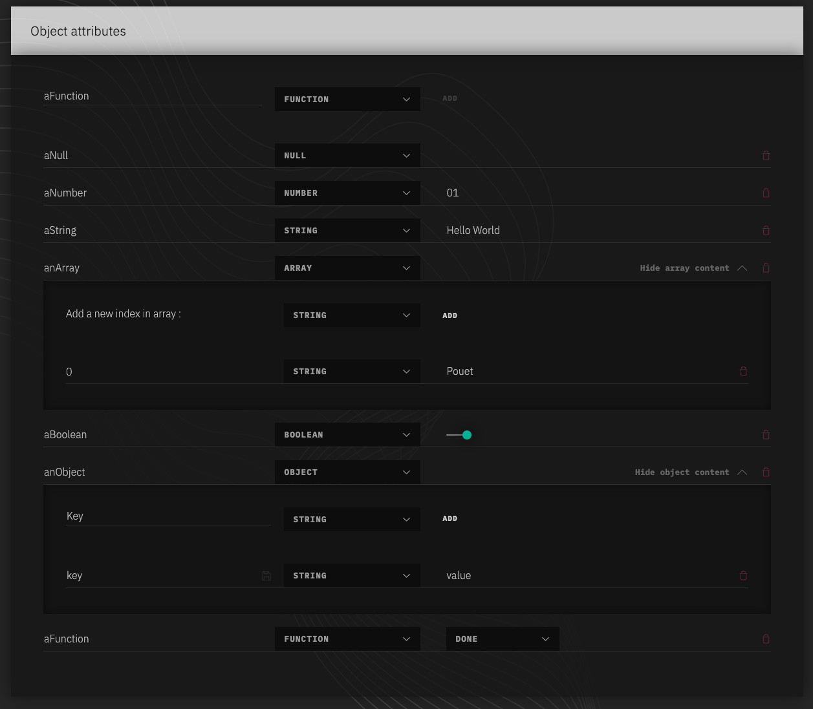
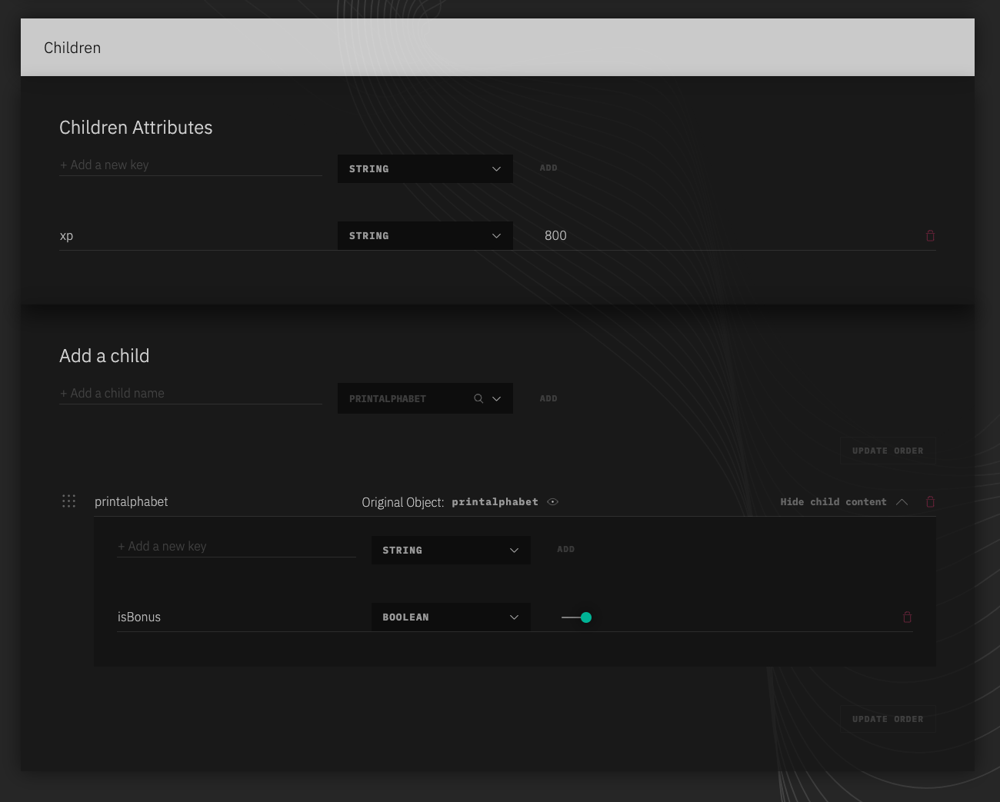
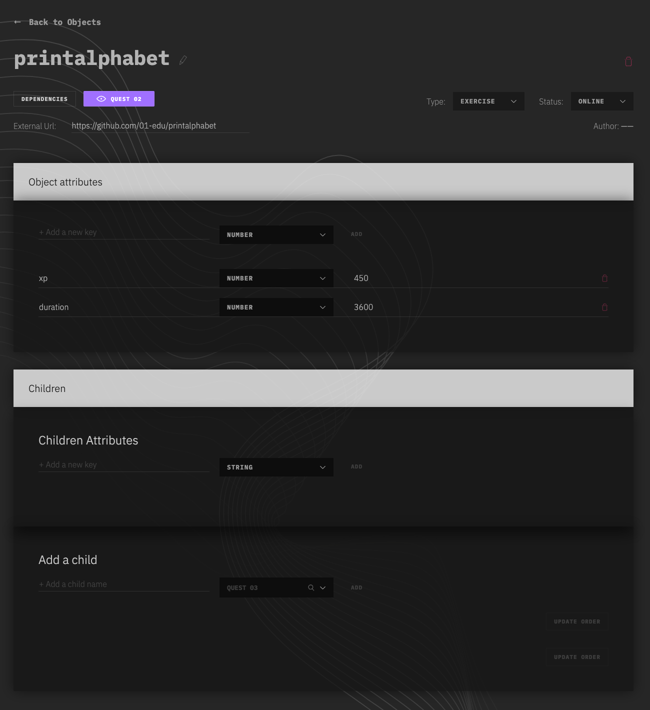

# Object Attributes System

> This document cover two notions, the edition of attributes and the impact it has relatively to the others Objects.

## Edition of Attributes

> There is no limit to how many attributes can be defined to an Object.

In the "Object Attributes" section of the "Object Edit" Page, the first row is a form to create and append a new attribute. It requires two elements, the name of the attribute and its type (`String`, `Number`, `Boolean`, `Array`, `Object`, `Function`, `Null`). Click 'Add' to create the attribute.

> Within a same Object, each attribute's name must be unique.

Once created, the new attributes appears right bellow and the ability to associate a value to it is now available. Depending on the type of the attribute, the interface will vary.

- String value input is type String.
- Number value input is type Number.
- Booleans value input appears as a switch, true by default.
- Arrays and Objects content are hideable / showable via the "Show/Hide content" button on the right of the attribute. There is no limit on the depth of Object/Array, however, after a certain level, the interface will start to feel narrow.
- String value input is type String.
- Null will not display any input.
- Function will offer to select from all available functions, save on select.

Any attribute can be delete by clicking on the 'trash' icon on the right hand of it.

Here an example of how the section looks like.


## Attributes and RelationShips

When an attributes is set to an Object, other Objects, associated to this particular Object, will have access to it. Which means that, if an Object A is added as a child of an Object B, A will embed its attributes within the instance of B.

Object's attributes follow a hierarchy when associated to an other Object.
The **defaults attributes** of a child, the ones defined in the original Object are the weakest ones. A **children attribute** is applied to all the children and override the default attributes. Finally, **relation attribute** is the strongest one, it override Default Attributes and Children Attributes.

When an object and its relationship are resolved, the three structures (`attrs`, `childrenAttrs`, `childAttrs`) are merged.

The following json shows how the object would be represented:

```json
{
  "children": {
    "printalphabet": {
      "duration": 3600,
      "xp": 800,
      "isBonus": true
    }
  }
}
```

Children


Child


## Detailed example

Let's create a few `exercises` objects

> swap

```js
{
  "id": 12344,
  "title": "swap",
  "attrs": {
    "language": "go",
    "duration": 7200
  }
}
```

> printalphabet

```js
{
  "id": 12345,
  "title": "printalphabet-v2",
  "attrs": {
    "language": "go",
    "duration": 3600
  }
}
```

We can now create a parent object that will reference them and link them.

This allow you to specify the structuration of your pedagocial content.

I'll make a quest that regroup those 2 exercises:

> quest-03

```js
{
  "id": 12346,
  "title": "quest-03",
  "attrs": {},
  "childrenAttrs": {
    "xp": 800,
    "duration": 4800,
  },
  "children": {
    "printalphabet": {
      "ref": 12345,
      "index": 0,
      "attrs": {
        "duration": 7200
      }
    },
    "swap": {
      "ref": 12344,
      "index": 1,
      "attrs": {}
    }
  }
}
```

All done, now when rendering an object, attributes are merged like so:

> rendered quest object

```js
{
  "id": 12346,
  "title": "quest-03",
  "attrs": {},
  "children": {
    "printalphabet": {
      "ref": 12345,
      "index": 0,
      "attrs": {
        "language": "go",
        "xp": 800,
        "duration": 7200
      }
    },
    "swap": {
      "ref": 12344,
      "index": 1,
      "attrs": {
        "language": "go",
        "xp": 800,
        "duration": 4800
      }
    }
  }
}
```

First we apply the **default attributes** from the referenced object.
> Here `duration` and `language` are applied.

Then we apply the **children attributes** to every child.
> In this case we override every `duration` to 4800 and add the new `xp` attribute.

After that we apply the **relation attributes**, that are the most specific and as such,
override all others attributes.
> In this case only the `printalphabet` relation had attributes and so we apply
the given `duration` to the final merged object.
