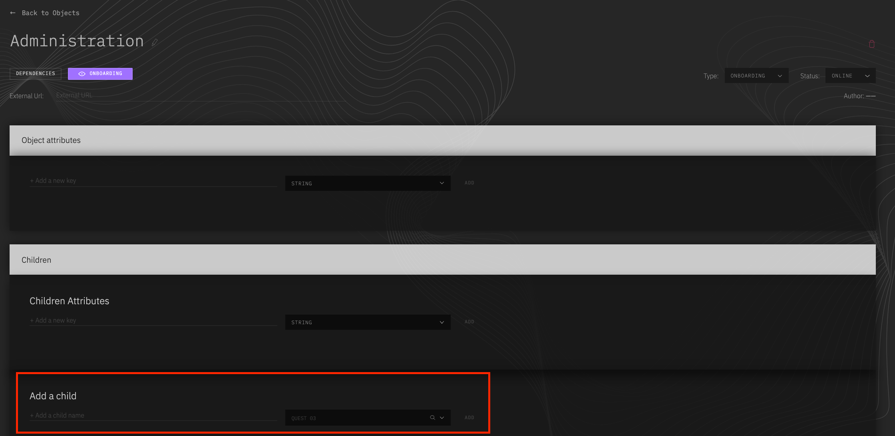

# Admin object's management - create a child object

## Usage

Objects of the Admin can be configured :

-   By setting particular **attributes** to the object
-   By associating **children** to the object

Children can be added, deleted, reordered in the list. Also, it's possible to configure it in a special way for the parent object, by setting children attributes for all the children.

This documentation explains how to associate a child to a parent object.

### Create a new object for your child in the admin

> Information is available for object's creation: [Object Creation](object-creation.md)

### Add this new object as a child of your parent's object

#### 1. Edit the parent object

#### 2. Go to _Children_ > _Add a child_

#### 3. Set up the new child:

-   Enter its name in the input "Add a child name"
-   Select your step object in the select input
-   Click on "ADD"

Your step is then related to its parent. You can see it in the _Children_ section of the parent's object. There, you can now:

-   Delete the child from its parent (the actual object of your child will not be deleted).
-   Reorder it in the children's list, by dragging it to the place you want.
-   Update its original settings by clicking on the eye icon of its reference (redirection to object edit page of the child).
    
