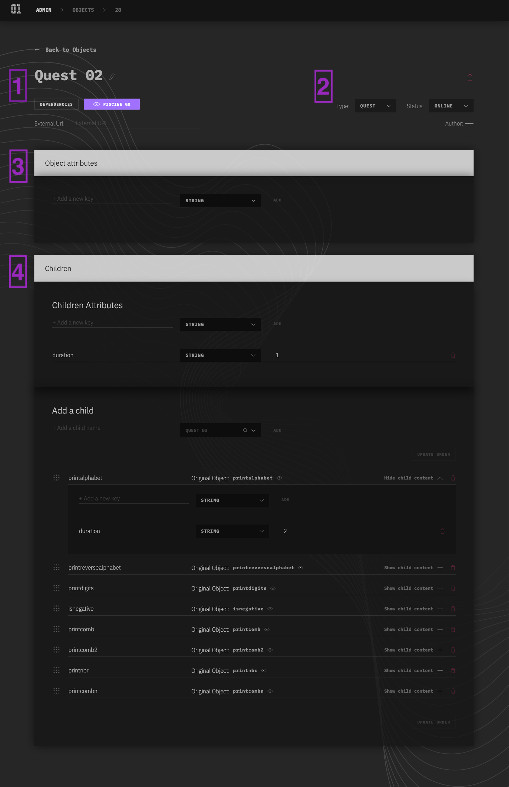

# Objects Edition

> Allow you to edit an object, see and manage its relations.

## Page Composition

### Pin 1

- Link back to the "Objects" page ;
- Editable name field, hit 'enter' or 'cmd + s' or click on the floppy-disk icon to save ;
- Major dependencies visualisation, (where my object is used as a child), click the label to navigate to the dependence ;
- External URL, this is an optional parameter, it's use to point at an other source of content or information needed by the object. We generaly use to point at a Git repository ;

### Pin 2

- Delete Button, Warning there, it will destroy your object! ;
- Type of your Object (`organisation`, `campus`, `onboarding`, `cursus`, `quest`, `exercise`), save on select ;
- Status of your Object (`draft`, `online`, `offline`), save on select ;
- The first and last name of the original author ;

### Pin 3

- Object Attribute edition area, manage all the attributes relative to this Object. These attributes will be exposed to its relationship ;

### Pin 4

- Object Children edition area ;
- Children Attributes edition area, these attributes impact and overload all the following children. Works the same way as standard attributes ;
- Add a child, allows to add a child to the children list, more information here -> [Object Child creation](object-child-creation.md) ;
- Children List, allows you to reorganise, delete and edit child. Each child can be overload with its own attributes, the edition works the same way as the original attributes ;

More informations about attribute overload system [here](object-attribute-system.md)
