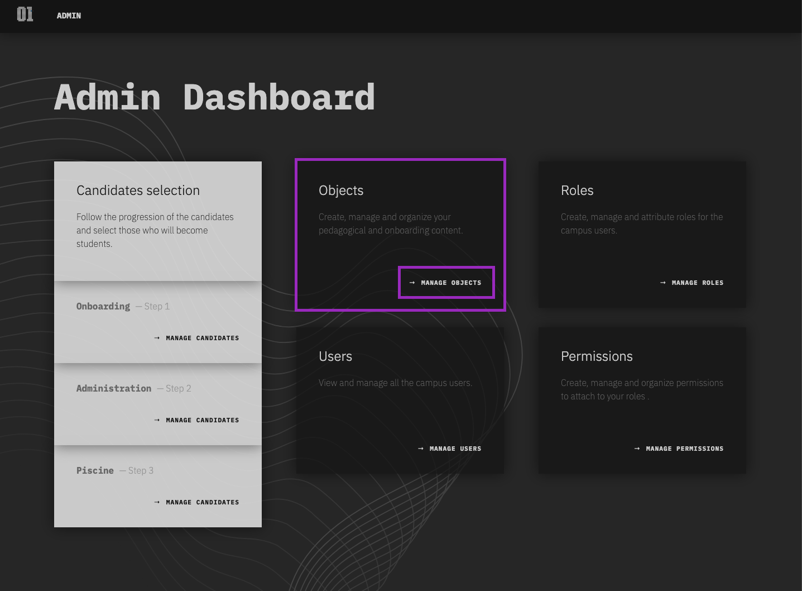
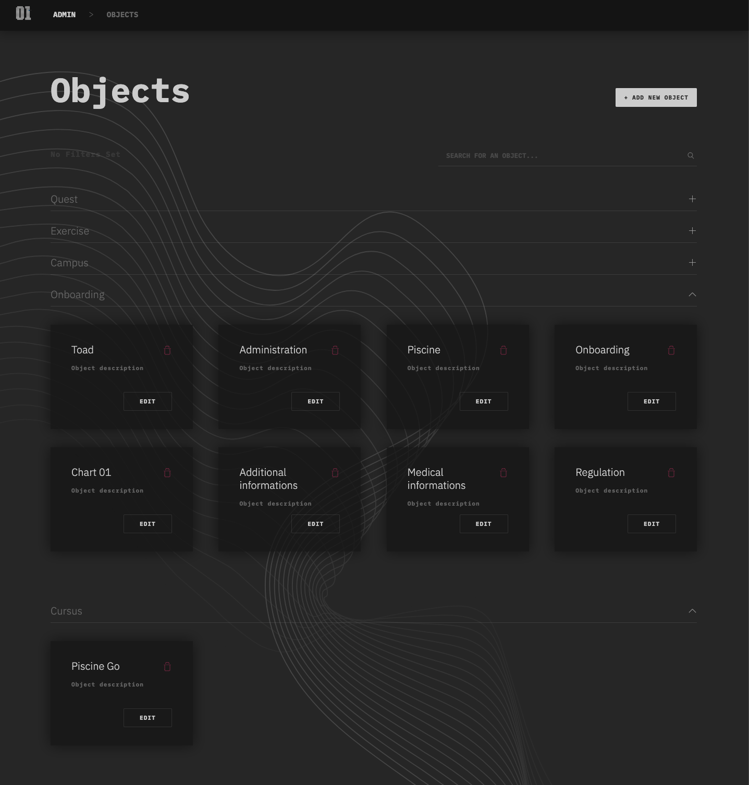

# Objects

> Allow you to create, manage and organize your pedagical and onboarding content.

## Definition

An Object is an highly customizable element, which can be use in many situations. We use it to compose cursuses and onboarding processes.
Objects can be associated together and then share a vertical or horizontal relationship, which allows to build complex structure of multiple objects.

It structure can be visualized in two parts. The first one is the definition of the object itself and attributes, called `attrs`. The second part is the definition of minor relationships, called `children` and attributes applied to them, called `childrenAttrs`.

This is the minimal structure of an object:

-   name
-   type (`organisation`, `campus`, `onboarding`, `cursus`, `quest`, `exercise`)
-   status (`draft`, `online`, `offline`)
-   attrs {}
-   childrenAttrs {}
-   children {}

## Browse Objects:

To access your Objects, go to the admin dashboard and then click on the _manage object_ link within the "Object" card.

Objects are sorted by type in different sections. This page offer a search bar that allow you query the objects by name. In the top-right corner, click the _add a new object_ button to create a new object. Fill a name, select a type and click _create_ to validate your creation. You will be redirected to the Object Edition page (document is here).

