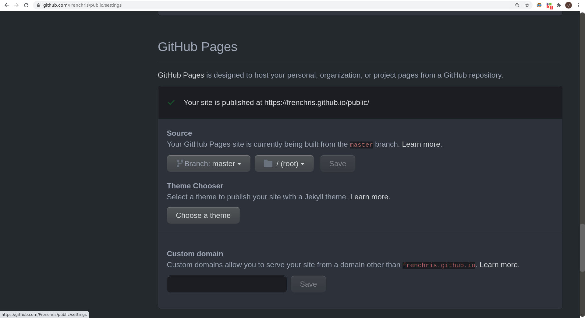
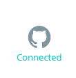
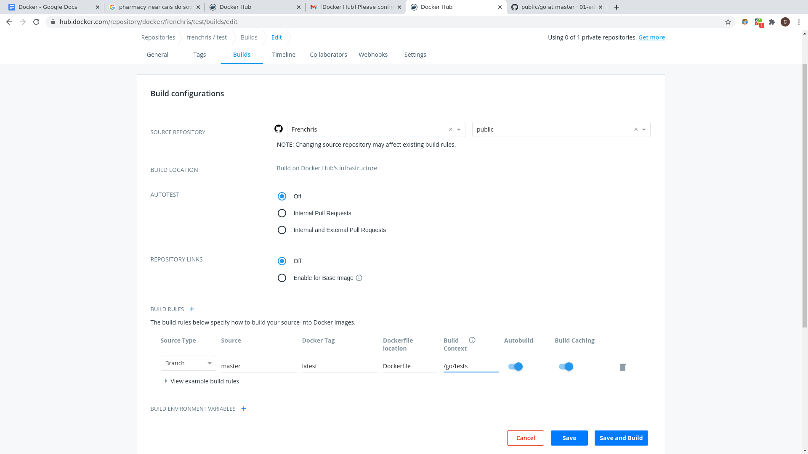

# Addition of repository procedure

## Introduction

This document is a guide on how to add your own repository to store your projects and exercises.
This guide assumes that you have understood the files structures of the repository [public](https://github.com/01-edu/public).
It will only address the settings part of this task.
The addition of projects will be treated first as it does not require the knowledge of Docker.

However being familiar with Docker is **mandatory** for adding your own exercises with your own tests.

## Prerequisites

- A GitHub account where your exercises repository will be stored [https://github.com](https://github.com)
- A Docker Hub account [https://hub.docker.com](https://hub.docker.com)

## Setup of GitHub repository

### Create your own public repository

Once logged into your GitHub account, click on the creation of new repository:
It is the button `New` (the button is on the top corner right side).

### Git clone your repository and prepare an example for the folder structure for projects

- Create a folder called `subjects`.
- Inside this folder create a folder called what you wish (example: `firstproject`).
- Inside the folder `firstproject` create a `README.md` file which you will use as the subject content of your first project.
- After the subject content `README.md` is created, create a folder `audit` inside the `firstproject` directory.
- Inside the `audit` folder create a `README.md` that respect the audit type of file. We advise you to take an example such as the
  ascii-art audit `README.md` file. Here is the [link](https://raw.githubusercontent.com/01-edu/public/master/subjects/ascii-art/audit/README.md) to the raw file.
- Once all those files are done, git push them to your new repository.

### Publish the repository on GitHub pages

- Go to the settings tab of your projects repository.
- On the option page find the GitHub Pages section.
- Please see below the settings to follow.
  (Please not that it might take up to 10 mins for your page to be published)

- You will notice that a message says Your site is published at “https://yourgithublogin.github.io/nameofyourrepo”

### Configuration of Docker image (if exercises tests need to be added)

The container runs with the following settings (options of `docker run`) :

- `--read-only`
  - Mount the container's root filesystem as read only
- `--network none`
  - Connect a container to a network without Internet
- `--memory 500M`
  - Memory limit
- `--cpus 2.0`
  - Number of CPUs
- `--user 1000:1000`
  - Username or UID (format: <name|uid>[:<group|gid>])
- `--env EXERCISE=hello-world`
  - Exercise name
- `--env USERNAME=aeinstein`
  - Student's login
- `--env HOME=/jail`
  - Home directory of the container
- `--env TMPDIR=/jail`
  - Temporary directory of the container
- `--workdir /jail`
  - Working directory inside the container
- `--tmpfs /jail:size=100M,noatime,exec,nodev,nosuid,uid=1000,gid=1000,nr_inodes=5k,mode=1700`
  - Mount a tmpfs directory on `/jail`, 100 MB writable.
- `--volume volume_containing_student_repository:/jail/student:ro`
  - Bind mount a volume containing the student repository.

Example of a [Dockerfile](https://github.com/01-edu/public/blob/master/js/tests/Dockerfile) and its [entrypoint](https://github.com/01-edu/public/blob/master/js/tests/entrypoint.sh).

## The addition of a custom project

**Take note of the paths of a project subject you added and add them to the attributes**

Example:
If user Frenchris, added an exercise to the nameofyourrepo called `firstproject`
This is the path where the README.md subject would be.
https://frenchris.github.io/nameofyourrepo/subjects/firstproject/

Note that you do not keep the README.md at the end of the path but you do keep the `/`.

This path should be added to the attribute “subject” of type string in the object attribute of the new exercise.

Additionally the README.md audit path would be.
https://frenchris.github.io/nameofyourrepo/subjects/firstproject/audit/

This path should be added to the attribute “subject” of type string in the object attribute of the new exercise.

- Once both those path are noted, create your project on your server.
- Add the regular attributes (`groupMin`, `groupMax`, `language`, `exerciseType`).
- Add the optional attributes to test if your wish (`auditsRatio`, `auditsRequired`) both set to 1.
- And add the `audit` and `subject` attributes (of type `string`) with the previously noted paths.

  Now that the attributes are filled.

- Create a module, called `Div-custom` for example. Add its standard attributes.
- Add `firstproject` as a child to `Div-custom`.

**Note**: If you do not wish students from other events to be selected for matches in this new event.
in the children attributes of the module,

- Add `matchWhere` as a `FUNCTION`.
- Set its value to `USERINEVENT`.
  This attribute will isole the event during matches to the user of the event.
- Add this `Div-custom` as a child in your campus object.
- Go to event, and launch the event `yourcampus/Div-custom`.
- Add yourself and other testing accounts to the newly launched event.
- Test your subject by creating a group and launching an audit
  If the paths are correctly inputed and your repository is correctly publicly published on GitHub pages, you will see your subject and your audit in the platform.

## Setup of your Docker repository

1. Sign in your Docker Hub account and link it to your repository.
2. In your account, go to your settings and link your GitHub account.
3. Create a repository named “test” and make sure that your GitHub account is linked.
   If you see this image,
   
   It means your GitHub account is correctly linked.
4. In the Builds tab configure the automated build settings as below (for the go tests).
   
5. Once the build is complete (it can take 5 to 15 mins). Go back to the attributes of the exercise:
   - Add the attribute **testImage (type string)**.
     The `testImage` attribute is the name of the [Docker](https://docs.docker.com/get-started) image used to run the container responsible for testing the student's code.
   - Fill it with the name of the repository,
     **in this example: frenchris/test**
6. Once your exercise has both the attributes completed correctly, the exercise is viable and can be tested on the server which was selected for its addition.
7. As a reminder to test the exercise it is suggested to follow these steps:
   - `Create` a custom `Quest-test` object
   - `Adding` the new `exercise` object as a child to the newly created `Quest-test` object
   - `Create` a `Piscine-test` object
   - `Adding` the new `Quest-test` as a child to the newly created `Piscine-test` object
   - `Adding` the `Piscine-test` to the `campus` object as **first child**
   - Go to the event page and launch the newly created `Piscine-test`. (You may need to refresh the page 2-3 times before the `campus/Piscine-test` option appears)
   - Once the event is launched, use the event page to add yourself as a student in the launched event `Piscine-test`
   - You can now try the exercise. If everything is well set, the subject should be loaded and, when you submit a correct solution, the exercise should pass.
