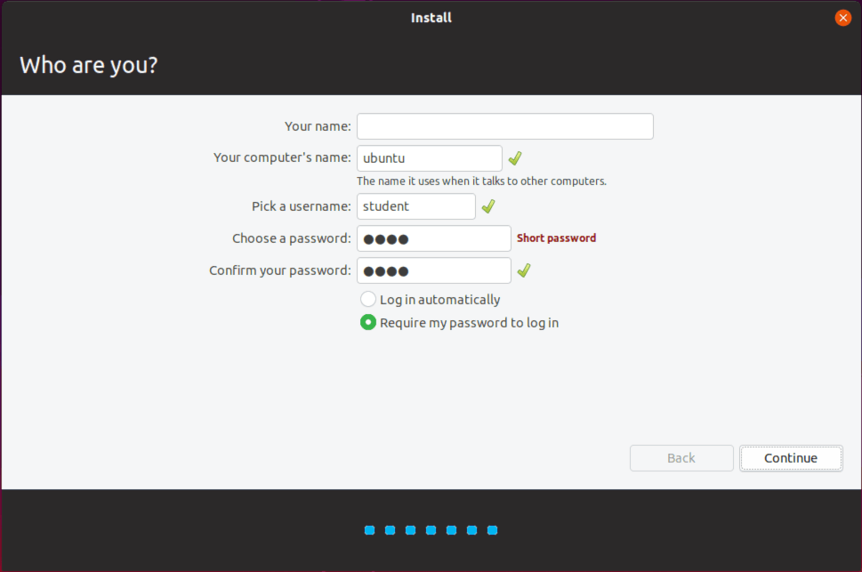
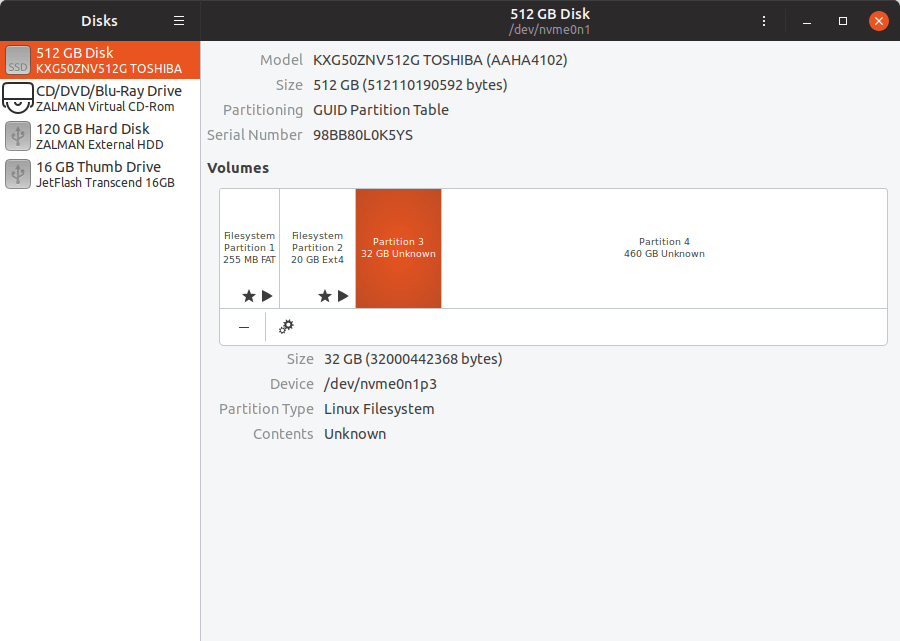
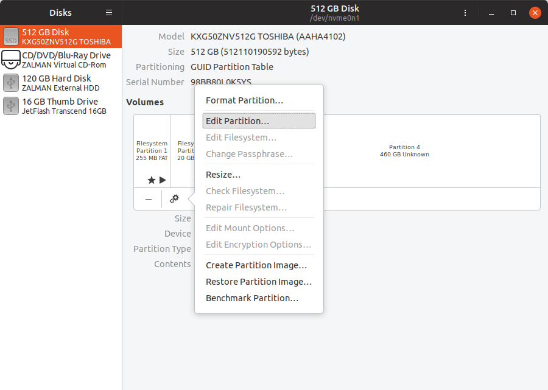
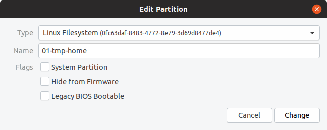

# Ubuntu

## OS Installation

Download and boot the [last Ubuntu release](http://releases.ubuntu.com/19.04/ubuntu-19.04-desktop-amd64.iso).

Follow the steps :


The partitioning is :

1. 256 MB : EFI partition
2. 20 GB : system partition
3. 32 GB : unused partition (will be used later)
4. rest : unused partition (will be used later)




Remove the installation disk and then reboot.

Skip the welcoming window.

Don't install updates if Ubuntu asks to. The scripts will.

Start the disk utility to name partitions so that OverlayFS can identify them.

3. 32 GB - **Partition 3** : `01-tmp-home`
4. rest - **Partition 4** : `01-tmp-system`

The same procedure is required to make USB disk usable for the students, the partition name must be : `01-home`





## OS configuration

```shell
student@tmp-hostname:~$ wget github.com/01-edu/public/archive/master.zip
student@tmp-hostname:~$ unzip master.zip
student@tmp-hostname:~$ cd public-master/scripts
student@tmp-hostname:~$ sudo ./install_client.sh
[...]
Ask for student user password (will be removed later)
[...]
Ask to set the root password
[...]
Long installation/configuration process
[...]
student@tmp-hostname:~$ cat dconfig.txt | dconf load /
student@tmp-hostname:~$ reboot
```

The system is now read-only, every data is written to a temporary partition.

The session is password-less.

To gain a superuser terminal with read/write access to the filesystem, type these commands:

```shell
student@tmp-hostname:~$ su -
Password:
root@tmp-hostname:~# overlayroot-chroot
```
