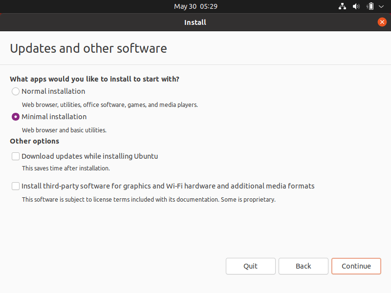
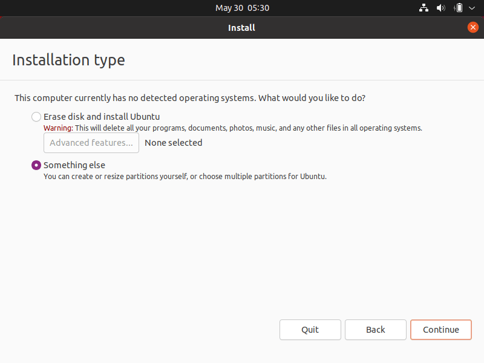
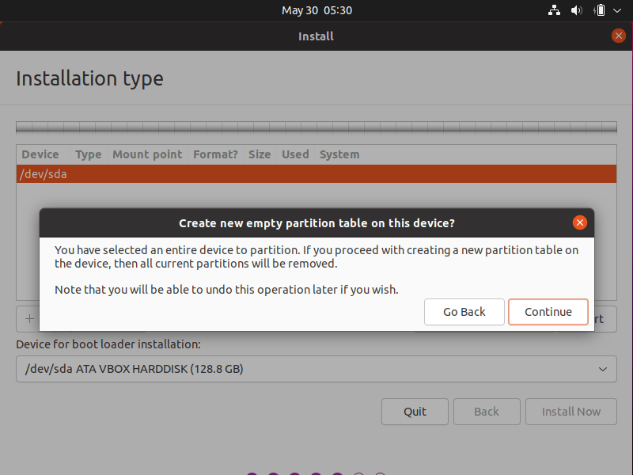
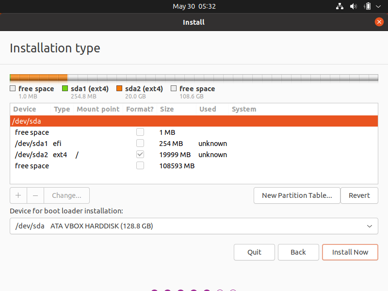
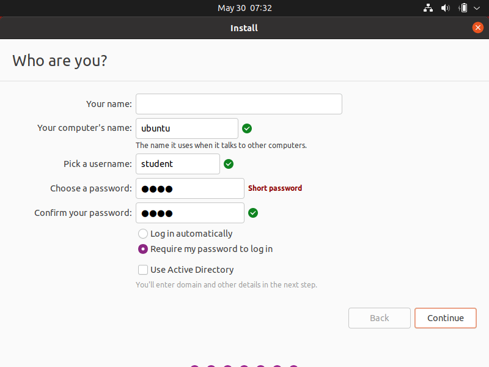

# Ubuntu

## OS Installation

Download and boot the [latest Ubuntu release](https://releases.ubuntu.com/21.04/ubuntu-21.04-desktop-amd64.iso).

Follow the steps with these customizations:





The partitioning is:

1. 256 MB : EFI partition
2. 20 GB : system partition




Remove the installation disk and then reboot.

Skip the welcoming window.

Don't install updates if Ubuntu asks to. The scripts will.

## Admin access

This is optional but you can add your public SSH key to access the administrator account later:

```shell
unset HISTFILE
sudo mkdir /root/.ssh
wget github.com/xpetit.keys
cat xpetit.keys | sudo tee /root/.ssh/authorized_keys
sudo chmod 400 !$
rm xpetit.keys
```

## OS configuration

Run a terminal and type these commands:

```shell
unset HISTFILE
sudo apt -y install git
git clone https://github.com/01-edu/public.git
public/sh/debian/ubuntu/setup.sh
```

The script will ask for student user password (which will be deleted after) and then after a long configuration process it will restart the computer.

The system is now read-only, every data is written to a temporary partition.

The session is password-less.

To gain a superuser terminal, use SSH:

```console
user@remote:~$ ssh -p512 root@IP_ADDRESS
```

To gain access with read/write access to the filesystem, use this command:

```console
root@ubuntu:~# overlayroot-chroot
INFO: Chrooting into [/media/root-ro]
root@ubuntu:/#
```
