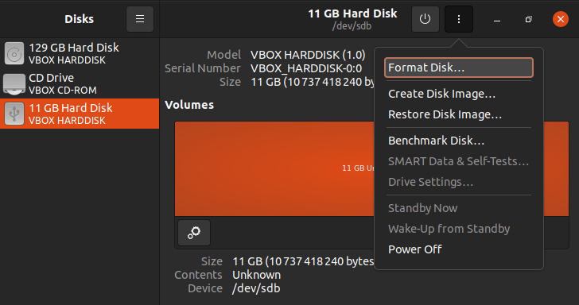
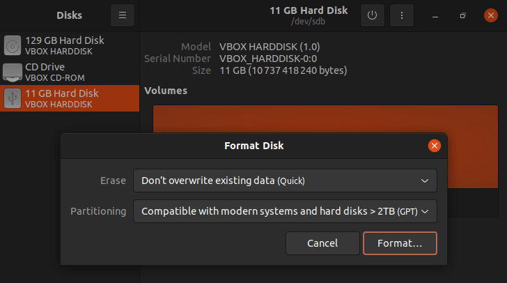
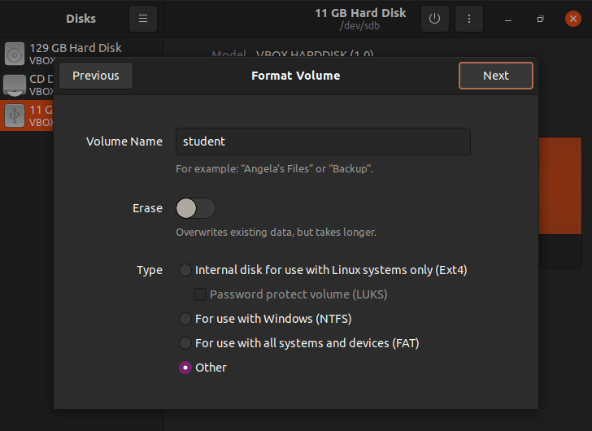
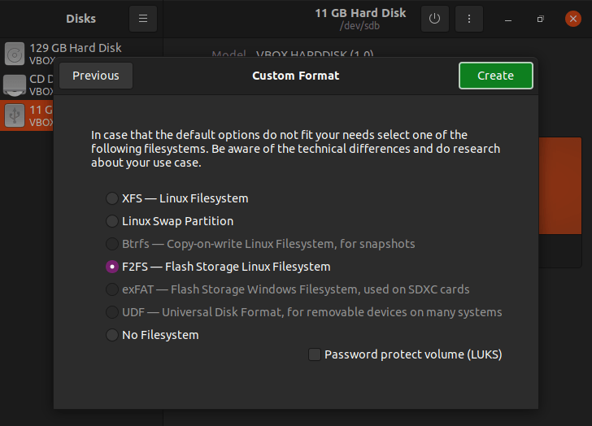
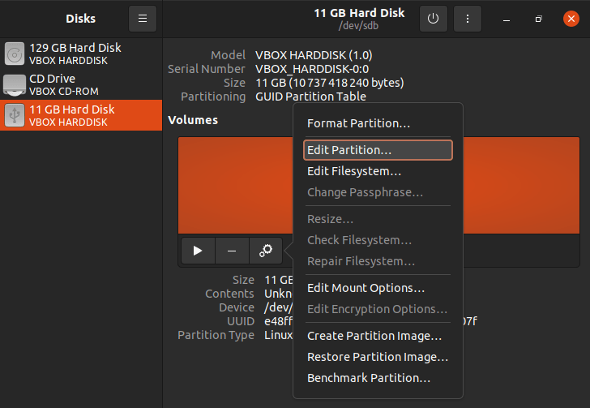
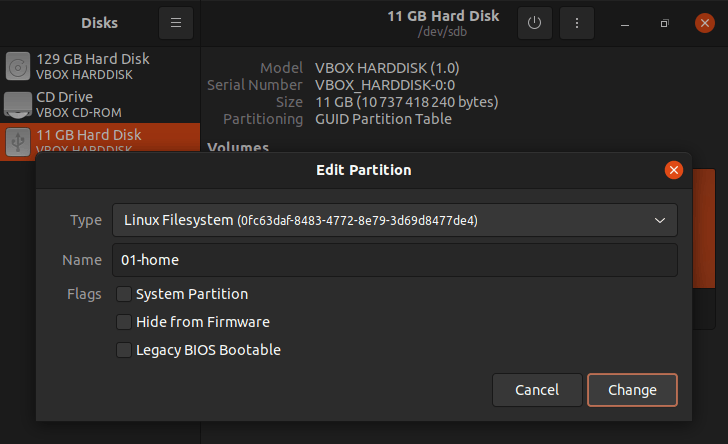
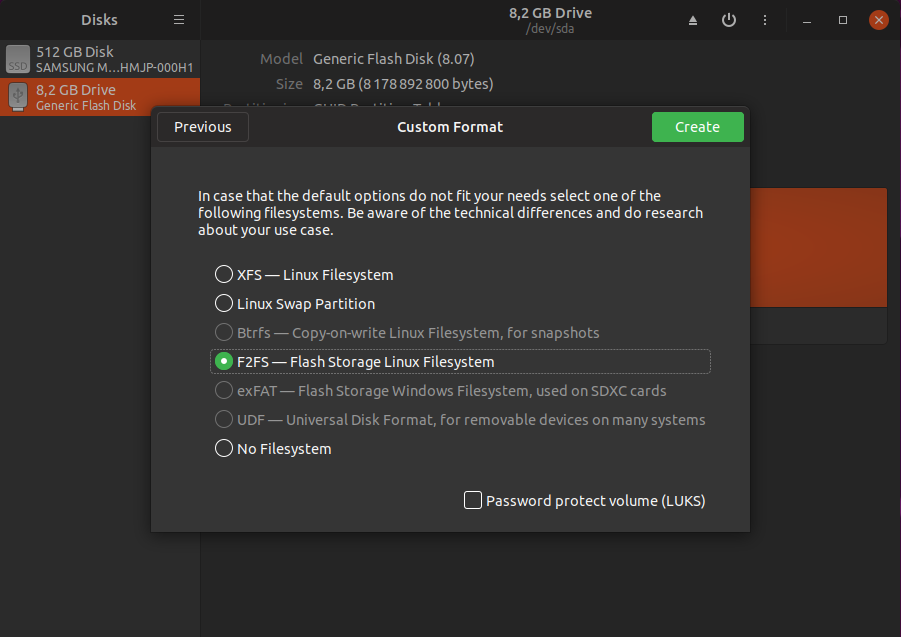
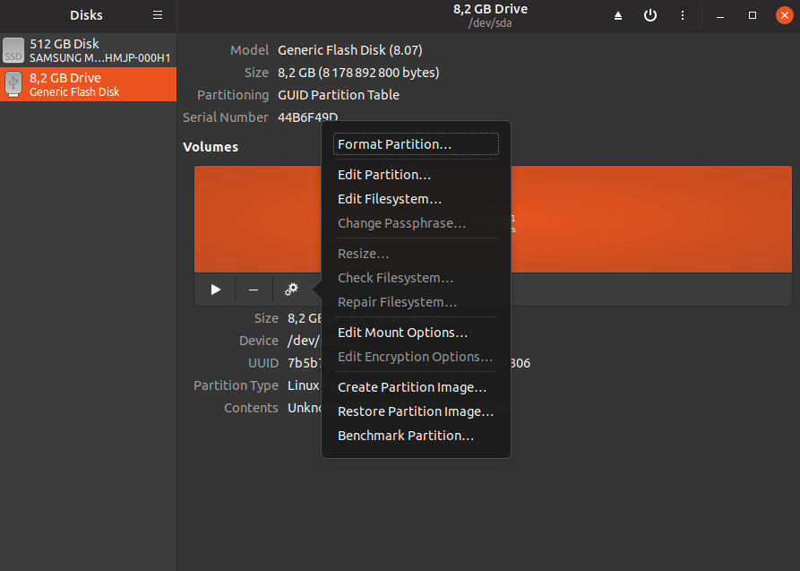
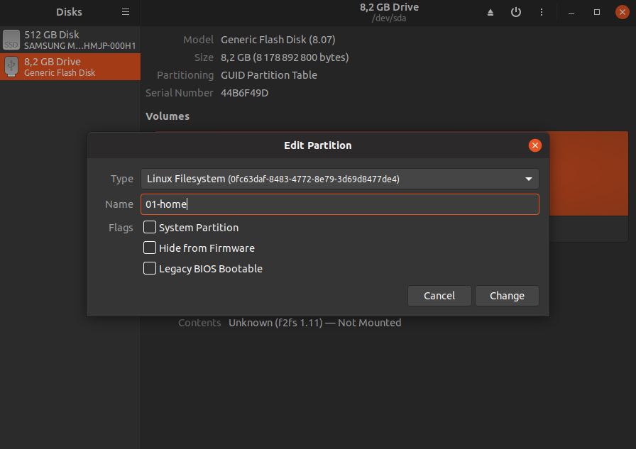

# USB CONFIGURATION

Requirements :

1. 32 GB
2. interface type: 3.0

Follow the steps :

> Execute the "disks" program

> Choose the usb drive to configure and press format disk

> Choose "Compatible with modern systems and hard disks > 2TB(GPT)"

> Create new partition (size == all memory)

> Volume name: any
> Erase: none
> Type: other

> Choose F2FS

> Format created partition

> The new name must be 01-home

