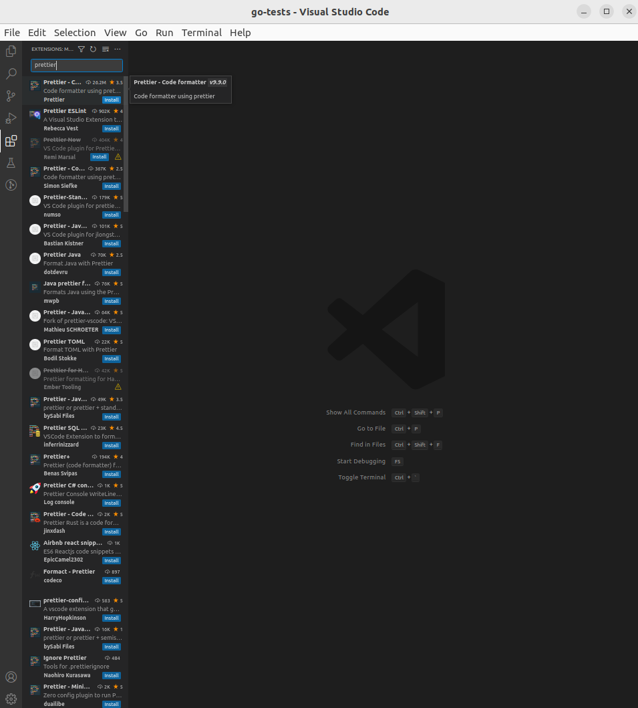
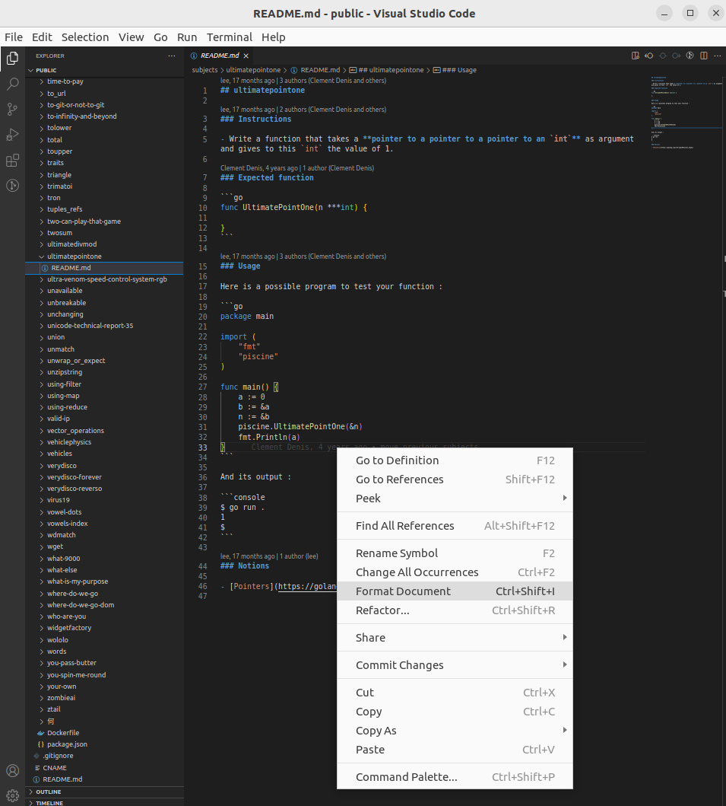
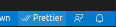

### Format with Prettier

In order to have a consistent formatting for the markdown files, we use Prettier with the default settings.

### How to install

In VS Code, click on the extensions icon, and type Prettier. It should be the first result of the search. Click on install.

### Usage

After installing it, one way of using it is to right click the view of the file you want to format and click on format document. If you have other formatters/linters installed, you will be prompted to select which one you want to use.

An alternative way is to press `ctrl + shift + i`, but this might vary depending on your local settings.

When the document is formatted, you should be able to see the Prettier text with the double tick on the bottom right corner of your window as in the image. If you only see one, another way to run it is by clicking on the `Prettier` text.

For instructions on how to set up Prettier in other code editors, or for setting up the CLI tool, please check the [official docs](https://prettier.io/docs/en/install.html)
