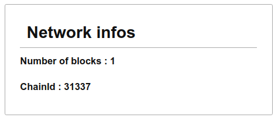

## Connect Interface

_Any problem in computer science can be solved with another layer of indirection. But that usually will create another problem. - David Wheeler_

Today we will learn how to create basic interfaces. All those exercises consist in a single HTML page with Javascript. You will need an Ethereum JavaScript Library, ethers.js and web3.js should be suitable.

## Content

### Mandatory

1. `Local Node Info`
2. `Random Wallet`
3. `Donation`
4. `Connect To MetaMask`
5. `Tip`

### Optional

6. `Read a Secret`

## Integration

In this Quest, tests can be run with

```sh
npm i
npx hardhat node
npx mocha <exercice>.test.js
```

---

---

## Exercise 1: Local Node Info

To start, we will create a simple page that displays basic information from our local node.

### Instructions

Create a web page, `localNodeInfo.html` that loads an ethereum library, connects to a local node at `http://localhost:8545` and displays basic information :

- In an element with (`id`=`chainId`), the number ID of the current network
- In an element with `blockNumber` as `id` the number of blocks in the chain



### Hint

You can use any library such as `ethers.js` or `web3.js` to connect to your local node.

Automated tests check for elements with specific IDs, the design is up to you.

Minimal structure:

```HTML
<!DOCTYPE html>
<body>
  <span id="chainId"></span>
  <span id="blockNumber"></span>

  <script src="XXX"></script>
  <script type="module">
    // Your code
  </script>
</body>
</html>
```

### Notions

- [ethers Provider transaction-methods](https://docs.ethers.io/v5/api/providers/provider/#Provider--network-methods)
- [web3](https://web3js.readthedocs.io/en/v1.3.4/web3-eth.html)

---

---

## Exercise 2: Random Wallet

You will have to create a simple web-based wallet.

### Instructions

- Create a web page, `randomWallet.html` that loads an ethereum library and connects to a local node `http://localhost:8545`.
- When loaded the page generates a new wallet.
- The address of the wallet is displayed in an HTML element with id `address`.
- The balance of this address is displayed in an HTML element with id `balance`.
- A button, with id `refreshBalance` refreshes the balance.


### Hint

You might need to send Ether from one of the default accounts of your local node to test the wallet. You could use the `send ether` exercise from the prior quest.

### Notions

- [ethers : wallet](https://docs.ethers.io/v5/api/signer/#Wallet)
- [web3 : accounts](https://web3js.readthedocs.io/en/v1.3.4/web3-eth-accounts.html)

---

---

## Exercise 3: Donation

We will use a new wallet to send t donation

### Instructions

Create a web page, `donation.html` that loads an ethereum library and connects to a local `http://localhost:8545`.

When loaded, the page generates a random wallet. The page should display the address of the wallet inside an element with id `address` and the balance of this address inside an element with id `balance`.

Additionally, the page contains:

- an input field (id:`amount`)
- a button (id:`donate`)

Pressing this button should send the amount inputted to the address `0x837F324FF70AD9AE4B71084c941c23dDF8371d60`.

```html
<input type="number" id="amount" /> <button id="donate">Donate</button>
```

### Hint

You will need to send ETH from the default accounts of the node to your random wallet.

### Notions

- [ethers : wallet](https://docs.ethers.io/v5/api/signer/#Wallet)
- [web3 : accounts](https://web3js.readthedocs.io/en/v1.3.4/web3-eth-accounts.html)

---

---

## Exercise 4: Connect To MetaMask

### Instructions

Create a web page, `connectToMetaMask.html` that :

- Loads an ethereum JavaScript Library. It should be the only JavaScript library.
- Contains a `Connect` button that triggers metamask to ask the user to connect an account.
- Once connected, the page displays :
  - the address of the account
  - the balance of this account
- Contains a button `Refresh balance` that refreshes the balance.

**Note on vocabulary** :

A **wallet** is an object or a software that contains private keys and allows the user to sign them.
An **account** is, on Ethereum, a particular address with an associated private key.

Most **wallets**, like MetaMask, can manage several **accounts**, often stemming from the same cryptographic **seed**. However, please be aware that some software use interchangeably accounts and wallets.

### Notions

- [ethers : connecting to MetaMask](https://docs.ethers.io/v5/getting-started/#getting-started--connecting)
- [MetaMask : getting started ](https://docs.metamask.io/guide/getting-started.html)

### Relevance

We use a common wallet.

---

---

## Exercise 5: Tip

### Instructions

Create a web page, `tip.html` that contains a `Connect` button that triggers a MetaMask window that asks the user to connect an account. Once connected, it displays the address of the wallet.

Additionally, the page contains:

- an input field (id:`address`)
- a button (id:`tip`)

Pressing on the button send the amount of 0.001701 ETH to the address in the input field.

### Notions

- [ethers : connecting to MetaMask](https://docs.ethers.io/v5/getting-started/#getting-started--connecting)
- [MetaMask : getting started ](https://docs.metamask.io/guide/getting-started.html)

---

---

## Exercise 6: Read a Secret (Optional)

### Instructions

Create a web page, `readSecret.html` that loads an ethereum library, connects to ethereum testnet `kovan` and displays a secret contained in a smart contract.

The smart contract is available at the address `0x27c8dda37a22a29cb78320bf5e1c81ca087b2f8e` on Kovan testnet. It contains one function `getSecret()` that returns a string.

You might use the following interface :

```js
const abi = ["function getSecret() view returns (string)"];
```

### Notions

- [ethers contract](https://docs.ethers.io/v5/api/contract/contract/)
- [Infura](https://infura.io/)
- [Alchemy](https://www.alchemy.com/supernode)
- [web3](https://web3js.readthedocs.io/en/v1.3.4/web3-eth.html)

### Relevance

Reading your first smart contract.
