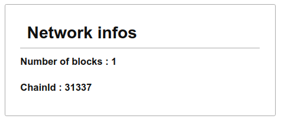

## Local Node Info

To start, we will create a simple page that displays basic information from our local node.

### Instructions

Create a web page, `localNodeInfo.html` that loads an ethereum library, connects to a local node at `http://localhost:8545` and displays basic information :

- In an element with (`id`=`chainId`), the number ID of the current network
- In an element with `blockNumber` as `id` the number of blocks in the chain



### Hint

You can use any library such as `ethers.js` or `web3.js` to connect to your local node.

Automated tests check for elements with specific IDs, the design is up to you.

Minimal structure:

```HTML
<!DOCTYPE html>
<body>
  <span id="chainId"></span>
  <span id="blockNumber"></span>

  <script src="XXX"></script>
  <script type="module">
    // Your code
  </script>
</body>
</html>
```

### Notions

- [ethers Provider transaction-methods](https://docs.ethers.io/v5/api/providers/provider/#Provider--network-methods)
- [web3](https://web3js.readthedocs.io/en/v1.3.4/web3-eth.html)
