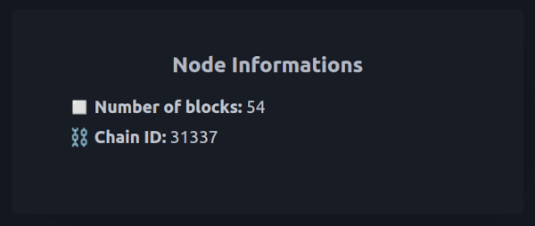

## Local Node Info

To get started, we will create a simple web page that displays basic information from our local node.

### Instructions

Create a web page called `localNodeInfo.html` that does the following:

1. Loads an Ethereum library, such as `ethers.js` or `web3.js`.
2. Connects to a local Ethereum node at `http://localhost:8545`.
3. Displays the following information on the page:
  - The ID of the current network in an element with `chainId` as `id`.
  - The number of blocks in the chain in an element with `blockNumber` as `id`.




### Hint

🚫 Please be aware that the test environment restricts internet access for security reasons. Therefore, you need to download the library  and import it locally. 

🎨 Automated tests only check for the content of elements with specific IDs; the rest of the design is up to you.

🎁 Here is a minimal example structure for the HTML file:

```HTML
<!DOCTYPE html>
<body>
  <span id="chainId"></span>
  <span id="blockNumber"></span>

  <script src="./XXX"></script>
  <script type="module">
    // Your code
  </script>
</body>
</html>
```

### Notions
- [ethers Provider transaction-methods](https://docs.ethers.io/v5/api/providers/provider/#Provider--network-methods)
- [web3 providers](https://docs.web3js.org/guides/web3_providers_guide/)