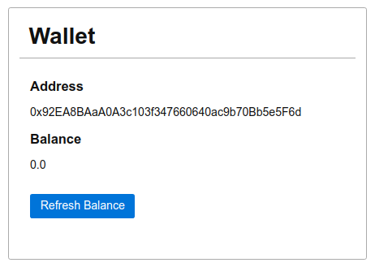

## Random Wallet

You will have to create a simple web-based wallet.

### Instructions

- Create a web page, `randomWallet.html` that loads an ethereum library and connects to a local node `http://localhost:8545`.
- When loaded the page generates a new wallet.
- The address of the wallet is displayed in an HTML element with id `address`.
- The balance of this address is displayed in an HTML element with id `balance`.
- A button, with id `refreshBalance` refreshes the balance.

### Hint

You might need to send Ether from one of the default accounts of your local node to test the wallet. You could use the `send ether` exercise from the prior quest.

### Notions

- [ethers : wallet](https://docs.ethers.io/v5/api/signer/#Wallet)
- [web3 : accounts](https://web3js.readthedocs.io/en/v1.3.4/web3-eth-accounts.html)
