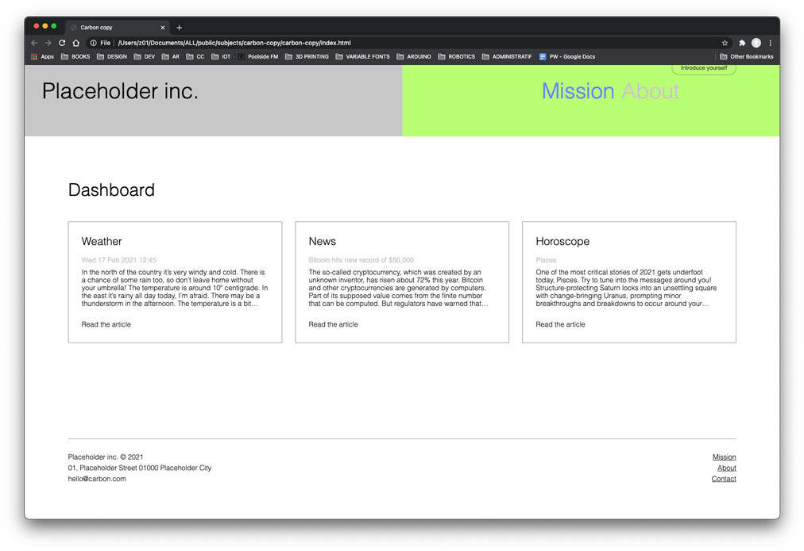
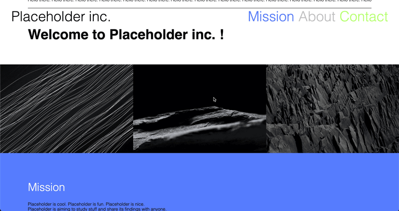
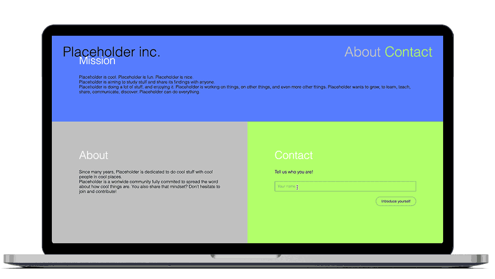
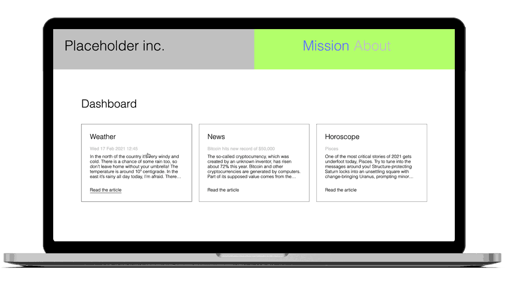

## Carbon copy

### Instructions

Today is a big day: you're gonna make your own webpage. Like a boss, yes.
If that one already sounds scary to you, don't worry, we've got your back ; you'll be provided some assets to complete this task.

The goal of this raid is to make a carbon copy of this webpage template:

Feel free to replace (or not, if you're lazy) the text contents by things about you / your company / your organisation / your dog / anything you want to talk about. Just try to approximatively match the same amount of content, so it still looks visually similar to the placeholder version.

The raid is divided in 3 phases:

- pure HTML structure
- custom CSS style
- JS interactions

#### Phase 1: HTML only (mandatory)

Create & write the HTML file `index.html` to build the structure of the page.
For this phase, we provide you a CSS file (`styles.css`) that you just have to [link](https://developer.mozilla.org/en-US/docs/Web/HTML/Element/link) to your `index.html`, meaning you won't need to style anything. However, you can do it from scratch and write yourself the whole CSS if you feel up to it.

Here is a [wireframe](https://en.wikipedia.org/wiki/Website_wireframe) of the webpage, showing the HTML tags you have to use:

#### Phase 2: custom CSS (mandatory)

First of all, let's custom the color atmosphere of the webpage with your own taste: go to the CSS file `styles.css`, & replace the current blue & yellow to 2 new colors of your choice.

Now that the page is mainly built, you have to populate the "Dashboard" section with 3 new elements.

Those 3 cards have to display respectively one information with:

- a title
- a subtitle
- a text paragraph

For this phase, you'll have to make the whole HTML & CSS by yourself.

#### Phase 3: JS interactions (mandatory & optional)

If you made it until here pretty fast, now the fun will begin! You're gonna add a bunch of JS interactions to make things appear / disappear / change in the HTML & CSS by linking a JS [script](https://developer.mozilla.org/en-US/docs/Web/HTML/Element/script) to your `index.html`.

- Change the order of the pictures when clicking on the pictures' section, [toggling](https://developer.mozilla.org/fr/docs/Web/API/Element/classList) the pre-defined class `row-reverse` from the CSS file `styles.css`.

- In the Contact section, when clicking on the "Introduce yourself" button, get the text typed in the `input` and display it in the middle of the following sentence: "Nice to meet you _[put here the input data]_ 👋! Thanks for introducing yourself." Also, the `
`, `<input>` & `<button>` elements have to disappear after the button has been clicked.

- When clicking on a card, open a modale window that will show the whole article ; the modale will be closed either when clicking on a "Close" button, or when the "Escape" key is pressed.

- In the modale article, create a widget that allows to change the text alignment ; on click on `left` or `center` buttons, the layout changes to the chosen justification, and the selected option's `font-weight` becomes `bold` whereas the other becomes `light`.

- Warrior option: change the `header` text content to be a random quote every time the page is loaded. You can use this marvelous [Chuck Norris API](https://api.chucknorris.io/) to [fetch](https://developer.mozilla.org/en-US/docs/Web/API/Fetch_API/Using_Fetch) his most inspiring sayings and display them in your own page!

### Notions

- [HTML tags](https://developer.mozilla.org/en-US/docs/Web/HTML/Element)
- [CSS basics](https://developer.mozilla.org/en-US/docs/Learn/Getting_started_with_the_web/CSS_basics)
- [Css flexbox layout](https://developer.mozilla.org/en-US/docs/Web/CSS/CSS_Flexible_Box_Layout/Basic_Concepts_of_Flexbox) is always useful
- [Link a JS script](https://developer.mozilla.org/en-US/docs/Web/HTML/Element/script)
- [`classList` / `toggle`](https://developer.mozilla.org/fr/docs/Web/API/Element/classList)
- [`getElementById`](https://developer.mozilla.org/en-US/docs/Web/API/Document/getElementById) or [`querySelector`](https://developer.mozilla.org/en-US/docs/Web/API/Element/querySelector)
- [`textContent`](https://developer.mozilla.org/en-US/docs/Web/API/Node/textContent)
- [`style`](https://developer.mozilla.org/fr/docs/Web/API/HTMLElement/style)
- [`addEventListener`](https://developer.mozilla.org/fr/docs/Web/API/EventTarget/addEventListener): [`click` event](https://developer.mozilla.org/en-US/docs/Web/API/Element/click_event) / [`keydown` event](https://developer.mozilla.org/en-US/docs/Web/API/Element/keydown_event)
- [`fetch`](https://developer.mozilla.org/en-US/docs/Web/API/Fetch_API/Using_Fetch)

### Provided files

Download [this folder](https://assets.01-edu.org/carbon-copy) to have at your disposal the following files:

- the CSS file `styles.css` containing the pre-styled elements
- the `images` folder containing the images to display in the webpage
- the `assets` folder containing the templates & wireframes images of the webpage
