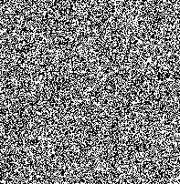

# Inspector Image



### Objective

Discover a new method of passive analysis

Discover some basic image recognition approaches

See what steganography is, and what information an image can hide

### Advice

I strongly advise to do this project in Python  
https://en.wikipedia.org/wiki/Steganography  
https://en.wikipedia.org/wiki/Exif

### Instructions

Your program should show the pgp key which is hidden in the image

The location where this photo was taken

- The project has to be written in an interpreted language (I highly recommend Python).

This project will help you discover:

- Image recognition
- Steganography
- Metadata

### Bonus

You can add more features in this order:

- Added more steganography methods

- Added GUI (Tkinter, QT and GTK are allowed)

- Facial recognition on two images compared(OpenCV is allowed)

- Other advanced features.

### Usage

```
$>  image -map image.jpeg
Lat/Lon:	(13.731) / (-1.1373)

$> image -steg image.jpeg
-----BEGIN PGP PUBLIC KEY BLOCK-----
Version: 01

mQENBGIwpy4BCACFayWXCgHH2QqXkicbqD1ZlMUALpyGxDFiWh1SErFUPJOO/CgU
2688bAd26kxDSGShiL9YUOQJ6MS+zJ0KlBkeKPoQlPHRBVpH7vjcRbZNgDxd82uE
7mhM6AH+W3fAim/PhU3lm661UGMCHM3YLupa/N0Dhhmfimtg+0AimCoXk6Q6WJxg
ao8XY1Wqacd2L0ssASY5EkMahNgtX0Ri8snbTlImd5Jq/sC4buZq96IlxyhtX0ew
zD/md0U++8SxG9+gi+uuImqV8Wq1YHvJH5BtIbfcNG9V00+03ikEX9tppKxCkhzx
9rSqvyH6Uirs3FVhFtoXUSg8IeYgSH6p5tsVABEBAAG0CDAxQDAxLjAxiQEcBBAB
AgAGBQJiMKcuAAoJEAJuInmYDhhbO3gIAITZhEtLBj524y1oeBKI5fZDwgCQum6B
D9ZaUq1+dI98HsiRAiUqw1YbuJQgeUVGCmqXeC3E7VTPCPZsaCLfWWZVeosRIqB8
PwGxcY6vXHYR4S6T8rHwsNASw+Vo2pmQIGn4tABmtyappqJbwSz+5yg73DjYXiX/
e/f6i9nrFFsfMjjKd71cAyHjV8u0z7fGDXpR22vo7CdloXMxsZRyHjd/4ofUgvu0
6hWYG2zBWTXpwaYRU9u1NCr1gfKnukm8gbILSSgjr8pQ3OLWHleJXc0sCEJFKSbg
+I0KJP7Ccrxy0MaKYk0T0tYbBrvqQCzXqzAqcjn+1GoDDS1J8WBJopM=
=N8hc
-----END PGP PUBLIC KEY BLOCK-----
$>
```

### Submission and audit

Files that must be inside your repository:

- Your program source code.
- a README.md file, Which clearly explains how to use the program.

Don’t hesitate to double check the names of your folders and files to ensure they are correct!
