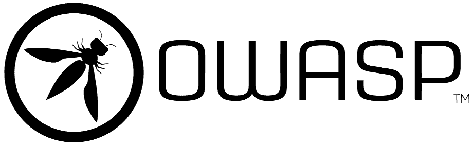

## VulnHunter: OWASP Juice Shop Web Vulnerability Exploration

<center>

</center>

### Introduction

OWASP Juice Shop is an intentionally vulnerable web application used for security training, awareness, and ethical hacking practice. It covers many web vulnerabilities from the **OWASP Top 10** security risks. In this project, you will explore common web vulnerabilities by identifying, exploiting, and documenting them in a safe and controlled environment.

### Objective

The goal of this project is to help you gain hands-on experience in finding and exploiting web vulnerabilities. You will learn about and attempt to exploit various vulnerabilities such as **SQL Injection**, **Cross-Site Scripting (XSS)**, and **Insecure Authentication** within the Juice Shop web application.

By completing this project, you will:

- Develop a deep understanding of OWASP Top 10 vulnerabilities.
- Learn ethical hacking techniques and how to exploit web vulnerabilities safely.
- Gain experience in security testing and penetration testing methodologies.
- Understand the ethical implications and responsibilities of security testing.

### Role Play

As part of the project, you will participate in a role-play session where you will assume the role of a **Security Consultant** or **Penetration Tester**. In this session, you will present your findings to a hypothetical team of stakeholders (auditors) and explain the vulnerabilities you discovered, their impact, and how to fix them.

The goal of the role-play session is to:

- Assess your understanding of the vulnerabilities and how you exploited them.
- Test your ability to explain complex technical issues in a clear and concise way.
- Challenge you to think critically about the security measures and improvements you suggested.
- Evaluate your ethical considerations when performing security testing and how you approached legal boundaries.

You should be ready to answer questions such as:

- What vulnerabilities did you discover, and why are they important?
- How did you exploit each vulnerability? Can you demonstrate this process?
- What would be the real-world impact of these vulnerabilities if left unpatched?
- How would you recommend fixing the issues? What security measures should be put in place?
- What were the ethical and legal concerns during your testing process, and how did you ensure responsible vulnerability disclosure?

Prepare to explain your findings, the techniques you used, and your remediation recommendations as if you were speaking to a real client or development team. The role-play session will be a key part of your project evaluation.

### Project Requirements

#### Setup and Installation

You are required to set up the OWASP Juice Shop application using Docker. Follow the instructions below to set up Juice Shop:

**Local Setup using Docker**:

```sh
docker pull bkimminich/juice-shop
docker run --rm -p 3000:3000 bkimminich/juice-shop
```

Access the application at `http://localhost:3000`.

For more information: https://hub.docker.com/r/bkimminich/juice-shop

#### Vulnerability Challenges

Once Juice Shop is up and running, you are required to find and exploit a minimum of **5 vulnerabilities** from the OWASP Top 10 list, such as:

- **SQL Injection (SQLi)**: Exploit vulnerable SQL queries to bypass authentication or retrieve data.
- **Cross-Site Scripting (XSS)**: Inject scripts into vulnerable input fields to perform malicious actions.
- **Broken Authentication**: Identify weaknesses in user authentication mechanisms and attempt to gain unauthorized access.
- **Insecure Direct Object Reference (IDOR)**: Access resources without proper authorization by exploiting insecure access controls.
- **Cross-Site Request Forgery (CSRF)**: Perform actions on behalf of another user by exploiting insecure CSRF tokens.

You will document each vulnerability you discover, explaining how you found and exploited it, the potential risks, and the steps to remediate it.

#### Documentation

Create a `README.md` file that contains the following:

##### 1. Exploit Report

For each vulnerability you find, submit an **Exploit Report** that includes:

- **Vulnerability Type**: Identify the vulnerability (e.g., SQLi, XSS).
- **How It Was Exploited**: Describe the step-by-step process of how you exploited the vulnerability.
- **Impact**: Explain the potential impact of the vulnerability if exploited in a real-world scenario.
- **Remediation**: Suggest ways to fix or mitigate the vulnerability.

##### 2. Ethical Hacking Report

In addition to your technical exploit report, submit an **Ethical Hacking Report** that discusses the ethical responsibilities when performing security testing. This report should cover the following points:

- The importance of obtaining proper authorization before testing.
- The legal and ethical boundaries of vulnerability testing.
- How to report vulnerabilities responsibly and avoid causing harm.

### Bonus

If you complete the mandatory part successfully, and you still have free time, you can implement anything that you feel deserves to be a bonus, for example:

- **Find Extra vulnerabilities** Find an extra 5 vulnerabilities or more.
- **Automated Scanning**: Use **OWASP ZAP** or other security tools to automate the scanning of Juice Shop and identify vulnerabilities.
- **Docker Analysis**: Analyze the Juice Shop Dockerfile and set up to identify any infrastructure-related vulnerabilities.

### Ethical and Legal Considerations

You are responsible for following the guidelines for ethical hacking. Make sure you only perform security testing in environments where you have explicit permission. Never perform unauthorized testing on live systems or personal accounts.

> ⚠️ Disclaimer: This project is for educational purposes only. Ensure that all testing is done ethically and in accordance with legal standards. The institution is not responsible for the misuse of the techniques demonstrated.

### Submission and Audit

Upon completing this project, you should submit the following:

- Your **README.md** file.
- Any additional files or scripts used during the project.

### Resources

Some useful resources:

- [OWASP Juice Shop GitHub Repository](https://github.com/juice-shop/juice-shop)
- [OWASP Top 10 Vulnerabilities](https://owasp.org/www-project-top-ten/)
- [OWASP ZAP (Zed Attack Proxy)](https://owasp.org/www-project-zap/)
- [OWASP Juice Shop Documentation](https://owasp-juice.shop/)
- [Hacksplaining OWASP Top 10](https://www.hacksplaining.com/owasp)
- [OWASP Juice Shop Docker Image](https://hub.docker.com/r/bkimminich/juice-shop)

Before asking for help, explore these resources to gain a better understanding of the Juice Shop project and web vulnerabilities.
