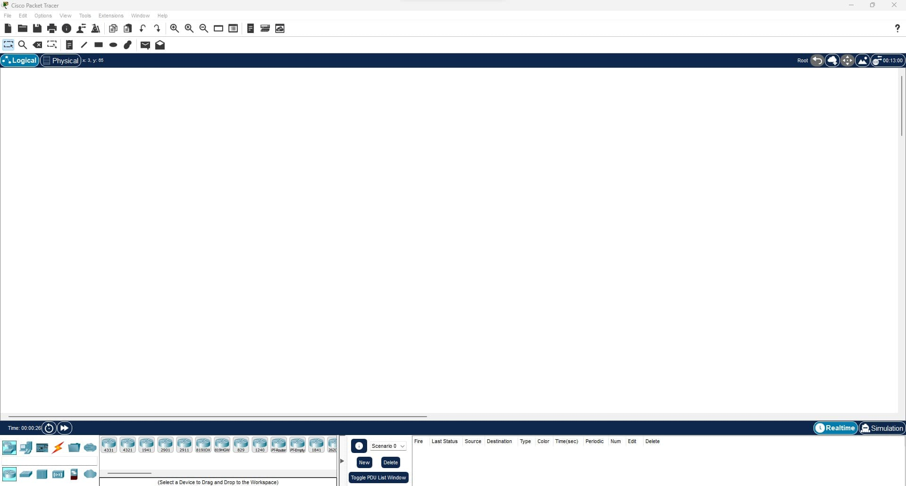
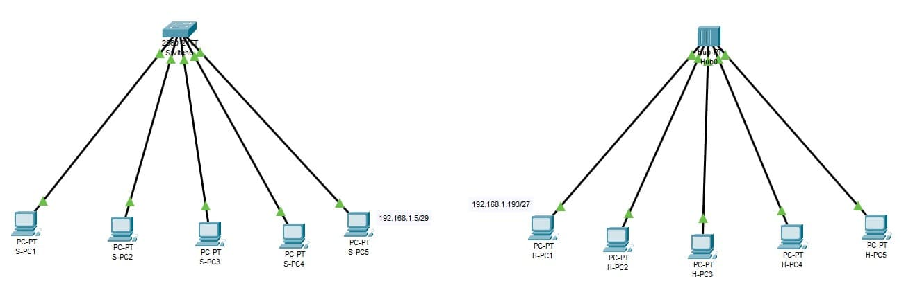
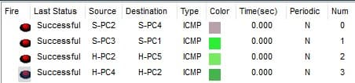
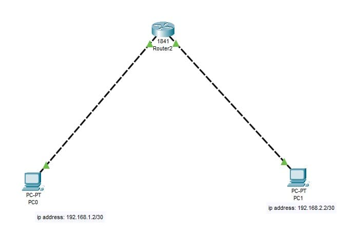
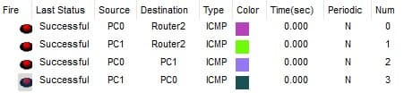
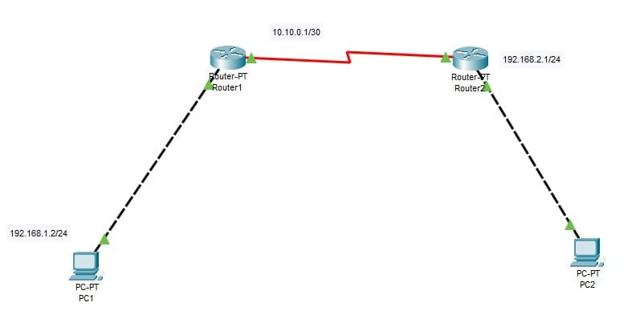
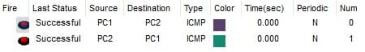
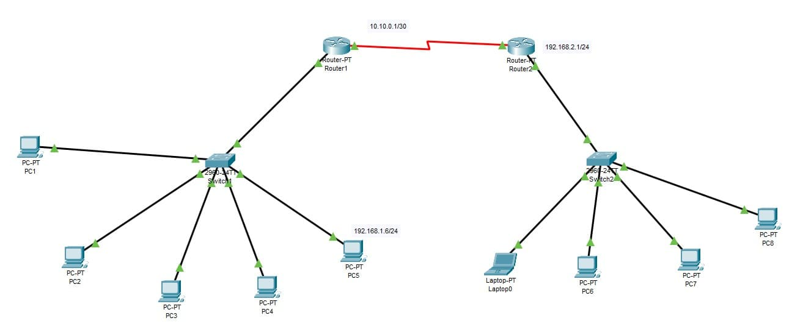

## deep-in-net


### Objectives

This project will be divided in 8 exercises where we will introduce you to the `Cisco Packet Tracer`, a valuable networking tool. Additionally, as a cloud and DevOps student, you will gain insight into key networking concepts as follows:

- `Discovering and dealing with networking devices`, this is fundamental in order to understand how networks are built and maintained.

- `Understanding and using important services and protocols`, this is also critical as they provide the framework for communication and data transfer between devices on a network.

- `The OSI Model` is a conceptual framework that describes the different layers of network communication and is an essential concept to master when learning about computer networks.

- `Discover some important networking commands in Linux`, knowing them is valuable, as Linux is a widely used operating system in networking and server environments. These commands are used to configure and troubleshoot network settings and interfaces, making them essential tools for network administrators and engineers.

### Tips

- It is recommended not to rely on IP Subnet Calculator tools.
- To configure the devices, utilize the command-line interface (CLI) available in the `Cisco Packet Tracer`.
- Test connectivity for different protocols using appropriate commands.
- Use command-line debugging techniques to troubleshoot communication issues instead of relying on graphical user interface (GUI) tools.

> Networking plays a critical role in various IT specialties, and is particularly essential for cloud and DevOps engineering.
> Be curious and never stop searching!

### Guideline

> You must respect the defined netmask and IP address for each network!

### Instructions

#### Cisco Packet Tracer:

The Cisco Packet Tracer is a powerful network simulation tool used for teaching and learning complex networking concepts. It allows users to design, configure, and troubleshoot network setups, without the need for physical networking equipment. The tool can simulate a wide range of network devices, including routers, switches, servers, and endpoints, and enables users to create, configure, and connect network topologies in a virtual environment.

You have to install `Cisco Packet Tracer` on your machine or VM:



Take your time to discover it!

> You will need it in the audit.

#### Exercise 1:

In your `Cisco PacketTracer` create this network:


- `PC0` can communicate with `PC1`.
- `PC2` can communicate with `PC3`.
- `PC4` can communicate with `PC5`.


**Knowledge:**

- What is RJ-45 cable?
- Understand what is the difference between straight through and crossover RJ-45 cables.

#### Exercise 2:

In your `Cisco PacketTracer` create this network:



- All computers connected to the Switch must be connected.
- All computers connected to the Hub must be connected.



**Knowledge:**

- Understand the function of a `switch` and a `hub`, how they operate and their role in networking.
- Differentiate between the `switch` and the `hub`.
- Identify the `OSI model layer` that the `switch` and `hub` operate on.

#### Exercise 3:

In your `Cisco PacketTracer` create this network:


- Static IP addresses are mandatory for all servers.
- Services provided by each server should be limited to their designated purpose.
- The `DHCP server` must be responsible for assigning IP addresses to all PCs.
- The `HTTPS server` must display a hello message and `HTTP` must be disabled.


- You must create a user account with the name "deepinnet" and provide `RWDNL` access on your `FTP server`.


- Configure the following records in your `DNS server`:

  - Map "deep-in-net.local" to IP address 192.168.1.99.
  - Map "deep-in-net.com" to "deep-in-net.local".

```bash
deep-in-net.local > 192.168.1.99
deep-in-net.com > deep-in-net.local
```

- Ensure that "https://deep-in-net.com" redirects to your `HTTPS server`.


**Knowledge:**

- Define a `server` and its purpose in networking.
- Explain `DHCP` and how it operates in a network.
- Define `DNS` and its role in network communication.
- Understand the purpose of `HTTP` and how it is used in networking.
- Explain `HTTPS` and how it is different from `HTTP`.
- Understand the purpose of `FTP` and how it operates in network communication.
- Define `TCP` and `UDP` communication and differentiate between them.
- Identify the `OSI model layer` where `TCP` and `UDP` operate.
- Define a `port` in networking and its function.
- Identify the `port` and `OSI model layer` for each protocol used.
- Understand the different types of `DNS` records.

#### Exercise 4:

In your `Cisco PacketTracer` create this network:



- Both PCs must communicate with each other.



**Knowledge:**

- What is a `router` and what is its role?
- Differentiate between the switch and the router.
- Identify the `OSI model layer` where a `router` operates.
- Understand the term "default gateway".

#### Exercise 5:

In your `Cisco PacketTracer` create this network:


- All devices connected to the same switch must be able to communicate with each other.
- All devices in `subnet 1` can communicate with all devices in `subnet 2`.
- All devices in `subnet 2` can communicate with all devices in `subnet 1`.


#### Exercise 6:

In your `Cisco PacketTracer` create this network:



- The PC in `subnet 1` can communicate with The PC in `subnet 2`.
- The PC in `subnet 2` can communicate with The PC in `subnet 1`.



**Knowledge:**

- What is a routing table and explain its role in routing network traffic.

#### Exercise 7:

In your `Cisco PacketTracer` create this network:



- All devices connected to the same `switch` must be able to communicate with each other.
- All devices in `subnet 1` can communicate with all devices in `subnet 2`.
- All devices in `subnet 2` can communicate with all devices in `subnet 1`.


#### Exercise 8:

In your `Cisco PacketTracer` create this network:


- All devices connected to the same switch must be able to communicate with each other.
- All devices in `subnet 1` can communicate with all devices in `subnet 2`.
- All devices in `subnet 1` can communicate with all devices in `subnet 3`.
- All devices in `subnet 2` can communicate with all devices in `subnet 1`.
- All devices in `subnet 2` can communicate with all devices in `subnet 3`.
- All devices in `subnet 3` can communicate with all devices in `subnet 1`.
- All devices in `subnet 3` can communicate with all devices in `subnet 2`.


### Bonus

If you complete the mandatory part successfully and you still have free time, you can implement anything that you feel deserves to be a bonus.

Challenge yourself!

### Documentation

Create a `README.md` clarification of all the knowledge you have learned and the steps you passed to create the network architectures, thorough descriptions of components, and an explanation of the network architectures, presented clearly and concisely. Ensure it contains all the necessary information about the architectures (devices, addresses, subnets, ...). This file must be submitted as part of the solution for the project.

### Submission and audit

You must save your Exercises solutions as "ptk" files, and then push them to your repository with your documentation file.

Your repository must look like this:

```console
user:~/deep-in-net$ ls
ex01.pkt
ex02.pkt
ex03.pkt
ex04.pkt
ex05.pkt
ex06.pkt
ex07.pkt
ex08.pkt
bonus.pkt
README.md
user:~/deep-in-net$
```

> In the audit you must answer a group of questions, and recreate a network in the `cisco packet tracer`, be prepared.
> You must also explain any calculations that you have made without the use of tools!
> If you fail to do any of this, then your project will be considered a failed project! so take your time to learn and practice.
