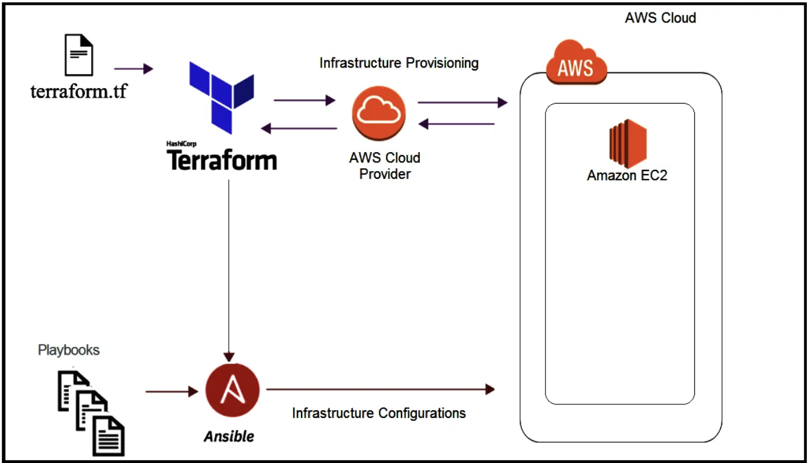

## CloudPress

### Objective

CloudPress is a project designed to provide hands-on experience in deploying a WordPress website with MariaDB and Nginx on the Amazon Web Services (AWS) cloud platform. The goal is to utilize Terraform for infrastructure creation and Ansible for application installation, resulting in a production-ready setup.

Upon completion of this project, you'll achieve:

- A robust AWS environment primed for hosting WordPress and MariaDB orchestrated through Terraform.

- Seamless installation and configuration of Linux, Nginx, MariaDB, PHP, and WordPress using Ansible.

- Implementation of security protocols, performance optimizations, and meticulous documentation, ensuring a fully-fledged production-level WordPress site.

## Prerequisites

Before starting this project, make sure you have a solid understanding of the following concepts:

- Cloud computing principles, particularly AWS.
- Terraform for infrastructure provisioning.
- Ansible for application installation and configuration.
- Familiarity with web servers, databases, and WordPress.
- Web security and optimization best practices.

### Instructions

#### AWS Infrastructure Setup with Terraform

- Create an AWS account.
- Configure Terraform files to provision EC2 instances, security groups, storage, and networking.
- Securely set up and configure an EC2 Instance (SSH, security, etc.).

> Keep track of your usage to avoid unexpected bills, try to use the free tier!

> Verify that all services are terminated after completion of use!

#### Nginx Installation and Configuration using Ansible

- Install Nginx on the EC2 Instance.
- Configure Nginx for serving web content.
- Adjust firewall settings to allow HTTP/HTTPS traffic.
- Start the Nginx service.

#### MariaDB Installation and Configuration using Ansible

- Install MariaDB on the EC2 Instance.
- Create a MariaDB database for WordPress.
- Create a user for WordPress and configure user rights and privileges.
- Start the MariaDB service.

#### PHP Installation and Configuration using Ansible

- Install PHP on the EC2 Instance.
- Configure PHP settings for the WordPress site.
- Start the PHP service.

#### WordPress Installation and Configuration using Ansible

- Download and set up WordPress on the EC2 Instance.
- Configure WordPress to use the MariaDB database.
- Start the WordPress service.

#### Documentation

Prepare a comprehensive `README.md` detailing:

- Architecture overview.
- Deployment process.
- Additional configurations made.
- Tips and potential pitfalls.

### Evaluation Criteria

Your CloudPress project will be evaluated based on:

- Successfully setting up WordPress, MariaDB and Nginx using Terraform to create the infrastructure and Ansible for installing everything.
- Secure and effective environment configuration.
- Quality and clarity of the provided documentation.

### Conclusion

Completing CloudPress will equip you with valuable experience in deploying web applications on a public cloud. Emphasizing infrastructure as code practices and configuration management, you'll have a functional WordPress website hosted on AWS, preparing you for similar real-world tasks in your career.
