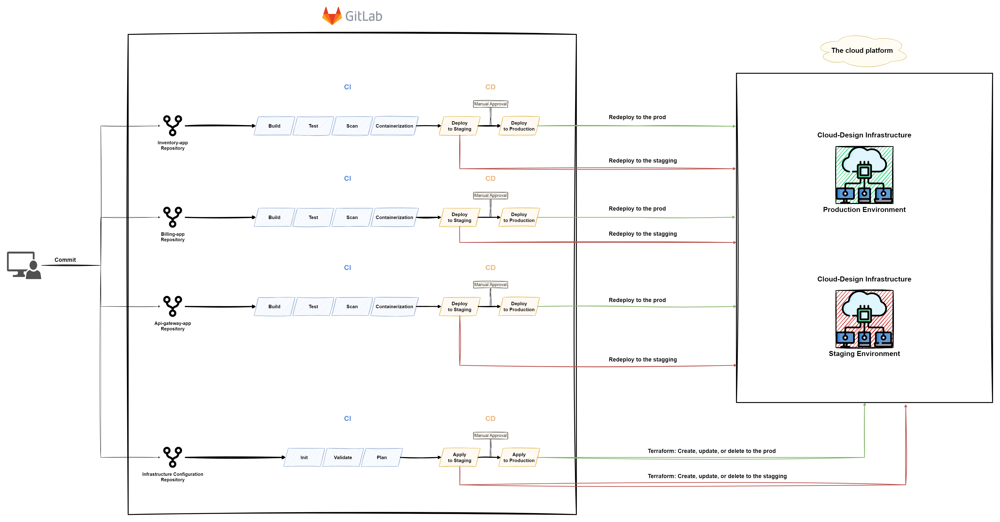

## Code-Keeper

### Objective

In this project, you will create a complete pipeline to scan and deploy a
microservices-based application. Your challenge is to design, implement, and
optimize a pipeline that incorporates industry best practices for continuous
integration, continuous deployment, and security. Your mission is to:

- Set up a source control system for the microservices source code and the
  infrastructure configuration.
- Create a Pipeline to `create`, `update`, or `delete` the infrastructure for
  the staging and production environment.
- Create a `continuous integration (CI)` pipeline to build, test, and scan the
  source code.
- Create a `continuous deployment (CD)` pipeline to deploy the application to a
  staging and production environment.
- Ensure the `security` and `reliability` of the application throughout the
  pipeline stages.

### Prerequisites

To complete this project, you should have a good understanding of the
following:

- GitLab and GitLab CI
- Ansible as a configuration management and automation tool
- Docker and containerization
- Terraform as an Infrastructure as Code (IaC)
- Cloud platforms (e.g., AWS, Azure, or Google Cloud)

### Tips

- Spend time on the theory before rushing into the practice.
- Read the official documentation.

> Any lack of understanding of the concepts of this project may affect the
> difficulty of future projects, take your time to understand all concepts.

> Be curious and never stop searching!

### Role play

To further enhance the learning experience and assess the student's knowledge
of DevOps concepts and practices, we will include a role play question session
as part of the project. This exercise will require students to apply their
knowledge in various real-life scenarios, helping them to solidify their
understanding of the material and prepare for real-world situations.

The goal of the role play question session is to:

- Assess your understanding of the concepts and technologies used in the
  project.
- Test your ability to communicate effectively and explain your decisions.
- Challenge you to think critically about your solution and consider
  alternative approaches.

Prepare for a role play question session where you will assume the role of a
DevOps engineer presenting your solution to your team or a stakeholder. You
should be ready to answer questions and provide explanations about your
decisions, architecture, and implementation.

### Deploy GitLab and Runners for Pipeline Execution

You must deploy a `GitLab` instance using `Ansible`. This hands-on exercise
will help you gain a deeper understanding of `Ansible` as a configuration
management and automation tool while also giving you experience in deploying
and configuring `GitLab`.

1. Create an `Ansible` playbook to deploy and configure a `GitLab` instance.
   The playbook should automate the installation of `GitLab` and any required
   dependencies. It should also configure `GitLab` settings such as user
   authentication, project settings, and CI/CD settings.

2. Deploy a `GitLab` instance on a cloud platform (e.g., AWS, Azure, or Google
   Cloud) or in a local environment using the `Ansible` playbook. Ensure that
   the instance is accessible to all team members and is configured to support
   collaboration and code reviews.

3. Configure the `GitLab` instance to support `CI/CD pipelines` by setting up
   `GitLab` Runners and integrating them with your existing pipeline. Update
   your pipeline configuration to utilize `GitLab CI/CD` features and execute
   tasks on the deployed Runners.

> You will need to demonstrate the successful deployment and configuration of
> `GitLab` using `Ansible` in the audit.

### The pipelines

You are a DevOps engineer at a company that is transitioning to an Agile
approach and wants to achieve high delivery for their microservices'
architecture. As the DevOps engineer, your manager has tasked you with creating
a pipeline that supports Agile methodologies and enables faster, more
consistent deployments of the microservices.

1. You will use your `crud-master` source code and `cloud-design`
   infrastructure, to create a complete pipeline for the following
   applications:

- `Inventory application` is a server that contains your inventory-app code
  running and connected to the inventory database.
- `billing application` is a server that contains your billing-app code running
  and connected to the billing database and consuming the messages from the
  RabbitMQ queue.
- `api-gateway application` is a server that contains your API gateway code
  running and forwarding the requests to the other services.
  > Each application must exist in a single repository.

2. You must provision your `cloud-design` infrastructure for two environments
   on a cloud platform (e.g., AWS, Azure, or Google Cloud) using `Terraform`.

- `Production Environment`: The live infrastructure where the software is
  deployed and used by end-users, requires stable and thoroughly tested updates
  to ensure optimal performance and functionality.
- `Staging Environment`: A replica of the production environment used for
  testing and validating software updates in a controlled setting before
  deployment to the live system.
  > The two environments should be similar in design, resources, and services
  > used! Your infrastructure configuration must exist in an independent
  > repository with a configured pipeline!

The pipeline should include the following stages:

- `Init`: Initialize the Terraform working directory and backend. This job
  downloads the required provider plugins and sets up the backend for storing
  the Terraform state.

- `Validate`: Validate the Terraform configuration files to ensure correct
  syntax and adherence to best practices. This helps catch any issues early in
  the pipeline.

- `Plan`: Generate an execution plan that shows the changes to be made to your
  infrastructure, including the resources that will be created, updated, or
  deleted. This job provides a preview of the changes and enables you to review
  them before applying.

- `Apply to Staging`: Apply the Terraform configuration to `create`, `update`,
  or `delete` the resources as specified in the execution plan. This job
  provisions and modifies the infrastructure in the staging environment.

- `Approval`: Require manual approval to proceed with deployment to the
  `production environment`. This step should involve stakeholders and ensure
  the application is ready for production.

- `Apply to Production`: Apply the Terraform configuration to `create`,
  `update`, or `delete` the resources as specified in the execution plan. This
  job provisions and modifies the infrastructure in the production environment.

3. Design and implement a `CI pipeline` for each repository that will be
   triggered on every code push or pull request. The pipeline should include
   the following stages:

- `Build`: Compile and package the application.
- `Test`: Run unit and integration tests to ensure code quality and
  functionality.
- `Scan`: Analyze the source code and dependencies for security vulnerabilities
  and coding issues. Consider using tools such as `SonarQube`, `Snyk`, or
  `WhiteSource`.
- `Containerization`: Package the applications into Docker images using a
  Dockerfile, and push the images to a container registry (e.g., Docker Hub,
  Google Container Registry, or AWS ECR).

4. Design and implement a `CD pipeline` that will be triggered after the `CI
pipeline` has been completed. The pipeline should include the following stages:

- `Deploy to Staging`: Deploy the application to a `staging environment` for
  further testing and validation.
- `Approval`: Require manual approval to proceed with deployment to the
  `production environment`. This step should involve stakeholders and ensure
  the application is ready for production.
- `Deploy to Production`: Deploy the application to the `production
environment`, ensuring zero downtime and a smooth rollout.

> Each repository must have a pipeline!

> Any modification in the application's source code must rebuild and redeploy
> the new version to the `Staging Environment` and then to the `Production
Environment` after manual approval.

### Cybersecurity

Your pipelines and infrastructure should adhere to the following cybersecurity
guidelines:

- `Restrict triggers to protected branches`: Prevent unauthorized users from
  deploying or tampering by triggering pipelines only on protected branches,
  controlling access, and minimizing risk.

- `Separate credentials from code`: Avoid storing credentials in application
  code or infrastructure files. Use secure methods like secret management tools
  or environment variables to prevent exposure or unauthorized access.

- `Apply the least privilege principle`: Limit user and service access to the
  minimum required, reducing potential damage in case of breaches or
  compromised credentials.

- `Update dependencies and tools regularly`: Minimize security vulnerabilities
  by keeping dependencies and pipeline tools updated. Automate updates and
  monitor for security advisories and patches.

### Documentation

You must push a `README.md` file containing full documentation of your solution
(prerequisites, configuration, setup, usage, ...).

### Bonus

If you complete the mandatory part successfully and you still have free time,
you can implement anything that you feel deserves to be a bonus, for example:

- Security scan for the infrastructure configuration using `tfsec`.
- Add `Infracost` in your infrastructure pipeline to estimate the
  infrastructure cost.
- Use `Terragrunt` to create multiple Environments.

Challenge yourself!

### Submission and audit

You must submit:

- CI/CD pipeline configuration files, scripts, and any other required
  artifacts.
- An Ansible playbook and used scripts for deploying and configuring a GitLab
  instance.
- A well-documented README file that explains the pipeline design, the tools
  used, and how to set up and use the pipeline.

Your Solution must be running and your users and applications repository and
CI/CD must be configured correctly for the audit session.

> In the audit you will be asked different questions about the concepts and the
> practice of this project, prepare yourself!
