#### General

##### Check the Repo content

Files that must be inside the repository:

```bash
$ tree deep-in-net/
deep-in-net/
├── bonus.pkt
├── README.md
├── ex01.pkt
├── ex02.pkt
├── ex03.pkt
├── ex04.pkt
├── ex05.pkt
├── ex06.pkt
├── ex07.pkt
└── ex08.pkt
$
```

> the `bonus.pkt` is optional!

###### Are all the required files present?

#### Exercise 1:

##### Open the `ex01.pkt` file in `Cisco PacketTracer`.

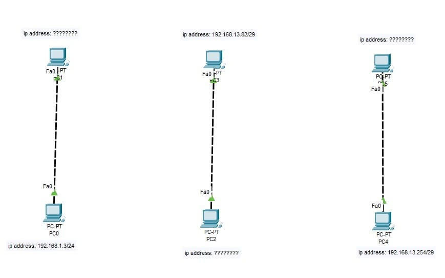

###### Are the `devices/links/IPs/netmasks` in the solution similar to the required in the subject?

##### Check the communication between the PCs

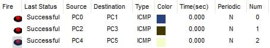

- `PC0` can communicate with `PC1`.
- `PC2` can communicate with `PC3`.
- `PC4` can communicate with `PC5`.

###### Can you confirm that the communications mentioned above are established?

##### Ask the following questions to the group or student

- What is a RJ-45 cable?
- What is difference between straight through and crossover RJ-45 cables?
- How are the IP addresses calculated?

###### Did the student reply correctly to the questions?

#### Exercise 2:

##### Open the `ex02.pkt` file in `Cisco PacketTracer`.


###### Are the `devices/links/IPs/netmasks` in the solution similar to the required in the subject?

##### Check the connections and communications.


###### Does all computers connected to the Switch must be connected?

###### Does all computers connected to the Hub must be connected?

##### Ask the following questions to the group or student

- What is the function of a `switch`, how does it operate and what is its role in networking?
- What is the function of a `hub`, how does it operate and what is its role in networking?
- What are the differences between a `hub` and a `switch`?
- Can you identify the `OSI model layer` that the `switch` and the `hub` operate on?

###### Did the student reply correctly to the questions?

#### Exercise 3:

##### Open the `ex03.pkt` file in `Cisco PacketTracer`.

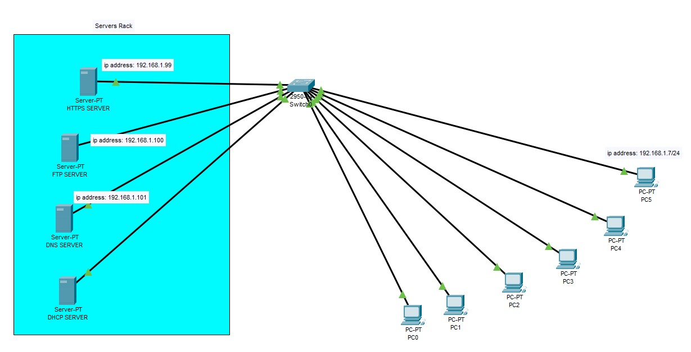

###### Are the `devices/links/IPs/netmasks` in the solution similar to the required in the subject?

###### Can you confirm that all `servers` have static IP addresses?

###### Do all servers only provide the service specified for them?

###### Is the `DHCP server` responsible for assigning the IP addresses to all PCs?

##### Check the `HTTPS Server`.

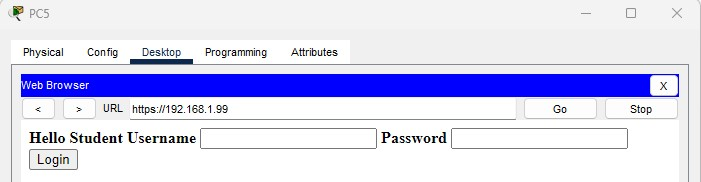

###### Can you connect to the `HTTPS Server` from any PC in the network?

###### Does the `HTTPS Server` shows a "hell" message and is the `HTTP` disabled?

##### Check the `FTP server`.

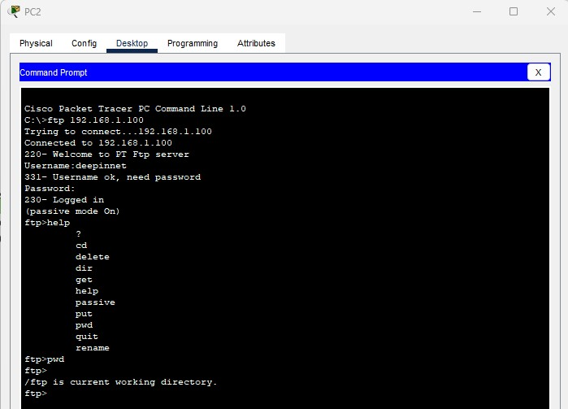

###### Does a `"deepinnet"` user with `RWDNL` access exists in the `FTP server`?

###### Can you connect to the `FTP server` using the `"deepinnet"` user from any PC in the network?

##### Check the `DNS server`.

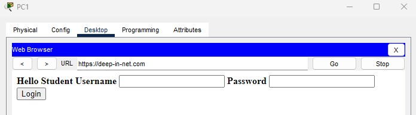

##### Confirm if the `DNS server` records are correct.

```bash
deep-in-net.local > 192.168.1.99
deep-in-net.com > deep-in-net.local
```

###### Does the `DNS server` contains the correct records as above?

###### Does `"https://deep-in-net.com"` redirects to the `HTTPS Server`?

##### Ask the following questions to the group or student:

- What is a `server` and what is its purpose in networking?
- How does `DHCP` work in a network and what is its function?
- What is the definition of `DNS` and what role does it play in network communication?
- What is the purpose of `HTTP` and how is it used in networking?
- What is `HTTPS` and how does it differ from `HTTP`?
- What is the purpose of `FTP` and how does it operate in network communication?
- What is `TCP` and `UDP` communication and what distinguishes them from each other?
- At which `OSI model layer` do `TCP` and `UDP` operate?
- What is a `port` in networking and what is its function?
- What are the `port` and `OSI model layer` for each protocol used?
- What are the various types of `DNS` records and what are their purposes?

###### Did the student reply correctly to the questions?

#### Exercise 4:

##### Open the `ex04.pkt` file in `Cisco PacketTracer`.

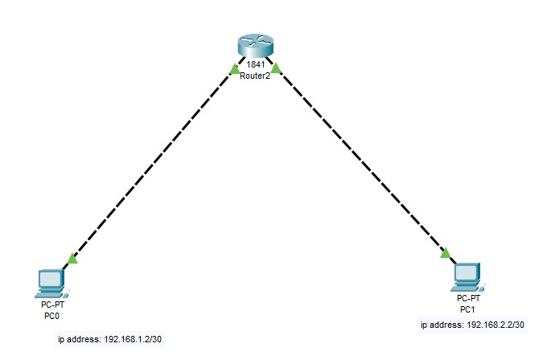

###### Are the `devices/links/IPs/netmasks` in the solution similar to the required in the subject?

##### Check the connections and communications.


###### Are the 2 PCs communicating with each other?

##### Ask the following questions to the group or student:

- What is a `router` and what is its role in a network?
- How does a `switch` differ from a `router` in terms of functionality?
- At which `OSI model layer` does a `router` operate?
- What is meant by the term "default gateway" in networking?

###### Did the student reply correctly to the questions?

#### Exercise 5:

##### Open the `ex05.pkt` file in `Cisco PacketTracer`.

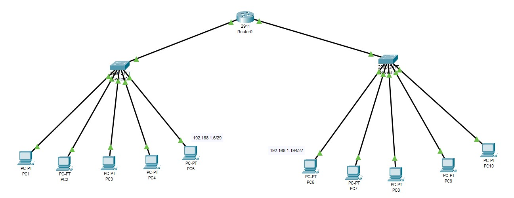

###### Are the `devices/links/IPs/netmasks` in the solution similar to the required in the subject?

##### Check the connections and communications.

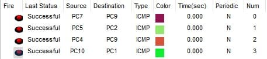

###### Are all devices connected to the same `switch` able to communicate with each other?

###### Are all devices in `subnet 1` able to communicate with all devices in `subnet 2` and vice versa?

#### Exercise 6:

##### Open the `ex06.pkt` file in `Cisco PacketTracer`.

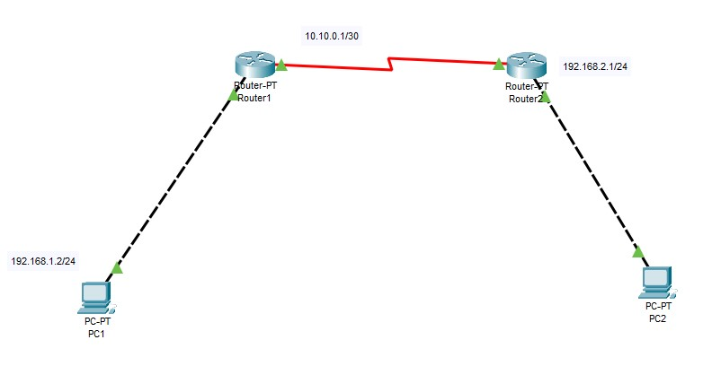

###### Are the `devices/links/IPs/netmasks` in the solution similar to the required in the subject?

##### Check the connections and communications.

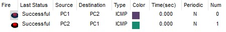

###### Is the PC in `subnet 1` able to communicate with the PC in `subnet 2` and vice versa?

##### Ask the student to explain what is a `routing table` and what is its role?

###### Did the student reply correctly to the question?

#### Exercise 7:

##### Open the `ex07.pkt` file in `Cisco PacketTracer`.

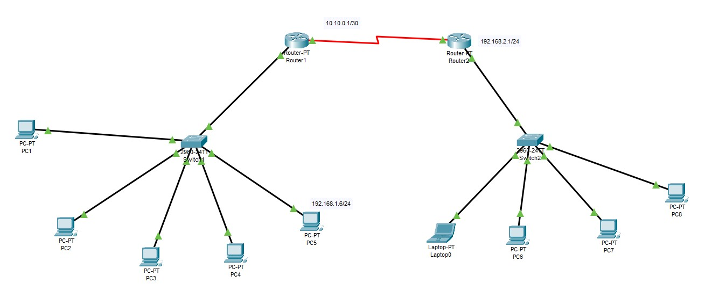

###### Are the `devices/links/IPs/netmasks` in the solution similar to the required in the subject?

##### Check the connections and communications.

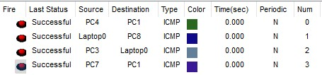

###### Are all devices connected to the same `switch` able to communicate with each other?

###### Are all devices in `subnet 1` able to communicate with all devices in `subnet 2` and vice versa?

##### Ask the student to recreate the `"Exercise 7"` network again without external tools.

###### Was the student able to recreate the network?

###### Does the created network perform correctly?

#### Exercise 8:

##### Open the `ex08.pkt` file in `Cisco PacketTracer`.


###### Are the `devices/links/IPs/netmasks` in the solution similar to the required in the subject?

##### Check the connections and communications.

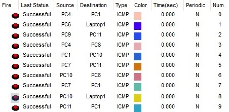

###### Are all devices connected to the same switch able to communicate with each other?

###### Can all devices in `subnet 1` communicate with all devices in `subnet 2` and vice versa?

###### Can all devices in `subnet 1` communicate with all devices in `subnet 3` and vice versa?

###### Can all devices in `subnet 2` communicate with all devices in `subnet 3` and vice versa?

#### Check the Documentation:

###### Is the README.md file containing the clarification of all the knowledge learned and the steps passed by the learner to recreate the network architectures?

#### Bonus:

###### + Did the student pass the network recreation exam without error and in a short time?

###### + Did the student add any optional bonus? If he did ask him what was it.

> The auditor has the freedom to decide whether the bonus deserves to count or not!
