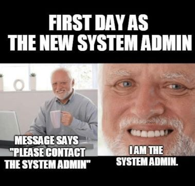

## deep-in-system



In this project you will learn how to administer a Linux server, You will set up security and network for a ubuntu server, and will install some popular services.

### Objectives

Implement some learned skills from the scripting pool in a real-life project.

Having a first experience in a ubuntu server setup.

Discovering some network and security implementations in Linux.

Discovering some popular services in Linux.

### Advice

Read the entire project before starting implementation!

Try to understand all the commands that you will use in your setup.

Save any command you entered, it will be useful if you want to reinstall the server or do some debugging.

Create a backup file for each config file you will modify, this will be useful if you broke the config.

> In this project we have put some passwords and private keys exposed, It is not recommended to do this in any way!
> And don't use these passwords and private keys outside this learning project!

### Instructions

#### The Virtual Machine Part:

Install a ubuntu server's latest LTS as a virtual machine.

- The VM disk size must be 30GB.

- You must divide your VM disk into these partitions:
  `swap:` 4G
  `/`: 15G
  `/home`: 5G
  `/backup`: 6G

- Your username must be your login name.

- You have to set your hostname with the format of `{username}-host`, if your login is `potato`, then your hostname must be `potato-host`.

#### The Network Part:

Set a static private IP address, you are free to choose which netmask to use.

You must be able to connect to the Internet!, you can test with:

```console
$> ping -c 5 google.com
```

> You should not have any internet interface with dynamic ip assignment.

#### The Security Part:

> You do not have to use the root user in your setup process!
> You won't need it when you have `sudo`.
> Sudo provides fine-grained access control. It grants elevated permissions to only a particular program that requires it. You know which program is running with elevated privileges, rather than working with a root shell (running every command with root privileges).

- You have to disable remote root login via ssh.

- Change the ssh port to: `2222`.

- Configure the Firewall, and close all incoming ports, only used ports must be opened.
  > All open ports must be justified in the audit!

#### User Management Part:

You have to create 2 users in your server as follows:

##### 1- _luffy_:

- SSH authentication Method: Public key-based authentication
- Home directory: `/home/luffy`
- Sudoer: yes
- ssh-key: Your generated ssh key

> You have to keep your ssh key ready for the audit session!

##### 2- _zoro_:

- SSH authentication Method: Password authentication
- Home directory: `/home/zoro`
- password: Use your custom password
- sudoer: no

> You will use your custom password for the audit session!

#### Services Part:

- Install an FTP server and create a user `nami`.
  The user `nami` can access via FTP only to `/backup` with read-only access.
  `nami` user password: Use your custom password

> You will use your custom password for the audit session!
> Don't enable anonymous access!
> This will be risky!

#### The Database Part:

- You have to install MySQL Server

- Disable the remote connection to the root user.

- Do not allow connection to MySQL from outside the server!
  To improve the security of your website, you should keep your MySQL server accessible only by applications in the server, As long as it does not affect your solution.

- You must create a MySQL user, which has the only required access to the WordPress database.
  > Don't use the root user in your WordPress website!

#### WordPress Part:

- You have to install WordPress

- WordPress must be in your web server root directory: `http://{host}/`

- Your WordPress must work in a normal way, try to post something or create another user, any way you are free to do anything.

> The configuration file must not be public accessible!, try `http://{host}/wp-config.php`

#### Backup Part:

Backups protect against human errors, hardware failure, virus attacks, power failures, and natural disasters. Backups can help save time and money if these failures occur.

In this exercise, you will set up a simple backup method by using cron jobs.

- Set up a cron job that starts every Day At 00:00, it must create a tar file of the WordPress database.

- The backup files must be created in the `/backup` folder.

- The backup file name must contain the creation date.

- You must add a line to a log file (`/var/log/backup.log`) This line should contain a message informing you that the backup was successful and the timing of the backup.

- Your backup files must be downloadable from the `nami` FTP user.

### Bonus Part

If you complete the mandatory part perfectly, you can move to this part.
You can add anything you feel deserves to be a bonus, some of the suggested ideas:

- Install the Minecraft server, It must be always running even if you reboot your server.

- Automate all instructions with ansible, so you can remake this long process in more than 1 server in a short time.

- Set up the SSL in the web server and FTP server, you can use self-signed SSL.

_Challenge yourself!_

### Documentation

Create a `README.md` clarification of all the knowledge you have learned and the steps you passed to set up the server, thorough descriptions of steps, and an explanation of the used commands, presented clearly and concisely. Ensure it contains all the necessary information about the installed and configured services. This file must be submitted as part of the solution for the project.

### Submission and audit

You must export your VM to a safe place, you will need it in the audit.
You will use your exported VM to run a new VM for each audit.
Push the shasum of your exported VM, you can get it this way:

Example:
```console
user:~$ sha1sum {exported deep-in-system} > deep-in-system.sha1
user:~$ cat deep-in-system.sha1 | cat -e
<...>255bfef9560<...> {exported deep-in-system}$
user:~$
```

Files that must be inside your repository:

- deep-in-system.sha1
- README.md

> It's Forbidden to use external scripts!
> Any use of external scripts or use of commands without understanding their jobs is considered cheating!
