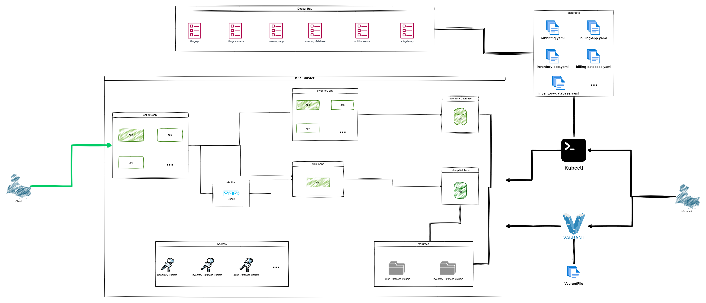

#### General

##### Check the Repo content

A `README.md` and `orchestrator.sh` and `Vagrantfile` files and all files used to create and delete and manage the student infrastructure must be submitted in the repo.

```console
.
├── Manifests
│   └── [...]
├── Scripts
│   └── [...]
├── Dockerfiles
│   └── [...]
└── Vagrantfile
```

###### Are all the required files present?

##### Ask the following questions to the group or student

- What are Container orchestration and what are their benefits of it?

- What are Kubernetes and what is its main role of it?

- What are K3s and what is its main role of it?

###### Did the student reply correctly to the questions?

##### Check the Student Documentation

The Documentation must exists in the `README.md` file!

###### Did the README.md file contains the all required information about the solution(Prerequisites, Configuration, Setup, Usage, ...)?

##### Check the docker images in dockerhub:

###### Does the used docker images in the YAML manifests must be uploaded in the student dockerhub account?

##### Check the cluster:

By using k3s in Vagrant 2 virtual machines must be created:

1. Master: the master in the k3s cluster.

2. Agent: an agent in the k3s cluster.

`kubectl` must be installed and configured in the learner machine to manage the cluster.

The nodes must be connected and available, try:

```console
$> kubectl get nodes -A
NAME                                           STATUS   ROLES    AGE    VERSION
<master-node>   Ready    <none>   XdXh   vX
<agent1-node>   Ready    <none>   XdXh   vX
$>
```

###### Does the cluster created by a Vagrantfile?

###### Does the cluster contains 2 nodes (master and agent)?

###### Does kubectl installed and configured in the learner machine

###### Does the nodes is connected and ready for usage?

##### Check the student infrastructure:

The student must implement this architecture:


##### Run the student infrastructure:

```console
user:~$ ./orchestrator.sh create
cluster created
user:~$
```

###### did the student provide a `orchestrator.sh` script that run and create and manage the infrastructure

###### did the student respect the architecture?

###### did the infrastructure start correctly?

##### Verify the K8s Manifests:

###### Is there a YAML Manifest for each service?

###### Are credentials not exists in the YAML manifests, except the secret manifests?

##### Ask the following questions to the group or student

- Explain What is a K8s manifest

- Explain the K8s manifests

- Did the student reply correctly to the questions?

###### Did the student reply correctly to the questions?

##### Check the secrets

```console
$> kubectl get secrets -o json
<...>
$>
```

###### Is the all used credentials and passwords presented in the secrets?

##### Check all deployed resources:

```console
user:~$ kubectl get all
<...>
user:~$
```

- `inventory-database container` is a PostgreSQL database server that contains your inventory database, it must be accessible via port `5432`.
- `billing-database container` is a PostgreSQL database server that contains your billing database, it must be accessible via port `5432`.
- `inventory-app container` is a Node.Js server that contains your inventory-app code running and connected to the inventory database and accessible via port `8080`.
- `billing-app container` is a Node.Js server that contains your billing-app code running and connected to the billing database and consuming the messages from the RabbitMQ queue, and it can be accessed via port `8080`.
- `RabbitMQ container` is a RabbitMQ server that contains the queue.
- `api-gateway-app container` is a Node.Js server that contains your api-gateway-app code running and forwarding the requests to the other services and it's accessible via port `3000`.

###### Did the all required applications is deployed?

- databases must be deployed as Statefulset, and volumes that enable containers to move across infrastructure without losing the data must be created.

- Node.JS applications must be deployed as a deployment and they must be scaled horizontally automatically, depending on CPU consumption:

1. `api-gateway`:
   max replication: 3
   min replication: 1
   cpu percent triger: 60%

2. `billing-app`:
   max replication: 3
   min replication: 1
   cpu percent triger: 60%

3. `inventory-app`:
   max replication: 3
   min replication: 1
   cpu percent triger: 60%

###### Do all apps deployed with the correct configuration?

##### Ask the following questions to the group or student

- What is statefulset in k8s?

- What is deployment in k8s?

- What is difference between deployment and statefulset in k8s?

- What is scaling and why we use it?

- What is a load balancer and what is the role of it?

- Why we don´t put the database as a deployment?

###### Did the student reply correctly to the questions?

##### Test The solution

#### Inventory API Endpoints

##### Open Postman and make a `POST` request to `http://[GATEWAY_IP]:[GATEWAY_PORT]/api/movies/` address with the following body as `Content-Type: application/json`:

```json
{
  "title": "A new movie",
  "description": "Very short description"
}
```

###### Can you confirm the response was the success code `200`?

##### In Postman make a `GET` request to `http://[GATEWAY_IP]:[GATEWAY_PORT]/api/movies/` address.

###### Can you confirm the response was success code `200` and the body of the response is in `json` with the information of the last added movie?

#### Billing API Endpoints

##### Open Postman and make a `POST` request to `http://[GATEWAY_IP]:[GATEWAY_PORT]/api/billing/` address with the following body as `Content-Type: application/json`:

```json
{
  "user_id": "20",
  "number_of_items": "99",
  "total_amount": "250"
}
```

###### Can you confirm the response was success code `200`?

##### Stop the billing-app container

###### Can you confirm the `billing-app` container was correctly stopped?

##### Open Postman and make a `POST` request to `http://[GATEWAY_IP]:[GATEWAY_PORT]/api/billing/` address with the following body as `Content-Type: application/json`:

```json
{
  "user_id": "22",
  "number_of_items": "10",
  "total_amount": "50"
}
```

###### Can you confirm the response was success code `200` even if the `billing_app` is not working?

#### K8s components


In less than 15 minutes and with the help of google the student must explain all kubernetes components and the roles of it.

###### Can the learner explain the k8s components in less than 15 minutes?

> If the learner is unable to explain the k8s component, this mean that learner have failed this audit, so he must re-read and spend more time on understanding!

#### Bonus

###### + Did the student add any optional bonus?

###### + Is this project an outstanding project?
