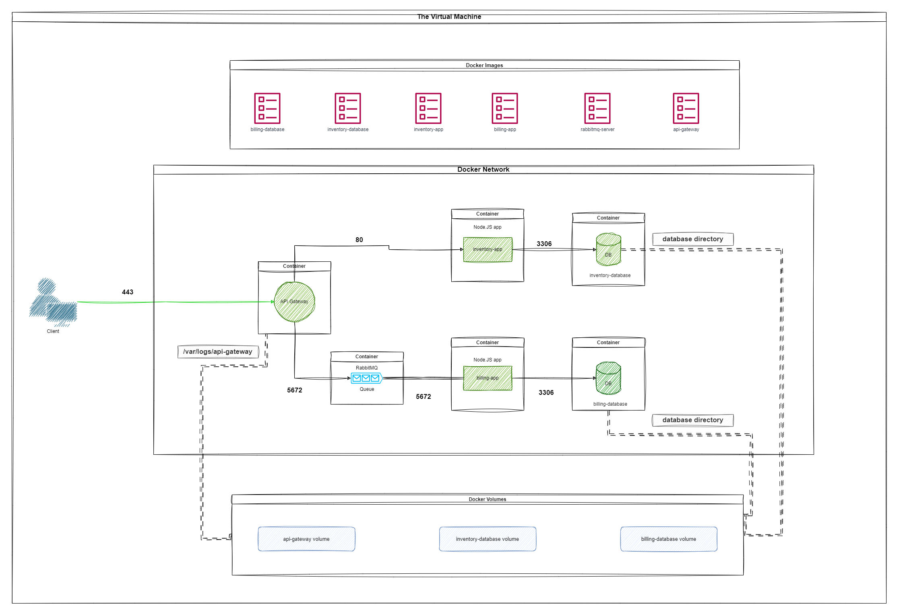

#### General

##### Check the Repo content

A `README.md` file and all files used to create and delete and manage the student infrastructure must be submitted in the repo.

###### Are all the required files present?

###### `.env` file is not exists in the repo?

###### Are all pushed files in the repo clean of any credentials or passwords?

##### Ask the following questions to the group or student

###### What are containers and what are their benefits of it?

###### What is the difference between containers and virtual machines?

###### What is docker and what is its main role of it?

###### Did the student reply correctly to the questions?

##### Check the Student Documentation
The Documentation must exists in the `README.md` file!

###### Did the README.md file contains the all required information about the solution(Prerequisites, Configuration, Setup, Usage, ...)?

##### Check the student infrastructure:

The student must implement this architecture:


##### Run the student infrastructure:

```console
user:~$ docker-compose up
<...>
inventory-database   ... done
billing-database     ... done
inventory-app        ... done
billing-app          ... done
RabbitMQ             ... done
api-gateway-app      ... done
<...>
user:~$
```

###### did the student respect the architecture?

###### did the infrastructure start correctly?

##### Ask the following questions to the group or student

###### What is microservices architecture?

###### Why do we use microservices architecture?

###### What is a queue and what are its benefits of it?

###### What is RabbitMQ?

###### Did the student reply correctly to the questions?

##### Verify the Dockerfiles:

###### Is there a Dockerfile for each service?

###### Are all Dockerfiles based on Debian or alpine?

###### There is no sensitive data in DockerFiles or other solution files, rather it's exists in the `.env`?

##### Ask the following questions to the group or student

###### Explain What is a Dockerfile

###### Explain the instructions used on the Dockerfile

###### Did the student reply correctly to the questions?

##### Check the Containers:

```console
user:~$ docker ps
CONTAINER ID   IMAGE            COMMAND CREATED STATUS         PORTS                                 NAMES
<...>       inventory-database      <...> <...> <...>          5432/tcp                              inventory-database
<...>       billing-database        <...> <...> <...>          5432/tcp                              billing-database
<...>       inventory-app           <...> <...> <...>          8080/tcp                                inventory-app
<...>       billing-app             <...> <...> <...>          8080/tcp                                billing-app
<...>       RabbitMQ                <...> <...> <...>          5672/tcp                              RabbitMQ
<...>       api-gateway-app         <...> <...> <...>         0.0.0.0:3000->3000/tcp, :::3000->3000/tcp  api-gateway-app
user:~$
```

- `inventory-database container` is a SQL database server that contains the inventory database, it must be accessible via port `5432`.
- `billing-database container` is a SQL database server that contains the billing database, it must be accessible via port `5432`.
- `inventory-app container` is a Node.Js server that contains the inventory-app code running and connected to the inventory database and accessible via port `8080`.
- `billing-app container` is a Node.Js server that contains the billing-app code running and connected to the billing database and consuming the messages from the RabbitMQ queue, and it can be accessible via port `8080`.
- `RabbitMQ container` is a RabbitMQ server that contains the queue
- `api-gateway-app container` is a Node.Js server that contains the api-gateway-app code running and forwarding the requests to the other services and it's accessible via port `3000`.

##### Check the Container restart policy:

```console
user:~$ docker inspect -f "{{ .HostConfig.RestartPolicy }}" <container-name>
{on-failure 0}
user:~$
```

###### Do all containers exists with the correct configuration?

###### Do the containers configured to restart in case of failure?

##### Check the Docker volumes:

```console
user:~$ docker volume ls
DRIVER    VOLUME NAME
<...>     inventory-database
<...>     billing-database
<...>     api-gateway-app
user:~$
```

- `inventory-database volume` contains the inventory database.
- `billing-database volume` contains the billing database.
- `api-gateway-app volume` contains the Api gateway logs.

###### Do all volumes exist with the correct configuration?

##### Ask the following questions to the group or student

###### What is Docker volume?

###### Why do we use Docker volume?

###### Did the student reply correctly to the questions?

##### Check the solution network:

###### Does the connection from outside the docker host allowed only to the api-gateway-app?

###### Is the connection to the api-gateway-app protected by SSL certification (self-signed certification is authorized)?

##### Ask the following questions to the group or student

###### What is the Docker network?

###### Why do we use the Docker network?

###### What is an SSL certification and why do we use it?

###### Did the student reply correctly to the questions?

##### Check the Docker images:

```console
user:~$ docker images
REPOSITORY              TAG          IMAGE ID       CREATED        SIZE
inventory-database     <...>          <...>         <...>          <...>
billing-database       <...>          <...>         <...>          <...>
inventory-app          <...>          <...>         <...>          <...>
billing-app            <...>          <...>         <...>          <...>
RabbitMQ               <...>          <...>         <...>          <...>
api-gateway-app        <...>          <...>         <...>          <...>
user:~$
```

###### Is there a Docker image for each service with the same service name?

##### Ask the following questions to the group or student

###### What is a Docker image?

###### Why do we use Docker images?

###### Where we can find some Public Docker images?

###### Did the student reply correctly to the questions?

##### Test The solution

#### Inventory API Endpoints

##### Open Postman and make a `POST` request to `http://[GATEWAY_IP]:[GATEWAY_PORT]/api/movies/` address with the following body as `Content-Type: application/json`:
```json
{
    "title": "A new movie",
    "description": "Very short description"
}
```

###### Can you confirm the response was the success code `200`?

##### In Postman make a `GET` request to `http://[GATEWAY_IP]:[GATEWAY_PORT]/api/movies/` address.

###### Can you confirm the response was success code `200` and the body of the response is in `json` with the information of the last added movie?

#### Billing API Endpoints

##### Open Postman and make a `POST` request to `http://[GATEWAY_IP]:[GATEWAY_PORT]/api/billing/` address with the following body as `Content-Type: application/json`:
```json
{
    "user_id": "20",
    "number_of_items": "99",
    "total_amount": "250"
}
```

###### Can you confirm the response was success code `200`?

##### Stop the billing-app container

###### Can you confirm the `billing-app` container was correctly stopped?

##### Open Postman and make a `POST` request to `http://[GATEWAY_IP]:[GATEWAY_PORT]/api/billing/` address with the following body as `Content-Type: application/json`:
```json
{
    "user_id": "22",
    "number_of_items": "10",
    "total_amount": "50"
}
```

###### Can you confirm the response was success code `200` even if the `billing_app` is not working?

#### Bonus

###### + Did the student add any optional bonus?

###### + Is this project an outstanding project?
