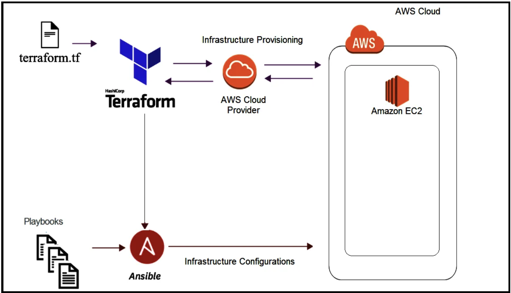

# Cloud Deployment Project: Deploying WordPress with MariaDB on AWS using Terraform and Ansible

## Objective

The primary objective of this project is to provide hands-on experience in deploying a WordPress website with MariaDB on the Amazon Web Services (AWS) cloud platform. You will use Terraform for infrastructure creation and Ansible for application installation. By the end of this project, you will have:

1. Set up a comprehensive AWS environment for hosting WordPress and MariaDB using Terraform.
2. Installed and configured Linux, Nginx, MariaDB, PHP, and WordPress using Ansible.
3. Implemented security measures, optimizations, and documented the setup for a production-grade WordPress site.

## Prerequisites

Before starting this project, make sure you have a solid understanding of the following concepts:

- Cloud computing principles, particularly AWS.
- Terraform for infrastructure provisioning.
- Ansible for application installation and configuration.
- Familiarity with web servers, databases, and WordPress.
- Web security and optimization best practices.

## Project Steps

### AWS Infrastructure Setup with Terraform

- Create an AWS account.
- Write Terraform configuration files to provision AWS infrastructure, including EC2 instances, security groups, storage, and networking.
- Setup and configure a EC2 Instance (ssh, security, ...).

> Always check your consumption and used services in order to avoid unexpected bills, try to use the free tier!

> Verify that all services are terminated after completion of use!

### Nginx Installation and Configuration using Ansible

- Install Nginx on the EC2 Instance.
- Configure Nginx for serving web content.
- Adjust firewall settings to allow HTTP/HTTPS traffic.
- Start the Nginx service.

### MariaDB Installation and Configuration using Ansible

- Install MariaDB on the EC2 Instance.
- Create a MariaDB database for WordPress.
- Create a user for WordPress and configure user rights.
- Start the MariaDB service.

### PHP Installation and Configuration using Ansible

- Install PHP on the EC2 Instance.
- Configure PHP settings for the WordPress site.
- Start the PHP service.

### WordPress Installation and Configuration using Ansible

- Download and set up WordPress on the EC2 Instance.
- Configure WordPress to use the MariaDB database.
- Start the WordPress service.

### Documentation

- In a `README.md` file prepare a clear and comprehensive documentation explaining your architecture, deployment process, and any additional configurations made.

## Evaluation Criteria

Your project will be evaluated based on the following criteria:

- Successful deployment of WordPress and MariaDB using Terraform for infrastructure creation and Ansible for installation.
- Effective configuration and secure setup of the environment.
- Quality and clarity of documentation.

## Conclusion

Completing this project will provide you with valuable experience in deploying web applications on a public cloud, emphasizing infrastructure as code practices, and configuration management. You will have a functional WordPress website using MariaDB, hosted on AWS, and be better prepared for similar real-world tasks in your future career.

Happy deploying!