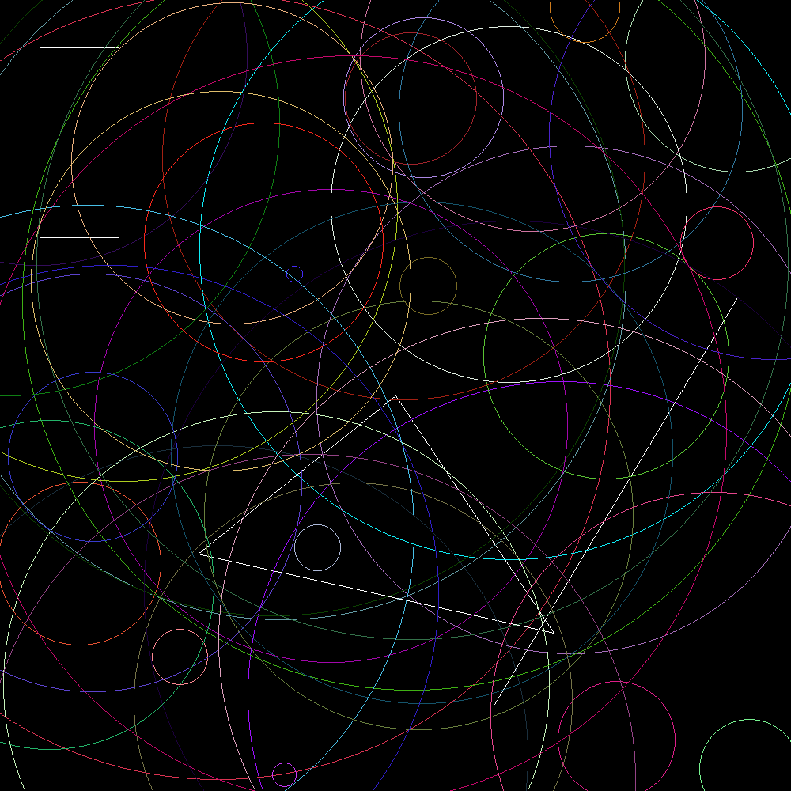

## drawing

### Instructions

The purpose of this exercise is to create an image like the example below:



You will need to do the following:

- Copy the code in the [usage](#usage) to your `main.rs`.

- Create a module called `geometrical_shapes` in another file.

You'll define the logic for creating and working with shapes in `geometrical_shapes`. Create the following traits:

- `Drawable` which contains the methods `draw` and `color`.

- `Displayable` which contains the method `display`.

Define them according to the way they are called in the `main.rs` function.

In order to compile and run `main.rs`, you'll need to define some structures. You are free to implement all the shapes with whatever internal structure you see fit, but you must provide an associated function `new` for all the shapes, which will be described below:

- `Point`: a new point should be created from two `i32` values.
- `Line`: a new line should be created from references to two different points.
- `Triangle`: a new triangle should be created from references to three different points.
- `Rectangle`: a new rectangle should be created from references to two different points.
- `Circle`: a new circle should be created from a reference to a point representing the center, and an `i32` value representing the circle's radius.

You'll also need to create the associated function `random` for `Line`, `Point` and `Circle`. You should derive their signatures from the usage.

> Don't forget to add the dependencies in your Cargo.toml.

### Bonus

You may optionally implement the following shapes, including the structures and traits needed to draw them:
- `Pentagon`
- `Cube`

### Usage

```rust
mod geometrical_shapes;

use geometrical_shapes as gs;
use gs::{Displayable, Drawable};
use raster::{Color, Image};

fn main() {
    let mut image = Image::blank(1000, 1000);

    gs::Line::random(image.width, image.height).draw(&mut image);

    gs::Point::random(image.width, image.height).draw(&mut image);

    let rectangle = gs::Rectangle::new(&gs::Point::new(150, 300), &gs::Point::new(50, 60));
    rectangle.draw(&mut image);

    let triangle = gs::Triangle::new(
        &gs::Point::new(500, 500),
        &gs::Point::new(250, 700),
        &gs::Point::new(700, 800),
    );
    triangle.draw(&mut image);

    for _ in 1..50 {
        gs::Circle::random(image.width, image.height).draw(&mut image);
    }

    raster::save(&image, "image.png").unwrap();
}

impl Displayable for Image {
    fn display(&mut self, x: i32, y: i32, color: Color) {
        if x >= 0 && x < self.width && y >= 0 && y < self.height {
            self.set_pixel(x, y, color).unwrap();
        }
    }
}
```

> The expected output is a png file: `image.png`

### Notions

- [Image processing library](https://docs.rs/raster/0.2.0/raster/)

- [Traits](https://doc.rust-lang.org/stable/book/ch10-02-traits.html)
