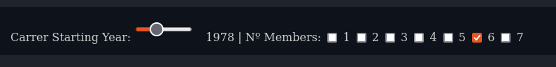

## groupie-tracker-filters

### Objectives

You must follow the same [principles](../README.md) as the first subject.

- Groupie Tracker Filters consists on letting the user filter the artists/bands that will be shown.

- Your project must incorporate at least these four filters:

  - filter by creation date
  - filter by first album date
  - filter by number of members
  - filter by locations of concerts

- Your filters must be of at least these two types:
  - a range filter (filters the results between two values)
  - a check box filter (filters the results by one or multiple selection)

### Example

Here is an example of both types of filters:

.

### Hints

- You have to pay attention to the locations. For example Seattle, Washington, USA **is part of** Washington, USA.

### Instructions

- The backend must be written in **Go**.
- You must handle website errors.
- The code must respect the [good practices](../../good-practices/README.md)
- It is recommended to have **test files** for [unit testing](https://go.dev/doc/tutorial/add-a-test).

### Allowed packages

- Only the [standard Go](https://golang.org/pkg/) packages are allowed.

This project will help you learn about:

- Manipulation, display and storage of data
- Event creation and display
- JSON files and format
- Go routines
