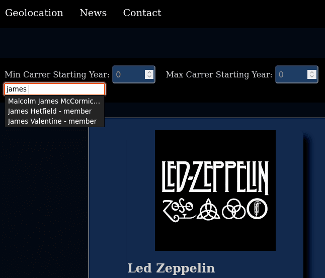

## groupie-tracker-search-bar

### Objectives

You must follow the same [principles](../README.md) as the first subject.

Groupie tracker search bar consists of creating a functional program that searches, inside your website, for a specific text input.
So the focus of this project is to create a way for the client to search a member or artist or any other attribute in the data system you made.

- The program should handle at least these search cases :
  - artist/band name
  - members
  - locations
  - first album date
  - creation date
- The program must handle search input as case-insensitive.
- The search bar must have typing suggestions as you write.
  - The search bar must identify and display in each suggestion the individual type of the search cases. (ex: Freddie Mercury -> member)
  - For example if you start writing `"phil"` it should appear as suggestions `Phil Collins - member` and `Phil Collins - artist/band`. This is just an example of a display.

### Example

Lets imagine you have created a card system to display the band data. The user can directly search for the band he needs. Here is an example:

- While the user is typing for the member he desires to see, the search bar gives the suggestion of all the possible options.

### Instructions

- The program must be written in **Go**.
- The code must respect the [**good practices**](../../good-practices/README.md).

### Allowed packages

- Only the [standard Go](https://golang.org/pkg/) packages are allowed

This project will help you learn about :

- Manipulation, display and storage of data.
- HTML.
- [Events](https://developer.mozilla.org/en-US/docs/Learn/JavaScript/Building_blocks/) creation and display.
- JSON files and format.
