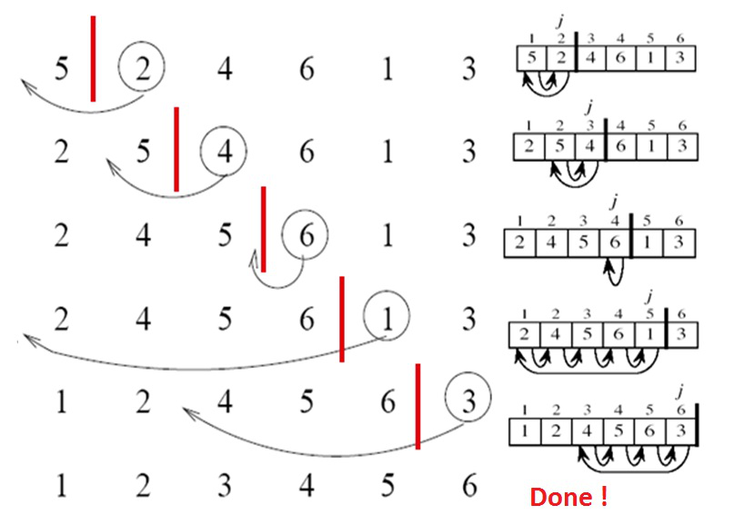

## insertion_sort

### Instructions

Implement the insertion-sort algorithm by creating a function named `insertion_sort`. It should execute the iterations of the algorithm **up to** the number indicated by `steps`. See the **Usage** for more information.

The insertion-sort algorithm sorts an array of size `n` in ascending order.

1. Iterates over the slice from `slice[1]` to `slice[n]`.

2. Compares the current element (`slice[key]`) to its predecessor (`slice[key-1]`).

3. If `slice[key]` is smaller than `slice[key-1]`, then `slice[key]` is compared to `slice[key-2]` and so on.

4. All of the elements with values greater than `slice[key]` will need to be shifted over, to fit the value at `slice[key]` into its new position.

A step-by-step example of insertion-sort:



**Figure 1** - Step by step execution of the algorithm insertion sort

### Expected Function

```rust
pub fn insertion_sort(slice: &mut [i32], steps: usize) {
}
```

### Usage

Here is a possible program to test your function,

```rust
use insertion_sort::insertion_sort;

fn main() {
    let mut target = [5, 3, 7, 2, 1, 6, 8, 4];
    // executes the first iteration of the algorithm
    insertion_sort(&mut target, 1);
    println!("{:?}", target);

    let mut target = [5, 3, 7, 2, 1, 6, 8, 4];
    let len = target.len();
    // executes len - 1 iterations of the algorithm
    // i.e. sorts the slice
    insertion_sort(&mut target, len - 1);
    println!("{:?}", target);
}
```

And its output:

```console
$ cargo run
[3, 5, 7, 2, 1, 6, 8, 4]
[1, 2, 3, 4, 5, 6, 7, 8]
$
```
