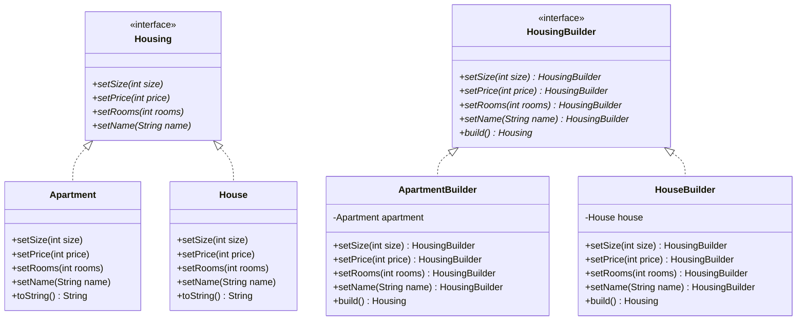

## Builder

### Instructions

Now let's implement the Builder Design Pattern



Here is the matching class diagram. Create the matching classes in the matching files.

The `Apartment` and `House` class should have an empty constructor.

The `toString` method of `Apartment` should return : `Apartment{size=<size>, price=<price>, rooms=<rooms>, name='<name>'}`  
The `toString` method of `House` should return : `House{size=<size>, price=<price>, rooms=<rooms>, name='<name>'}`

### Usage

Here is a possible ExerciseRunner.java to test your function :

```java
public class ExerciseRunner {

    public static void main(String[] args) {
        Housing house = new HouseBuilder()
                .setName("Maison")
                .setRooms(4)
                .setSize(80)
                .setPrice(100000)
                .build();
        Housing apartment = new ApartmentBuilder()
                .setName("Appart")
                .setRooms(2)
                .setSize(30)
                .setPrice(25000)
                .build();

        System.out.println(house);
        System.out.println(apartment);
    }
}
```
          
and its output :
```shell
$ javac *.java -d build
$ java -cp build ExerciseRunner 
House{size=80, price=100000, rooms=4, name='Maison'}
Apartment{size=30, price=25000, rooms=2, name='Appart'}
$
```

### Notions
[Class diagram](https://fr.wikipedia.org/wiki/Diagramme_de_classes)  

