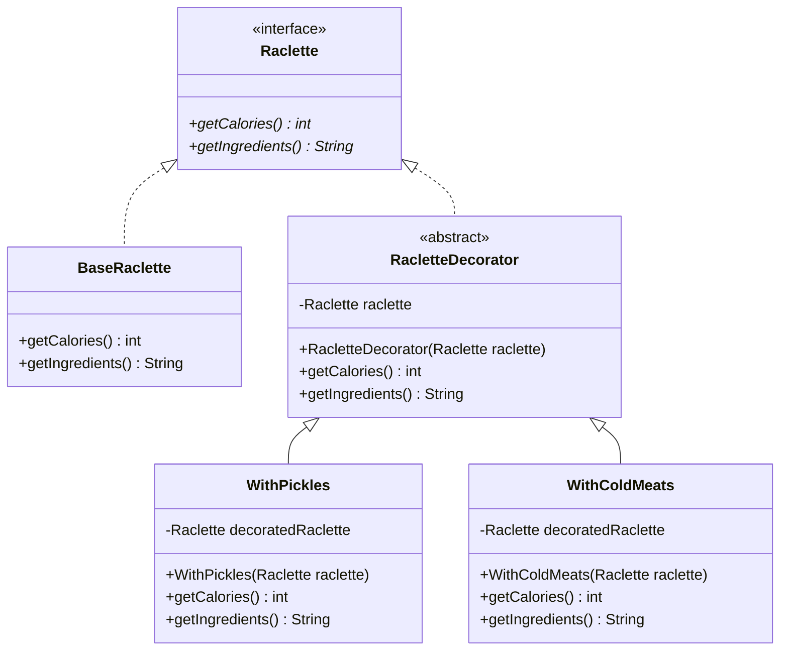

## Decorator

### Instructions

Now let's implement the Decorator Design Pattern



Here is the matching class diagram. Create the matching classes in the matching files.

Here is the description : 
* `BaseRaclette` :
  * `getCalories` should return 1000
  * `getIngredients` should return "Patate, fromage à raclette"
* `RacletteDecorator` :
  * `getCalories` should return the `getCalories` of the `decoratedRaclette` attribute
  * `getIngredients` should return the `getIngredients` of the `decoratedRaclette` attribute
* `WithPickles` :
  * `getCalories` should return the addition of 50 and the `getCalories` of the `decoratedRaclette` attribute
  * `getIngredients` should return the concatenation of `getIngredients` of the `decoratedRaclette` attribute and ", cornichons"
* `WithColdMeats` :
  * `getCalories` should return the addition of 350 and the `getCalories` of the `decoratedRaclette` attribute
  * `getIngredients` should return the concatenation of `getIngredients` of the `decoratedRaclette` attribute and ", charcuterie"

For each class, implement the `toString` method to return "`getIngredients()` pour `getCalories()` calories".

### Usage

Here is a possible ExerciseRunner.java to test your function :

```java
public class ExerciseRunner {

    public static void main(String[] args)  {
        Raclette r = new BaseRaclette();
        System.out.println(r);
        r = new WithPickles(r);
        System.out.println(r);
        r = new WithColdMeats(r);
        System.out.println(r);
    }
}
```
          
and its output :
```shell
$ javac *.java -d build
$ java -cp build ExerciseRunner 
Patate, fromage à raclette pour 1000 calories
Patate, fromage à raclette, cornichons pour 1050 calories
Patate, fromage à raclette, cornichons, charcuterie pour 1400 calories
$
```

### Notions
[Class diagram](https://fr.wikipedia.org/wiki/Diagramme_de_classes)  

