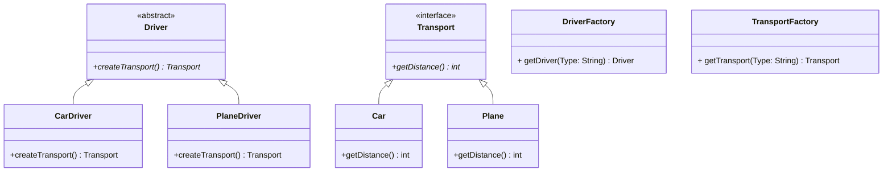

## Factory

### Instructions

Now let's implement the Factory Design Pattern



Here is the matching class diagram. Create the matching classes in the matching files.

The method createTransport of CarDriver should build and return a Car using TransportFactory, and for the PlaneDriver class, it should build and return a Plane.

The car should return 600 and the plane should return 10000.

### Usage

Here is a possible ExerciseRunner.java to test your function :

```java
public class ExerciseRunner {

    public static void main(String[] args)  {

        System.out.println(DriverFactory.getDriver("Car").createTransport().getDistance());
        System.out.println(DriverFactory.getDriver("Plane").createTransport().getDistance());
    }
}
```
          
and its output :
```shell
$ javac *.java -d build
$ java -cp build ExerciseRunner 
600
10000
$
```

### Notions
[Class diagram](https://fr.wikipedia.org/wiki/Diagramme_de_classes)  

