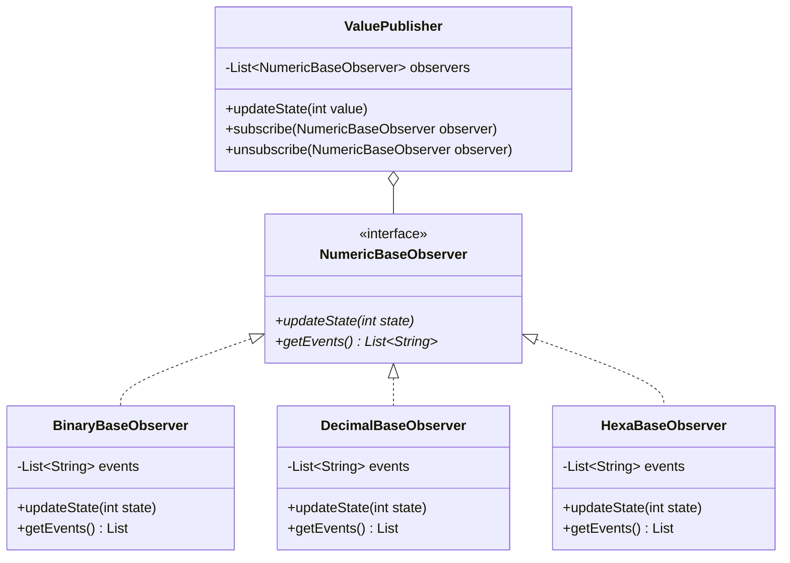

## Observer

### Instructions

Now let's implement the Observer Design Pattern



Here is the matching class diagram. Create the matching classes in the matching files.

Here is the description : 
* For `ValuePublisher` :
  * `updateState` calls the `updateState` method of all observers.
  * `subscribe` should add the observer to the list of observers.
  * `unsubscribe` should remove the observer from the list of observers.
* For `BinaryBaseObserver` :
  * `updateState` should add the binary String representation of its parameter to the list of events (e.g. for 13, should add "1101")
  * `getEvents` should return the list of events.
* For `DecimalBaseObserver` :
  * `updateState` should add the decimal String representation of its parameter to the list of events (e.g. for 13, should add "13")
  * `getEvents` should return the list of events.
* For `HexaBaseObserver` :
  * `updateState` should add the hexadecimal String representation of its parameter to the list of events (e.g. for 13, should add "d")
  * `getEvents` should return the list of events.

### Usage

Here is a possible ExerciseRunner.java to test your function :

```java
public class ExerciseRunner {

  public static void main(String[] args)  {
    ValuePublisher publisher = new ValuePublisher();

    BinaryBaseObserver binaryObserver = new BinaryBaseObserver();
    DecimalBaseObserver decimalObserver = new DecimalBaseObserver();
    HexaBaseObserver hexaObserver = new HexaBaseObserver();

    publisher.subscribe(binaryObserver);
    publisher.subscribe(decimalObserver);
    publisher.subscribe(hexaObserver);

    publisher.updateState(1254);
    publisher.updateState(45839);
    publisher.updateState(5984382);

    System.out.println("Binary " + binaryObserver.getEvents());
    System.out.println("Decimal " + decimalObserver.getEvents());
    System.out.println("Hexa " + hexaObserver.getEvents());
  }
}
```
          
and its output :
```shell
$ javac *.java -d build
$ java -cp build ExerciseRunner 
Binary [10011100110, 1011001100001111, 10110110101000001111110]
Decimal [1254, 45839, 5984382]
Hexa [4e6, b30f, 5b507e]
$
```

### Notions
[Class diagram](https://fr.wikipedia.org/wiki/Diagramme_de_classes)  

