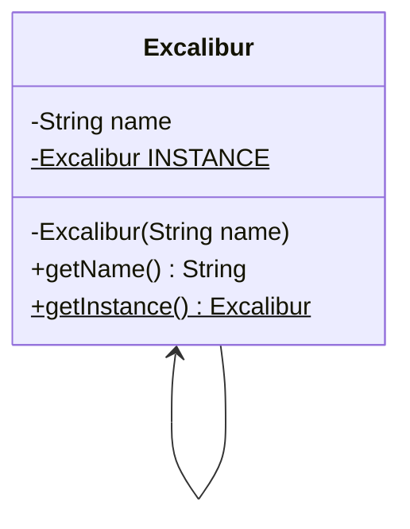

## Singleton

### Instructions

In this quest, we will implement some design patterns.

At first, we will implement the singleton pattern.



Here is the matching class diagram. Create the matching class in the matching file.

When calling `getInstance` method, an instance of Excalibur with name "Sword" should be returned.

### Usage

Here is a possible ExerciseRunner.java to test your function :

```java
public class ExerciseRunner {

    public static void main(String[] args)  {
        System.out.println(Excalibur.getInstance().getName());
    }
}
```
          
and its output :
```shell
$ javac *.java -d build
$ java -cp build ExerciseRunner 
Sword
$
```

### Notions
[Class diagram](https://fr.wikipedia.org/wiki/Diagramme_de_classes)  

