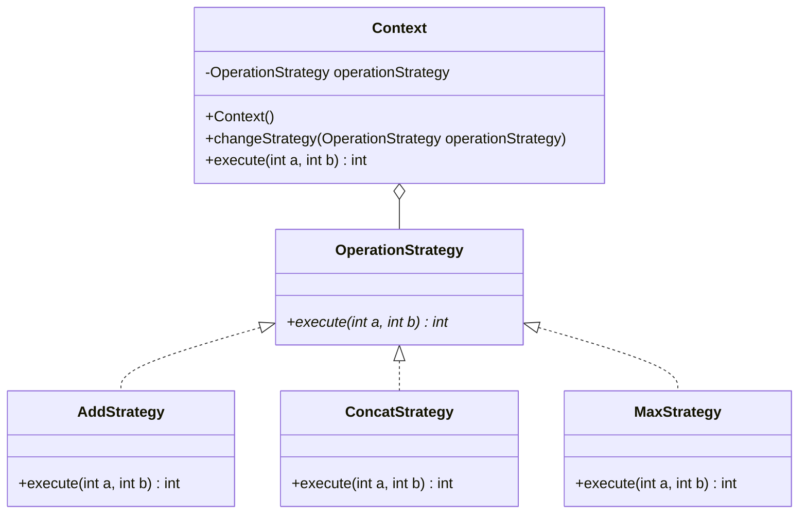

## Strategy

### Instructions

Now let's implement the Visitor Design Pattern



Here is the matching class diagram. Create the matching classes in the matching files.

Here is the description : 
* For `Context` :
  * `operationStrategy` field should be initialized with a `AddStrategy`
  * `changeStrategy` should update the `operationStrategy` field
  * `execute` should return the result of `operationStrategy.execute`
* For `AddStrategy` :
  * `execute` should return the sum of the two integers (e.g. a = 2, b = 4, then should return 6)
* For `ConcatStrategy` :
  * `execute` should return the concatenation of the two integers (e.g. a = 2, b = 4, then should return 24)
* For `MaxStrategy` :
  * `execute` should return the max of the two integers (e.g. a = 2, b = 4, then should return 4)

### Usage

Here is a possible ExerciseRunner.java to test your function :

```java
public class ExerciseRunner {

  public static void main(String[] args)  {
    Context context = new Context();
    System.out.println(context.execute(23, 43));

    context.changeStrategy(new MaxStrategy());
    System.out.println(context.execute(23, 43));

    context.changeStrategy(new ConcatStrategy());
    System.out.println(context.execute(23, 43));
  }
}
```
          
and its output :
```shell
$ javac *.java -d build
$ java -cp build ExerciseRunner 
66
43
2343
$
```

### Notions
[Class diagram](https://fr.wikipedia.org/wiki/Diagramme_de_classes)  

