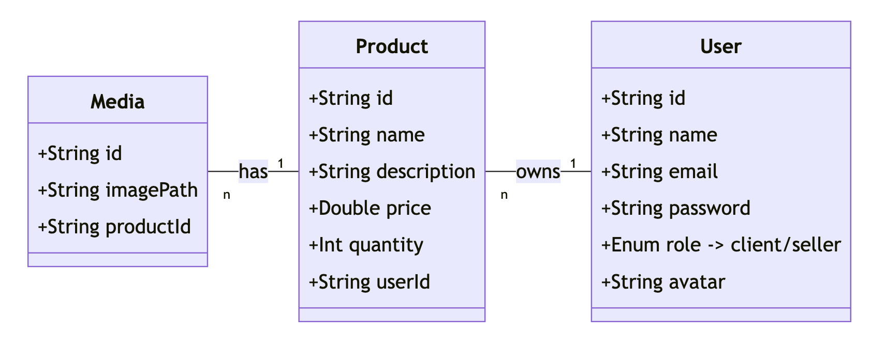

## Microservices with Angular

### Objectives

Develop an end-to-end e-commerce platform with Spring Boot microservices and Angular. The platform should support user registration (either as a client or seller), authentication, product CRUD functionality exclusively for sellers, and media management for product images.

### Instructions

#### 1. Microservices Setup

- Set up your microservice architecture. Consider Kafka for services communications.

#### 2. Enhanced Database Design

#### 3. API Development Enhancement

- **User Microservice**:
    - Users can register as clients or sellers, with sellers having the option to upload an avatar.
    - Authentication and profile management functions should be available.

- **Product Microservice**:
    - CRUD operations for products, with only authenticated sellers being able to create/update/delete their products.
    - Products should support an associated list of images.

- **Media Microservice**:
    - Handle media uploads with a size limit of 2MB.
    - Ensure only legitimate image files are uploaded.

#### 4. Front-end Development with Angular

- **Sign-In/Up Pages**: Implement authentication views. Sellers should have the option to upload/update their avatar.
- **Seller Product Management**: A dashboard where sellers can manage their products, including uploading images.
- **Product Listing**: A simple view to display all products without filtering or search capabilities.
- **Media Management**: A dedicated view for sellers to manage and upload media specifically for their products. Ensure appropriate file size and type validation.

#### 5. Authentication & Authorization

- Implement role-based authentication.
- Use **Spring Security** with **JWT** or **OAuth2** to distinguish between clients and sellers, ensuring only sellers can manage products and their associated media.

#### 6. Error Handling and Validation

- Provide feedback for incorrect file types or when exceeding the upload size limit.
- Handle cases like a client trying to add a product or a seller trying to modify another seller's product.
- Provide validation for all forms in the application.

#### 7. Security Measures

- **HTTPS Encryption**: Always use HTTPS to encrypt data in transit. Consider tools like **Let's Encrypt** for free SSL certificates.
- **Sensitive Information Protection**: Protect sensitive user information. Passwords and other details should never be exposed in API responses.
- **Password Security**: Use **Spring Security** to hash and salt passwords before saving them in the MongoDB database.
- **Access Control**: Ensure only the seller who created a product can modify or delete it and manage its media.

### Testing

Emphasize testing:
- Role-based functionalities.
- Media upload constraints.
- Authentication flows.
- Data integrity for product and media management by sellers.

### Resources
[Spring Boot Microservices Guide](https://spring.io/guides/tutorials/rest/)
[Spring Cloud Eureka Service Discovery Client Setup](https://www.baeldung.com/spring-cloud-netflix-eureka)  
[Let's Encrypt for ssl(HTTPS)](https://letsencrypt.org/getting-started/)