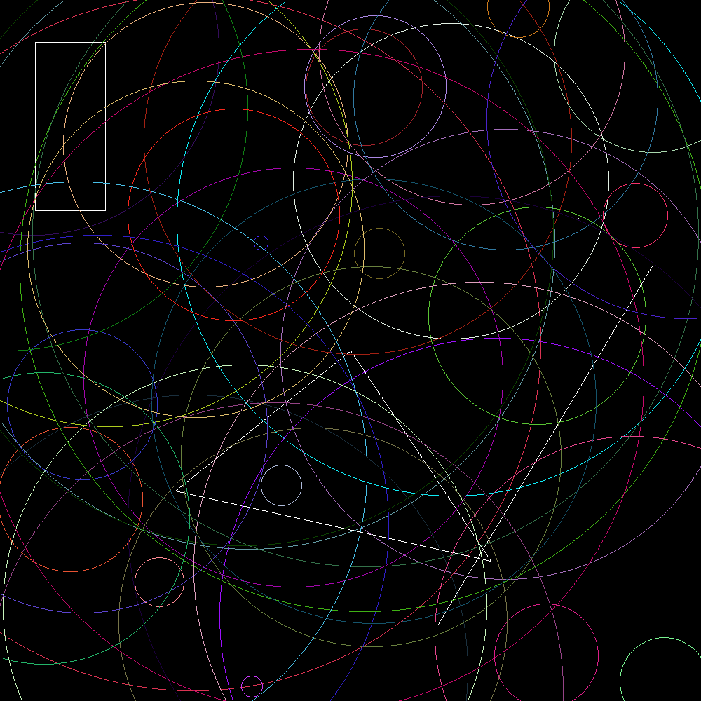

## Jart

### Instructions
The purpose of this exercise is to create an image like the example below:




You will need to do the following:

- Copy the code in the [usage](#usage) to your `Main.java`

You'll define the logic for creating and working with shapes in the geometrical_shapes package. Create the following interfaces:

- Drawable which contains the methods draw and getColor.

- Displayable which contains the methods display and save.

Define them according to the way they are called in the Main.java function.

In order to compile and run `Main.java`, you'll need to define some classes. You are free to implement all the shapes with whatever internal structure you see fit, but you must provide a constructor for all the shapes, which will be described below:

- `Point`: a new point should be created from two int values.
- `Line`: a new line should be created from references to two different points.
- `Triangle`: a new triangle should be created from references to three different points.
- `Rectangle`: a new rectangle should be created from references to two different points.
- `Circle`: a new circle should be created from a reference to a point representing the center, and an int value representing the circle's radius.


You'll also need to create the `random` method for `Line`, `Point`, and `Circle`. You should derive their signatures from the usage.

### Bonus
You may optionally implement the following shapes, including the classes and interfaces needed to draw them:

- Pentagon
- Cube

### Usage

```java
interface Displayable {
    void display(int x, int y, Color color);
    void save(String string);
}

interface Drawable {
    void draw(Displayable displayable);
    Color getColor();
}

public class Main {
    public static void main(String[] args) {
        Image image = new Image(1000, 1000);
        Rectangle rectangle = new Rectangle(new Point(50, 50), new Point(300, 200));
        rectangle.draw(image);
        Triangle triangle = new Triangle(new Point(100, 100), new Point(900, 900), new Point(100, 900));
        triangle.draw(image);

        for (int i = 0; i < 50; i++) {
            Circle circle = Circle.random(image.getWidth(), image.getHeight());
            circle.draw(image);
        }
        image.save("image.png");
    }
}
```


### Notions

- [java.awt](https://www.javatpoint.com/java-awt)
