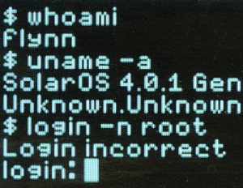

## login

> In the movie _TRON: Legacy_, Linux is rebranded "SolarOS" in reference to [Solaris](<https://en.wikipedia.org/wiki/Solaris_(operating_system)>), another Unix OS

---

Start the VM to boot the previously installed Debian system.

Do the following for both a user and the [superuser](https://en.wikipedia.org/wiki/Superuser) (`root`) :

- Login in the console
- Clear the console using the keyboard shortcut
- Change the password to this : `michelle`
- Show the command history using five keystrokes or less (using autocompletion)
- Log out using the keyboard shortcut

### Just numbers

Login as [`root`](https://en.wikipedia.org/wiki/Superuser) on the third [Linux console](https://en.wikipedia.org/wiki/Linux_console).

Check the Internet connectivity with the command `ping google.com`.
After a few hops, interrupt the program with : <kbd>Ctrl</kbd> + <kbd>C</kbd>.

Behind every name in a computer system there is a number (ID, index, address, etc) :

- User identifier
  - `root` → `0`
  - `student` → `1000`
- IP address
  - google.com → 216.58.214.14 (quad-dotted notation) → `3627734542`
  - tencent.com → 117.169.101.44 (quad-dotted notation) → `1974035756`
- File inode
  - `/etc/fstab` → `44696029`
  - `.profile` → `59639363`
- Port
  - `HTTP` → `80`
  - `HTTPS` → `443`
- Process identifier
  - `cron` → `254`

Names exist because they are human readable, but behind the scenes they are converted into numbers, unique in their namespace :

- A domain name can have several IP addresses, but an IP address can only identify one domain name
- Several processes may have the same name, but a PID identifies a single process

Find the commands to get :

- the inode of a specific file
- the current user ID
- the PID of a program, for example `bash`
