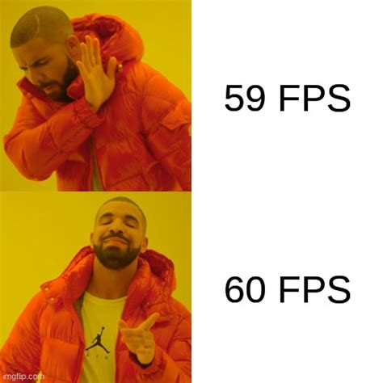

## make-your-game

With the passing of time and evolution of technology, the human brain has been requesting
more and more stimuli to keep the brain occupied. Boredom happens whenever
people don't receive enough of these stimuli. And you are not receiving enough
of it, so you decide to make **your own game**. And to make it more challenging you decide to use
JavaScript to make it.

Your game will be single player only and you will have to create your
own engine and tools for the game. And as you try to search for all sorts
of information you start to remember all the 60 FPS memes.

### Objectives

Here are some of the features you want to implement in your game:

- Game runs at at least **60 FPS** at all times
- No frame drops!
- Proper use of **RequestAnimationFrame**
- It is very hard to predict performances in JS. So measure performances to see if your code is fast. This will be tested!
- Pause menu, that includes:
  - Continue
  - Restart
- A score board that displays the following metrics:
  - **Countdown clock or Timer** that will indicate the amount of time the player has until the game ends or the time that the game has been running
  - **Score** that will display the current score (XP or points)
  - **Lives** that shows the number of lives that the player has left
- The use of layers must be minimal but not zero in order to optimize the rendering performance.

You must not use frameworks or canvas, the game must be implemented using plain JS/DOM and HTML only

### Instructions

Animation must have consistent motion, so in order to have a smooth animation (without interruptions or so called jank animation) you must achieve the special number, [**60 FPS**](https://www.algolia.com/developers-tech-blog/code-and-deep-dives/performant-web-animations/). You can see more about performance [here](../good-practices/README.md)

In order to play the game the player must only use the keyboard. The controls must be smooth, in other words you should not need to spam a key to take actions in the game. Instead, for example, if a key is kept pressed, the player must continue to do the relevant action. If the key is released the player should stop doing the action.

Basically, motions triggered by a key must not jank or stutter.

For the pause menu you must be able to pause, restart, and continue the game whenever you want to do so. The frames should not drop if paused.

### Pre-Approved List

Your game will have to respect the genre of one of these games listed below. In other words, the main goal of the game has to be similar to one of these:

- [Bomberman](https://en.wikipedia.org/wiki/Super_Bomberman)
- [Flipper/ Pinball](https://en.wikipedia.org/wiki/Pinball)
- [Space Invaders](https://en.wikipedia.org/wiki/Space_Invaders)
- [Donkey Kong](https://en.wikipedia.org/wiki/Donkey_Kong)
- [Brick Breaker/ Arkanoid](https://en.wikipedia.org/wiki/Arkanoid)
- [Pac-Man](https://en.wikipedia.org/wiki/Pac-Man)
- [Super Mario](https://en.wikipedia.org/wiki/Super_Mario)
- [Tetris](https://en.wikipedia.org/wiki/Tetris)
- [Duck Hunt](https://en.wikipedia.org/wiki/Duck_Hunt)

### Dev Tools

We strongly advise you to use Developer Tools available in every browser (can be accessed using hot keys that depend on the browser or from the browser's Tools menu option).

Developer tools that will help the most with developing this project:

- **Page Inspector**: You can view and edit page content and layout.
- **Web Console**: You can see your `console.log`s and interact with the page using JavaScript.
- **Performance Tool**: You can analyze your site's general responsiveness, performance, Javascript and layout performance.

The tool that will help you the most is the Performance Tool. There you can record a sample of your actions on the site and analyze the FPS, check for frame drops, how much time your functions take to execute, and other useful metrics monitoring.

In the developer tools you can also find a Paint Flashing option that will highlight every paint that happens in your page as actions are performed on it.

This project will help you learn about:

- [`requestAnimationFrame`](https://developer.mozilla.org/en-US/docs/Web/API/window/requestAnimationFrame)
- [Event loop](https://developer.mozilla.org/en-US/docs/Web/JavaScript/EventLoop)
- FPS
- DOM
- [Jank/stutter animation](https://addyosmani.com/blog/making-a-site-jank-free/)
  - [Example](https://googlechrome.github.io/devtools-samples/jank/)
- [Transform](https://developer.mozilla.org/en-US/docs/Web/CSS/transform)/ [opacity](https://developer.mozilla.org/en-US/docs/Web/CSS/opacity)
- Tasks
  - JavaScript
  - Styles
  - Layout
  - Painting
  - Compositing
- Developer Tools
  - [Firefox](https://developer.mozilla.org/en-US/docs/Learn/Common_questions/What_are_browser_developer_tools)
  - [Chrome](https://developers.google.com/web/tools/chrome-devtools)
