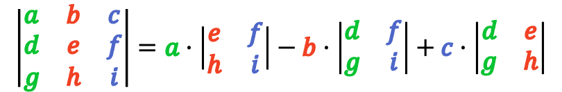

## matrix_determinant

### Instructions

Create a **function** which receives a 3x3 matrix (`[[isize; 3]; 3]`) and returns its determinant `isize`.

This is how you calculate a 2x2 matrix determinant:

```sh
|a b|
|c d|

a*d - b*c
```

To calculate a 3x3 matrix determinant you have to take 'a' and multiply it by the determinant of the matrix you get if you get rid of the 'a' column and the 'a' row. Then you subtract the multiplication of 'b' and the determinant of the matrix you get if you get rid of the 'b' column and row. And finally, you do the same process for 'c' and add it to the previous result.

```sh
|a b c|
|d e f|
|g h i|
```



### Expected Function

```rust
pub fn matrix_determinant(matrix: [[isize; 3]; 3]) -> isize {
    todo!()
}
```

### Example

Here is a program to test your function:

```rust
use matrix_determinant::*;

fn main() {
    let matrix = [[1, 2, 4], [2, -1, 3], [4, 0, 1]];

    println!(
        "The determinant of the matrix:\n|1  2  4|\n|2 -1  3|  = {}\n|4  0  1|",
        matrix_determinant(matrix)
    );
}
```

And its output:

```sh
$ cargo run
The determinant of the matrix:
|1  2  4|
|2 -1  3|  = 35
|4  0  1|
$
```
