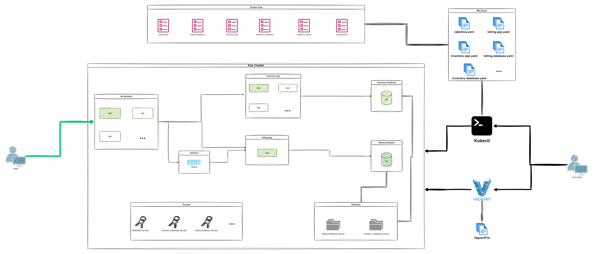

#### General

##### Check the Repo content

The repo contains a `README.md`, an `orchestrator.sh` script, a `Vagrantfile`
and all the additional files used to create, delete and manage the submitted
infrastructure.

###### Are all the required files present?

###### Does the project as a structure similar to the one below? If not, can the student provide a justification for the chosen project structure?

```console
.
├── Manifests
│   └── [...]
├── Scripts
│   └── [...]
├── Dockerfiles
│   └── [...]
└── Vagrantfile
```

##### Ask the following questions to the group or student

- What is container orchestration, and what are its benefits?

- What is Kubernetes, and what is its main role?

- What is K3s, and what is its main role?

###### Did the student reply correctly to the questions?

##### Check the Student Documentation

> There must be a `README.md` file with the project Documentation

###### Did the README.md file contains all the required information about the solution (prerequisites, configuration, setup, usage, ...)?

##### Check the docker images in the Docker Hub:

###### Are the docker images used in the YAML manifest uploaded from the student's Docker Hub account?

##### Check the cluster:

By using K3s in Vagrant two virtual machines must be created:

1. `Master`: the master in the K3s cluster.

2. `Agent`: an agent in the K3s cluster.

`kubectl` must be installed and configured in the learner machine to manage the cluster.

The nodes must be connected and available, try:

```console
$> kubectl get nodes -A
NAME  STATUS   ROLES    AGE    VERSION
<master-node>   Ready    <none>   XdXh   vX
<agent1-node>   Ready    <none>   XdXh   vX
$>
```

###### Is kubectl installed and configured in the learner's machine?

###### Was the cluster created by a Vagrantfile?

###### Does the cluster contain two nodes (_master_ and _agent_)?

###### Are the nodes connected and ready for usage?

##### Check the student infrastructure:

The student must implement this architecture:


##### Run the student infrastructure:

```console
user:~$ ./orchestrator.sh create
cluster created
user:~$
```

###### Did the student provide an `orchestrator.sh` script that runs and creates and manages the infrastructure?

###### Did the student respect the architecture?

###### Did the infrastructure start correctly?

##### Verify the K8s Manifests:

###### Is there a YAML Manifest for each service?

###### Are credentials not existing in the YAML manifests, except the secret manifests?

##### Ask the following questions to the group or student

- What is infrastructure as code and what are the advantages of it?

- Explain what is a K8s manifest.

- Explain each K8s manifests.

###### Did the student reply correctly to the questions?

##### Check the secrets

```console
$> kubectl get secrets -o json
<...>
$>
```

###### Are all the used credentials and passwords present in the secrets?

##### Check all deployed resources:

```console
user:~$ kubectl get all
<...>
user:~$
```

- `inventory-database container` is a PostgreSQL database server that contains your inventory database, it must be accessible via port `5432`.
- `billing-database container` is a PostgreSQL database server that contains your billing database, it must be accessible via port `5432`.
- `inventory-app container` is a server that contains your inventory-app code running and connected to the inventory database and accessible via port `8080`.
- `billing-app container` is a server that contains your billing-app code running and connected to the billing database and consuming the messages from the RabbitMQ queue, and it can be accessed via port `8080`.
- `RabbitMQ container` is a RabbitMQ server that contains the queue.
- `api-gateway-app container` is a server that contains your api-gateway-app code running and forwarding the requests to the other services and it's accessible via port `3000`.

###### Are all the required applications deployed?

- Databases must be deployed as _StatefulSet_, and volumes that enable containers to move across infrastructure without losing the data must be created.

- The following applications must be deployed as a deployment, and they must be scaled horizontally automatically, depending on CPU consumption:

1. `api-gateway`:
   max replication: 3
   min replication: 1
   CPU percent trigger: 60%

2. `inventory-app`:
   max replication: 3
   min replication: 1
   CPU percent trigger: 60%

The `billing-app` must be deployed as _StatefulSet_.

###### Do all apps deploy with the correct configuration?

##### Ask the following questions to the group or student

- What is _StatefulSet_ in K8s?

- What is _deployment_ in K8s?

- What is the difference between _deployment_ and _StatefulSet_ in K8s?

- What is scaling, and why do we use it?

- What is a load balancer, and what is its role?

- Why we don't put the database as a deployment?

###### Did the student reply correctly to all the above questions?

##### Test the solution

#### Inventory API Endpoints

##### Open Postman and make a `POST` request to `http://[GATEWAY_IP]:[GATEWAY_PORT]/api/movies/` address with the following body as `Content-Type: application/json`:

```json
{
  "title": "A new movie",
  "description": "Very short description"
}
```

###### Can you confirm the response was the success code `200`?

##### In Postman make a `GET` request to `http://[GATEWAY_IP]:[GATEWAY_PORT]/api/movies/` address.

###### Can you confirm the response was success code `200` and the body of the response is in `json` with the information of the last added movie?

#### Billing API Endpoints

##### Open Postman and make a `POST` request to `http://[GATEWAY_IP]:[GATEWAY_PORT]/api/billing/` address with the following body as `Content-Type: application/json`:

```json
{
  "user_id": "20",
  "number_of_items": "99",
  "total_amount": "250"
}
```

###### Can you confirm the response was success code `200`?

##### Stop the billing-app container

###### Can you confirm the `billing-app` container was correctly stopped?

##### Open Postman and make a `POST` request to `http://[GATEWAY_IP]:[GATEWAY_PORT]/api/billing/` address with the following body as `Content-Type: application/json`:

```json
{
  "user_id": "22",
  "number_of_items": "10",
  "total_amount": "50"
}
```

###### Can you confirm the response was success code `200` even if the `billing_app` is not working?

#### PostgreSQL database for Billing

##### Run `kubectl exec -it pods/billing-db-0 -- sh` to enter into the pod, then run `sudo -i -u postgres`, then `psql` and once in the database enter `\l`.

> The `billing-db-0` is the ID of the pods running the billing db database - it might be different. To check which is the pods ID run `kubectl get pods | grep billin-db`

###### Can you confirm the `orders` database is listed?

##### Still in `psql` run `\c orders` and then `TABLE orders;`.

###### Can you confirm the order with `user_id = 20` is listed properly?

###### Can you confirm the order with `user_id = 22` is NOT listed?

#### Check resilience of messaging queue

##### Start the billing-app container

###### Can you confirm the `billing-app` container was correctly stopped?

###### Can you confirm the order with `user_id = 22` is now listed properly?

#### K8s components


In less than 15 minutes and with the help of Google the student must explain all Kubernetes components and their roles.

###### Can the learner explain the K8s components in less than 15 minutes?

#### Bonus

###### +Did the student used his/her own `play-with-container` solution instead of the provided one?

###### +Did the student add any optional bonus?

###### +Is this project an outstanding project?
