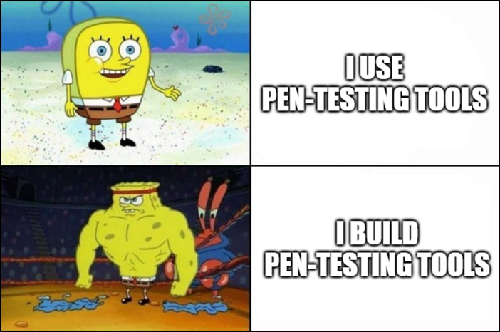

## Pentest-kit



### Introduction:

Penetration testing (Pentesting) is a critical process in cybersecurity, involving the use of specialized tools to identify vulnerabilities in systems and networks. This project involves creating basic penetration testing tools to understand security assessment fundamentals.

### Objective:

The goal is to build a simple penetration testing toolkit using a programming language of your choice. The toolkit will help you understand core security concepts and develop practical skills for basic security assessments.

By completing this project, you will:

- Gain practical experience in developing basic security tools.
- Understand core functionalities of port scanning and web directory discovery.
- Learn basic penetration testing concepts and methodologies.
- Enhance your understanding of ethical considerations in cybersecurity.

### Resources

- [Penetration Testing (Wikipedia)](https://en.wikipedia.org/wiki/Penetration_test)

- [Network Security Fundamentals (Wikipedia)](https://en.wikipedia.org/wiki/Network_security)

- [Port Scanner (Wikipedia)](https://en.wikipedia.org/wiki/Port_scanner)

- [Python Socket Programming (Real Python)](https://realpython.com/python-sockets/)

- [HTTP Status Codes (MDN)](https://developer.mozilla.org/en-US/docs/Web/HTTP/Status)

- [requests Quickstart (Official)](https://requests.readthedocs.io/en/latest/user/quickstart/)

- [Dirsearch Tool (Kali)](https://www.kali.org/tools/dirsearch/)

- [HTTP Headers Guide (MDN)](https://developer.mozilla.org/en-US/docs/Web/HTTP/Headers)

### Hints

Before starting this project, you should know the following:

**Basic Programming Concepts:**

- Command-line argument parsing
- HTTP requests and status code handling
- Basic socket programming for network connections
- File I/O operations for saving results
- Error handling and exception management

**Networking Fundamentals:**

- Understanding of IP addresses and port numbers
- Basic TCP connections and socket programming
- HTTP protocols and status codes
- Network scanning concepts

> You may use any Python libraries or techniques you're comfortable with. We encourage use of standard libraries like `argparse`, `socket`, or `requests`, but you're free to explore alternatives like `httpx`, `click`, or raw socket implementations. Avoid calling external CLI tools.

### Implementation Approach:

You are expected to build the tools from scratch, using your preferred methods and libraries, as long as the tools:

- Do not call external CLI utilities (e.g., nmap, dirb)
- Are implemented in Python or another programming language of your choice
- Follow ethical usage and clean documentation

#### For Beginners you can:

- Use simple, sequential logic (no threading or multiprocessing).
- Stick to a fixed list of common ports and directories.
- Include basic error handling for common issues (timeouts, invalid inputs).

#### For Advanced Learners you can:

- Add threading, async programming, or optimized logic.
- Support user-defined port ranges or directory wordlists.
- Improve user experience with colored output, logging, or interactive options.

### Role play

To enhance the learning experience and assess your knowledge, a role play question session will be included as part of this project. This section will involve answering a series of questions in a simulated real-world scenario where you assume the role of a Cyber Security Expert explaining basic pentesting tools to a team or stakeholder.

The goal of the role play question session is to:

- Assess your understanding of basic pentesting tools and techniques.
- Test your ability to communicate effectively about security assessments.
- Challenge you to think critically about the importance of penetration testing.
- Evaluate your understanding of ethical considerations in security testing.

### Project Requirements

#### Input Handling:

The toolkit should accept relevant input parameters such as IP addresses and URLs using command-line arguments.

#### Tool Development:

**TinyScanner (Simple Port Scanner):** Create a tool that checks for open or closed ports on a target host. Focus on common ports (22, 80, 443, 21, 25) using socket connections.

**DirFinder (Basic Directory Scanner):** Develop a tool to discover common directories on a web server using a built-in list of common directory names and HTTP status code checking.

**Documentation:** Create a comprehensive README.md file with installation instructions, usage examples, ethical guidelines, and penetration testing methodology basics.

**Documentation Requirements:**

- Installation instructions
- Usage examples with command-line demonstrations
- Basic penetration testing methodology explanation
- Troubleshooting common network issues
- Comprehensive ethical use guidelines and legal disclaimers

You are responsible for building all tools from scratch. Calling existing external CLI tools will not be considered a valid solution.

#### Output Management:

Store the results in a well-organized file format with timestamps and relevant information.

#### Usage Examples

```
$> python pentestkit.py --help

Welcome to PentestKit - Basic Security Scanner

OPTIONS:
    -s  "IP Address"       Run the port scanner on target IP
    -d  "URL"             Run the directory scanner on target URL
    -o  "FileName"        File name to save output
```

**Example Port Scanner Output:**

```
$> python pentestkit.py -s 192.168.1.1 -o scan_results.txt
Port 22: Open (SSH)
Port 80: Open (HTTP)
Port 443: Closed
Port 21: Closed
Port 25: Closed
Data Saved in scan_results.txt
```

**Example Directory Scanner Output:**

```
$> python pentestkit.py -d http://example.com -o dir_results.txt
/admin: Found (200)
/login: Found (200)
/uploads: Forbidden (403)
/backup: Not Found (404)
Data Saved in dir_results.txt
```

### Common Challenges & Solutions:

- **Network Timeouts:** Set reasonable timeout values (3-5 seconds) for connections
- **Connection Refused:** Handle socket exceptions gracefully with try-catch blocks
- **Invalid URLs:** Validate and format URLs properly before making requests
- **HTTP Errors:** Handle request exceptions and implement proper error reporting

### Bonus

If you complete the mandatory part successfully, and you still have free time, you can implement anything that you feel deserves to be a bonus, for example:

**Enhanced Port Scanner:**

- Add support for custom port ranges
- Implement basic service banner grabbing for open ports
- Add UDP port scanning capability

**Advanced Directory Scanner:**

- Load wordlists from external files
- Add recursive directory scanning functionality
- Implement response size analysis and filtering

**Additional Tools:**

- **HostMapper:** Ping sweeps to identify live hosts on a subnet
- **HeaderGrabber:** HTTP header analysis tool with security header detection

**Network Analysis:**

- Network mapping with subnet scanning
- Basic vulnerability detection
- Comprehensive reporting

**User Experience:**

- Add progress indicators and status updates
- Implement colored terminal output
- Create summary reports with security insights

Challenge yourself!

### Documentation

Create a README.md file that provides comprehensive documentation for your toolkit (prerequisites, setup, configuration, usage, ...). This file must be submitted as part of the solution for the project. Add clear guidelines and warnings about the ethical and legal use of the tools to your documentation.

**Documentation should include:**

- Project description and objectives
- Installation instructions
- Usage examples with command-line options
- Sample outputs
- Penetration testing methodology basics
- Troubleshooting section
- Ethical use guidelines and legal disclaimers

### Ethical and Legal Considerations

- **Get Permission:** Always obtain explicit permission before scanning any network or system.
- **Respect Privacy:** Only scan systems you own or have authorization to test.
- **Follow Laws:** Adhere to relevant laws such as CFAA and local cybersecurity regulations.
- **Report Responsibly:** Use findings constructively for security improvement.
- **Educational Use Only:** Use these tools solely for learning and authorized testing.

**Network Etiquette:**

- Avoid overwhelming systems or services
- Respect rate limits and implement delays
- Avoid storing unnecessary sensitive data

  **Disclaimer:** This project is for educational purposes only. Ensure all activities comply with legal and ethical standards. The institution is not responsible for misuse of the techniques and tools demonstrated.

### Submission and Audit

Upon completing this project, you should submit the following with proper repository structure:

**Repository Structure:**

```
pentest-kit/
├── README.md                 # Comprehensive documentation
├── requirements.txt          # Python dependencies
├── pentestkit.py             # Main application code
├── examples/                 # Sample output files
│   ├── scan_results.txt
│   └── dir_results.txt
└── docs/                     # Additional documentation (optional)
    └── methodology.md
```
