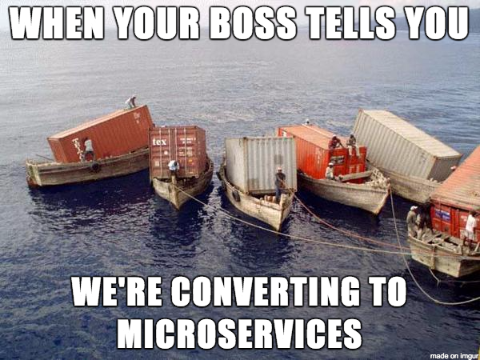

## play-with-containers

### Objectives

This project aims to discover the container concepts and tools, and practice
these tools by creating a microservices' architecture with docker and
docker-compose. Additionally, as a cloud and DevOps student, you will gain
insight into key containers and docker concepts as follows:

- `Containers`, is a unit of software that packages code and its dependencies,
  so the application runs quickly and reliably across computing environments.
- `Docker`, is a set of "platform as a service" products that use OS-level
  virtualization to deliver software in packages called containers.
- `Dockerfile`, is a text document that contains all the commands a user could
  call on the command line to assemble an image.
- `Docker Images`, is a read-only template that contains a set of instructions
  for creating a container that can run on the Docker platform.
- `Docker Networks`, it enables a user to link a Docker container to as many
  networks as he/she requires.
- `Docker Volumes`, Volumes are the preferred mechanism for persisting data
  generated and used by Docker containers.
- `Docker Compose`, Compose is a tool for defining and running multi-container
  Docker applications. With Compose, you use a YAML file to configure your
  application's services.

### Tips

- Spend time on the theory before rushing into the practice.
- Read the official documentation of Docker.

> Any lack of understanding of the concepts of this project may affect the
> difficulty of future projects, take your time to understand all concepts.

> Be curious and never stop searching!

> Each operation in Dockerfile is a layer in the image, You must design it
> appropriately to avoid duplicate or useless layers in the image.

> It is not recommended to use 'latest' in your Dockerfile, instead of that
> you can specify the version in the tag.

### Instructions

You have to install Docker in your Linux virtual machine, you will also need it
in the audit.

You have to implement this architecture:

You will use the services described in the `crud-master` project.
[Here](https://github.com/01-edu/crud-master-py)
is a working solution that you can use to solve this project.

You are required to create a `Dockerfile` for each service and call them in
your `docker-compose.yml` (each service should have its container for optimal
performance.). To ensure performance, the containers should be created from the
penultimate stable version of either `Alpine` or `Debian`, depending on your
preference. The corresponding service and Docker image must share the same
name. This implies that you must build your project's Docker images, and you are
not allowed to use pre-built Docker images or services like Docker Hub, except
for `Alpine` and `Debian`.

#### Docker Containers:

- `inventory-db container` is a SQL database server that contains your
  inventory database, it must be accessible via port `5432`.
- `billing-db container` is a SQL database server that contains your
  billing database, it must be accessible via port `5432`.
- `inventory-app container` is a server that contains your
  inventory-app. It will be connected to the inventory database and accessible
  via port `8080`.
- `billing-app container` is a server that contains your billing-app.
  It will be connected to the billing database and consuming the messages from
  the RabbitMQ queue. It will be accessible via port `8080`.
- `rabbit-queue` is a RabbitMQ server that contains the queue.
- `api-gateway-app container` is a server that contains your
  API gateway. It will forward the requests to the other services, and it's
  accessible via port `3000`.

> Containers must be restarted in case of failure!

#### Docker Volumes:

- `inventory-db volume` contains your inventory database.
- `billing-db volume` contains your billing database.
- `api-gateway-app volume` contains your API gateway logs.

#### Docker Network:

- You must have a docker network that establishes the connection between all
  services inside your docker host.
- Any outside request must be able to access only the `api-gateway-app` via
  port `3000`.

> All resources in your infrastructure must be targeted and managed by
> docker-compose.

> You don't have to push your credentials and passwords to your repo, the
> credentials and passwords must be in the `.env` file, and this file must be
> ignored in the `.gitignore` file.

> Don't push your passwords to Git, unless you want to throw a thief's party
> with free drinks and no bouncers on duty!

### Documentation

You must push a `README.md` file containing full documentation of your solution
(prerequisites, configuration, setup, usage, etc.).

### Bonus

Use your `crud-master` services for the solution of this project.

If you complete the mandatory part successfully, and you still have free time,
you can implement anything that you feel deserves to be a bonus.

Challenge yourself!

### Submission and audit

You must submit the `README.md` file and all files used to create, delete and
manage your infrastructure: docker-compose, Dockerfiles, scripts and so on.

> The infrastructure must be able to be created, deleted, and managed only by
> `docker-compose`. In the audit you will be asked different questions about
> the concepts and the practices of this project, prepare yourself!
