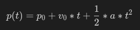
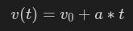

## project_motion

### Instructions

For this exercise, you will have to create a [projectile motion](https://cimg2.ck12.org/datastreams/f-d%3Abb024be6673110b31e78b46819e792adaed8dc661e082a61f0a6d64e%2BIMAGE%2BIMAGE.1).

Two structures will be provided. A structure called `ThrownObject` that will contain all the variables that are
essential for the projectile physics (initial position and velocity and time elapsed).

A structure called `Vec2` which represents a scalar with X and Y components. You can use it to represent positions and velocity.

You must implement:

- An associated function `new` that will initialize the `ThrownObject` with a given initial position and velocity.
- The trait `Iterator` where the new position and velocity of the object will be calculated and returned for each second.
  It should return the new position and velocity as a tuple, or `None` if the `ThrownObject` has already reached the floor.

Consider the value of gravity is 9.8m/s^2 and that the position (p) in the instant s of an object is given by:



and velocity (v) in the instant s of an object is given by:



### Notions

- [trait Iterator](https://doc.rust-lang.org/std/iter/trait.Iterator.html)
- [iter](https://doc.rust-lang.org/rust-by-example/trait/iter.html)

### Expected Function

```rust
#[derive(Debug, PartialEq, Clone, Copy)]
pub struct Vec2 {
    pub x: f64,
    pub y: f64,
}

#[derive(Debug, PartialEq, Clone, Copy)]
pub struct ThrownObject {
    initial_position: Vec2,
    initial_velocity: Vec2,
    elapsed: f64,
}

impl ThrownObject {
    pub fn new(position: Vec2, velocity: Vec2) -> Self {
        todo!()
    }
}

impl Iterator for ThrownObject {

}

```

### Usage

Here is a program to test your function

```rust
use project_motion::*;

fn main() {
    let mut obj = ThrownObject::new(Vec2 { x: 50., y: 50. }, Vec2 { x: 0., y: 0. });
    println!("{:?}", obj.next());
    println!("{:?}", obj.next());
    println!("{:?}", obj.next());
    println!("{:?}", obj.next());
}
```

And its output:

```console
$ cargo run
Some((Vec2 { x: 50.0, y: 45.1 }, Vec2 { x: 0.0, y: -9.8 }))
Some((Vec2 { x: 50.0, y: 30.4 }, Vec2 { x: 0.0, y: -19.6 }))
Some((Vec2 { x: 50.0, y: 5.899999999999999 }, Vec2 { x: 0.0, y: -29.400000000000002 }))
None
$
```
