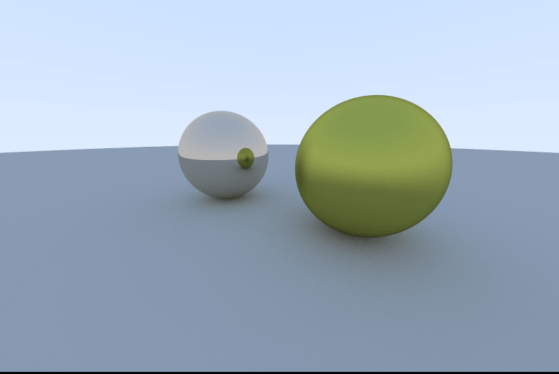

## rt

There are two ways to render a 3d scene into a 2d image: `rasterization`, which converts the shapes and geometric figures to pixels and applies calculations to obtain the color, the shadows, the refraction, etc... of those pixels. The other method is called `ray tracing` and consists in drawing each pixel with its color, shadows, refraction, reflection, etc.... already present from the start.

Imagine a camera pointing at a scene, and from that camera, a bunch of rays are coming, which bounce from object to object until they reach the light source (lamp, sun, etc...). This is basically how a ray tracer works.

In `ray tracing` each of these rays can be seen as a pixel in the image captured by the camera. Recursively the ray tracer will calculate where the light comes from in that pixel, allowing to give that pixel a color with some shadow aspect, some refraction aspect, and so on.

To understand better how ray tracing works, it is highly suggested that you search online this subject, as it can get quite complicated.

Below is an example of an image which your ray tracer should be able to produce:



> The image generated is including reflection that is one of the required bonus features. More information below.

### Objectives

In this project, you have to implement the ray tracer method in order to be able to render a computer generated image containing a few objects.

When building your ray tracer, you have to take some points into consideration:

- You need to be able to create at least 4 simple objects: a sphere, a cube, a flat plane and a cylinder.
- Your program must be able to change an object's location before creating the image. (Example: render a sphere with its center on the point (1,1,1)).
- You have to be able to look at the same scene from different angles by moving the camera/point of view.
- You also have to implement simple light management, which includes: different brightness and shadows.

As your ray tracer will probably be a bit slow to render high resolution scenes, you should make 4 .ppm images for the auditors to evaluate. The scenarios of these 4 images that you have to create consist of:

- a scene with a sphere;
- a scene with a flat plane and a cube with lower brightness than in the sphere image;
- a scene with one of each of all the objects (one cube, one sphere, one cylinder and one flat plane);
- a scene like the previous one, but with the camera in another position (thus generating the same image from a different perspective).

All the images should be in the format of 800x600. However, while testing, you should use smaller resolution images in order to reduce your rendering time (a 1200x1000 can take up to 40 mins to create). It would be best to consider the possibility of changing the output image's resolution easily.

Another aspect you should consider is that the auditor will have to use your ray tracer, so make it as usable and optimized as possible. You should provide the auditor clear documentation.

#### Documentation

By documentation, we mean the explaining of how the ray tracer work and how to work with it, for example: how to create an object, how to change brightness in a scene, etc... After reading the documentation, a new user of your ray tracer has to be able to use it without much guessing work.

You will have to create a [markdown](https://www.markdownguide.org/getting-started/) file, which will have to contain:

- Explanation on the features of your ray tracer
- Code examples and explanations on how to:
  - Create an instance of each object (a sphere, a cube, a flat plane and a cylinder).
  - Change the brightness.
  - Change the camera position and angle.

### Instructions

In order to render images you will create a [.ppm](https://www.cs.swarthmore.edu/~soni/cs35/f13/Labs/extras/01/ppm_info.html) file. A .ppm file consists of an image header and an image body. Example:

```
P3              \
4 4              > Image Header
255             /
0 0 0           \
0 0 0            \
0 0 0            |
255 0 255        |
100 0 0          |
0 255 175        |
0 0 0            |
0 0 0             > Image Body
0 0 0            |
0 0 0            |
015 175          |
0 0 0            |
255 0 255        |
0 0 0            |
0 0 0            /
255 255 255     /
```

The image header consists of three lines:

- the first one is the image format: what type of PPM (full color, ASCII encoding) image it is. P3 stands for the Portable PixMap type, so you will be using this one.
- the following stands for how many columns and rows of pixels the image will contain.
- and the third line is the maximum color value, 255 is the most common value since the rgb color code is very well known.

All the other lines below, are the rgb values for each pixel, for example the first line of the image body represents a black pixel (rgb(0,0,0) -> black). Each line represents one pixel, starting on the top left corner transitioning to the right and, in this case, the fifth line is the pixel in the first row on the second column.

So with this in mind, you will have to make an algorithm that fills a file by printing each line. You can use the cargo command this way: `cargo run > output.ppm`. This will print the standard output to the file `output.ppm`.

In order to create the previously mentioned objects, you will need to search online for documentation about the geometrics of each.

### Unit Tests

You must implement unit tests within your `rt` project to ensure your mathematical engine and collision algorithms are accurate. Specifically, your tests should:

- Verify **Vector Operations** by ensuring functions for dot products, cross products, and normalization return mathematically correct results.
- Verify **Ray-Object Intersections** for each geometric primitive (sphere, cube, plane, and cylinder) by testing cases where a ray hits, misses, or is tangent to the object.
- Test **Color Scaling** logic to ensure that brightness adjustments and light intensity calculations stay within the valid RGB range (0-255).
- Verify **Camera Transformations** by ensuring that translating or rotating the camera correctly updates the direction of generated primary rays.

### Bonus

As bonus for this project you can implement:

- Textures to the surfaces of the objects
- Reflection and refraction effects on the objects (make them shiny or reflective)
- Add particles
- Add fluids

Consider putting your bonuses behind command-line flags to achieve a reasonable performance standard defined above. For example, to render textures on your image, you can use a flag -t. Otherwise, textures will be ignored.

This project will help you learn about:

- [Ray Tracing](<https://en.wikipedia.org/wiki/Ray_tracing_(graphics)>)
- Computer generated imagery (CGI)
- Algorithms
- Geometry and maths
