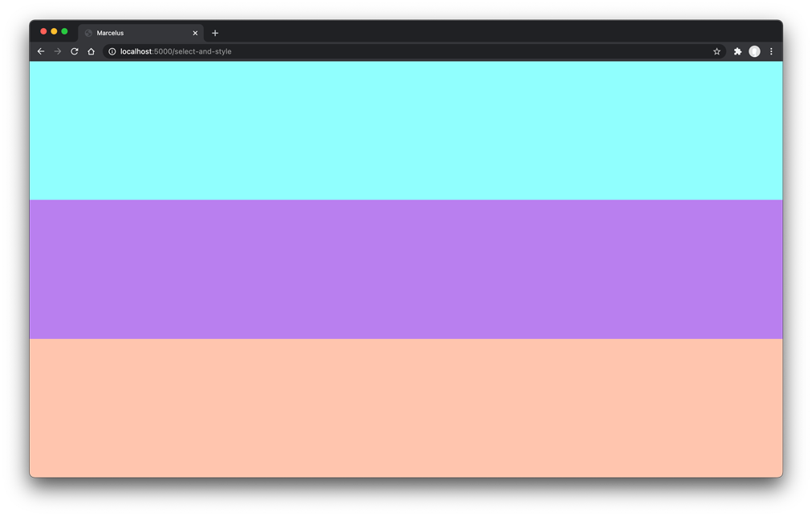

### Select & style

Now that you created & identified properly the different sections of your being, it's time to make it look more living-like! To achieve that, you're going to style it with [CSS](https://developer.mozilla.org/en-US/docs/Web/CSS).
Create a CSS file, [link it](https://developer.mozilla.org/en-US/docs/Web/HTML/Element/link#including_a_stylesheet) to your `select-and-style.html`, and:

- target all the elements with the [universal selector](https://developer.mozilla.org/en-US/docs/Web/CSS/Universal_selectors) and style them with a `margin` of 0, `box-sizing` to "border-box" and an `opacity` of 0.85
- target the `body` tag and style it with a `height` of 100vh so it takes the viewport height
- target all the `section` tags with the [type selector](https://developer.mozilla.org/en-US/docs/Web/CSS/Type_selectors), and style it with a `padding` of 20 pixels, a `width` of 100% and a `height` of "calc(100% / 3)" (one third of the `body` height)
- target each following element with the [`id` selector](https://developer.mozilla.org/en-US/docs/Web/CSS/ID_selectors), using the `id` you defined earlier for each section, and style it:
  - `face` with a "cyan" `background-color`
  - `upper-body` with a "blueviolet" `background-color`
  - `lower-body` with a "lightsalmon" `background-color`

To style an element, you systematically have to declare [rulesets](https://developer.mozilla.org/en-US/docs/Learn/Getting_started_with_the_web/CSS_basics#anatomy_of_a_css_ruleset), composed of a property and a value.
Here is an exemple of how to set the color of `div` tags to "red":

```div {
  color: red;
}
```

### Expected output

This is what you should see in the browser:


### Notions

- [`link` a CSS file](https://developer.mozilla.org/en-US/docs/Web/HTML/Element/link#including_a_stylesheet)
- [CSS basics](https://developer.mozilla.org/en-US/docs/Learn/Getting_started_with_the_web/CSS_basics)
- [ruleset](https://developer.mozilla.org/en-US/docs/Learn/Getting_started_with_the_web/CSS_basics#anatomy_of_a_css_ruleset)
- [List of different selectors](https://developer.mozilla.org/en-US/docs/Learn/Getting_started_with_the_web/CSS_basics#different_types_of_selectors)
- [universal selector](https://developer.mozilla.org/en-US/docs/Web/CSS/Universal_selectors)
- [type selector](https://developer.mozilla.org/en-US/docs/Web/CSS/Type_selectors)
- [`id` selector](https://developer.mozilla.org/en-US/docs/Web/CSS/ID_selectors)
