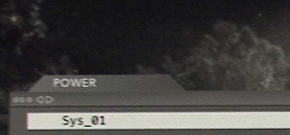

# `sys`

> _Ex Machina_ (film)

---

| Name          | Description                                                                                                        | Skills                 | Done            |
| ------------- | ------------------------------------------------------------------------------------------------------------------ | ---------------------- | --------------- |
| `linux`       | Introduction and VirtualBox installation/basic usage.                                                              | OS, virtualization     | subject + audit |
| `login`       | Connect to console (using different virtual terminals), basic commands and usage of the console.                   | OS                     | subject         |
| `add-vm`      | Download and add our training virtual machines (introduction to snapshots).                                        | virtualization         | VM, subject     |
| `connect`     | Fix a conflict of IP address, configure DHCP & static IP address.                                                  | OS, network            | VM, subject     |
| `remote`      | Remotely connect to a pseudo-terminal (configure firewall, change SSH port and listening address).                 | OS, network, security  | VM, subject     |
| `scan`        | Discover machines and services (scan ARP, `nmap`), brute-force portals.                                            | OS, network, security  | VM, subject     |
| `upgrade`     | Free disk space (caches, logs & temporary files) to upgrade the OS.                                                | OS                     | WIP             |
| `reboot`      | Learn how to recognize a blocked system and reboot it (hard reset, magic SysRq key).                               | OS                     |                 |
| `ram`         | Fix a program being OOM (enlarge swap and system memory, compare performance).                                     | OS, virtualization     |                 |
| `benchmark`   | Learn how to benchmark a program                                                                                   | OS, disk               | WIP             |
| `boot`        | Fix the various boot stages of a broken system (including a misconfigured application).                            | OS, network            | WIP             |
| `process`     | Find processes by port, name, file, resource usage. Find their configuration file path.                            | OS                     | WIP             |
| `monitoring`  | Monitor the system, by hand and with an application.                                                               | OS                     | WIP             |
| `network`     | Build a network by hand, DNS, `arp`, `ip.`                                                                         | network                |                 |
| `modem`       | Configure a system as a router/firewall, making it similar to a residential gateway.                               | network                |                 |
| `censorship`  | Bypass or mitigate various censorship methods (DNS, IP, DPI, MITM, shadowban, non-indexed content, deplatforming). | network, security      |                 |
| `virus`       | Remove a stealth virus (multiple signatures and infection vectors). Reinstall safely.                              | OS                     |                 |
| `data`        | Data recovery, fix corrupted file system, obtain minimal disk image size.                                          | OS, disk               |                 |
| `nas`         | Make your own NAS with RAID, Samba, NFS, iSCSI, ClamAV                                                             | OS, network, disk      | WIP             |
| `performance` | Boost the performance of a service tweaking scheduling CPU pinning, `[io]nice`, RAID 0, NIC bonding.               | OS, CPU, network, disk |                 |
| `sys`         | (Bonus) Recreate `debian-01` virtual machine.                                                                      | All of the above       | WIP             |
